# 一、git操作

## （一）、git的[操作逻辑](https://www.yiibai.com/git/getting-started-git-basics.html)
+ Git 项目的三个工作区域的概念：Git 仓库、工作目录以及暂存区域。
+ Git 仓库目录是 Git 用来保存项目的元数据和对象数据库的地方。这是 Git 中最重要的部分，从其它计算机克隆仓库时，拷贝的就是这里的数据。
+ 工作目录是对项目的某个版本独立提取出来的内容。这些从 Git 仓库的压缩数据库中提取出来的文件，放在磁盘上供你使用或修改。
+ 暂存区域是一个文件，保存了下次将提交的文件列表信息，一般在 Git 仓库目录中。 有时候也被称作‘索引’，不过一般说法还是叫暂存区域。
+ 在工作目录中修改文件。暂存文件，将文件的快照放入暂存区域。提交更新，找到暂存区域的文件，将快照永久性存储到 Git 仓库目录。
+ 如果 Git 目录中保存着的特定版本文件，就属于已提交状态。 如果作了修改并已放入暂存区域，就属于已暂存状态。 如果自上次取出后，作了修改但还没有放到暂存区域，就是已修改状态。
+ 如下图： 
<div align="center">  </div>

## （二）、git的基本概念与操作

### 2.1 git理论基础
+ Git下载和安装
+ Git基本操作:
  + Git bash：命令行模式
    + 自带vim编辑器；
  + vim编辑器操作：
    + 输入`vim`进入vim编辑器;
    + `Esc`回到一般模式,`--插入--`不见;
    + 输入`:q`退出编辑模式;
    + 输入`:q!`:强制退出不保存;
    + 输入`:wq`:保存后退出;
    + 输入`:wq!`:强制保存后退出;
    + 按住`Esc`键,再按两次大写的`z`键,也可退出vim编辑器;
  + Git Gui：界面菜单操作模式
+ Git初始化
+ 设置签名:
  + 用户名:name
  + Email:xxx@xxx.com
    + 这里的设置的用户名和邮箱只用来区分不同开发人员身份,和登录远程库的账号和密码没有任何关系;
+ 权限级别:
  + 项目级别/仓库级别: 尽在当前本地库范围内有效;
    + `git config user.name zhuloo`
    + `git config user.email zhuloo@sina.com`
    + `cat .git/config`: 命令可以查看user的信息,信息保存在当前项目下的`.git/config`文件下;
  + 系统用户级别: 登录windows系统的用户;
    + `git config --global user.name zhuloo`
    + `git config --global user.email zhuloo@sina.com`
    + `cd ~`: 切换到用户目录;
    + `ls`: 查看到`.gitconfig`的文件;
    + `cat .gitconfig`: 打开`.gitconfig`查看;
    + `cat ~/.gitconfig`: 直接打开用户目录下的`.gitconfig`查看;
  + 优先级: 就近原则,项目级别优先于系统用户级别,二者都存在时采用项目级别的签名;
    + 如果只有系统用户级别,就以系统用户级别的用户签名为准;
    + 二者都没有时不允许;

#### 2.1.1 三棵树
+ 工作目录、暂存区域、git仓库
+ <div align="center"> 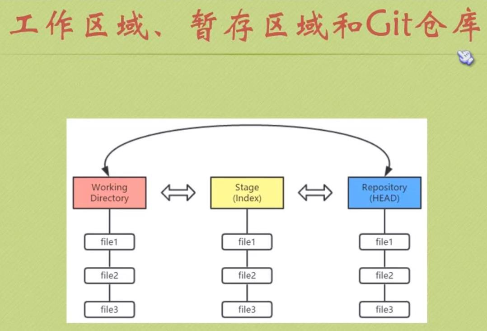 </div>


  + 工作目录working directory：就是当前文件夹可以看到的地方;
  + 暂存区域stages(index): 保存改动的即将提交仓库的列表信息, 也叫列表;
  + 仓库repository(HEAD): 最终安全存放数据版本的位置,有提交的所有版本的数据,HEAD指针指向最新提交的内容;

#### 2.1.2 Git的一般工作流程
  + 1. 在工作目录,即当前文件夹中添加和修改文件;
  + 2. 将进行版本管理的文件放入暂存区域: `git add .`;
  + 3. 将暂存文件提交到仓库: `git commit -m""`;

#### 2.1.3 Git管理的文件有三种状态
  + 已修改: `modified`;
  + 已暂存: `staged`;
  + 已提交: `committed`;

### 2.2 实战:查看工作状态与历史提交
+ `mkdir git_learning`: 新建空白文件夹;
+ `cd git_learning`: 切换到新建的文件夹;
+ `git init`: 初始化git项目;
+ `git status`: 查看当前的工作状态;git

#### 2.2.1 添加或修改文件后暂存
+ `git add good.txt`: 提交文件到暂存区域;
+ `git restore --staged good.txt`:
+ 提交暂存区域后,有两种相反操作:
  + 提交暂存区域后撤销提交: `git reset HEAD`, 即撤销`git add`命令提交暂存的这一步操作;
  + 提交暂存区域后又在工作目录修改了game.py文件, 撤销刚才的修改,用暂存区域的文件覆盖掉修改:`git checkout -- game.py`,刚才工作目录中的修改将直接被暂存区域中的game.py覆盖掉,所以`checkout`是一个有威胁的命令;
  
#### 2.2.2 暂存后提交
+ `git commit -m""`
+ `git log`: 提交了很多个版本,查看commit记录;
  + 一页显示不完, 以冒号暂停, 冒号后空格下一页, `b`上一页, `q`退出;
  + `z`表示向下移动一行, `k` 表示向上移动一行;
  + `数字+j`跳到第几行;
  + `/+关键词`:向下搜索

### 2.3 回到过去
+ Git可以自由地在个版本穿梭:
+ 三棵树及其之间对应的操作命令,如图:
<div align="center"> 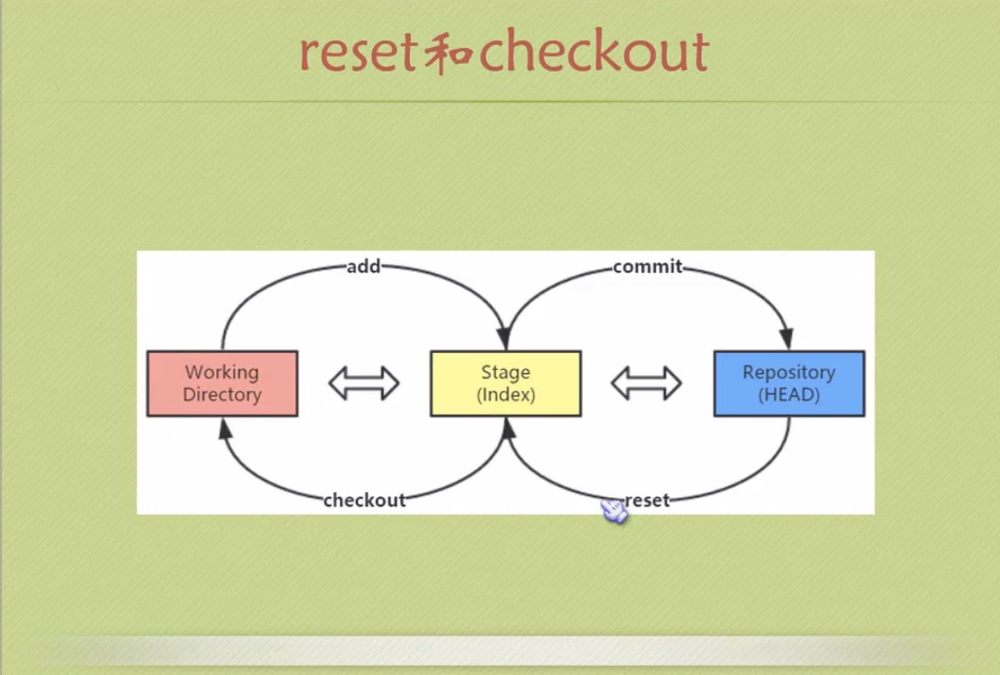 </div>

#### 2.3.1 `git reset`命令
+ 这两个命令是Git中最复杂的命令;
+ 仓库的三个快照,及其所对应版本;
<div align="center"> 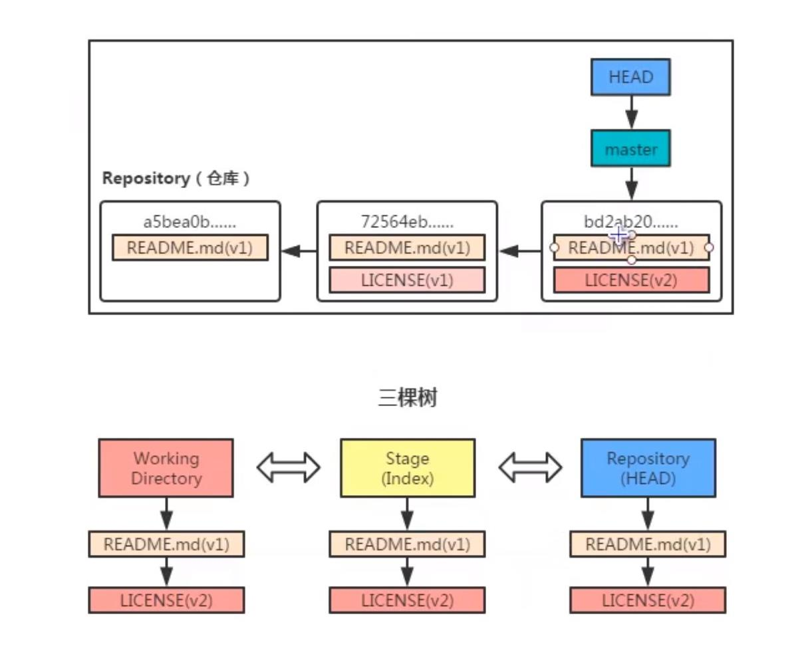 </div>

+ 三个快照是三次`commit`的结果,可以使用`git log`命令查看;
<div align="center"> 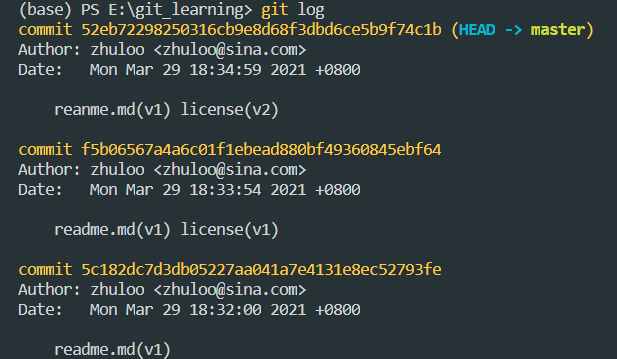 </div>
  
  + 橙色是三此提交的版本的hash值,可以使用前5为代表不同版本的快照ID;
+ HEAD是指向`commit`提交的不同版本快照的指针;
+ `git reset HEAD~`:命令将最新的快照`52eb722`回滚到了快照`f5b0656`,产生的结果:
<div align="center"> 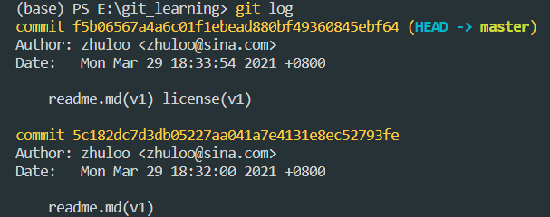 </div>

  + 回滚的结果是:仓库变成了两个图上的快照:
  + 最新的一次快照`ID52eb722`没有了;
  + 此时回滚到的快照`f5b0656`,保存到了暂存区域;
  + 一个波浪线表示回滚到上一个快照;
  + `git reset HEAD~3`: 表示回滚三个版本;

#### 2.3.2 git reset命令选项
+ `git reset --mixed HEAD~`: 移动HEAD指向,回滚到上一个快照,并将指向的新快照恢复到暂存区域,默认为`mixed`模式,结果如下图;
<div align="center"> 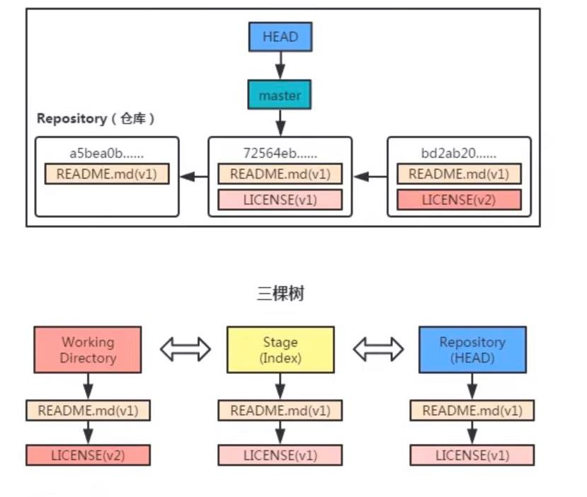 </div>

+ `git reset --soft HEAD~`: 只移动HEAD指向,指向上一个快照,不将其恢复到暂存区域,相当于撤销最后一次`commit`操作;
+ `git reset --hard HEAD~`: 移动HEAD指向,指向上一个快照,并将指向的新快照恢复到暂存区域,同时将暂存区域的文件还原到工作目录,结果如下图;
<div align="center"> 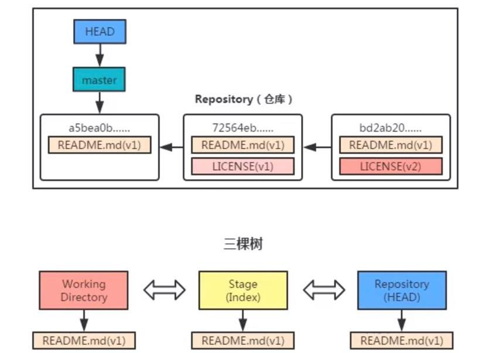 </div>

#### 2.3.3 回滚到指定快照
+ 指定具体的快照ID的前5个以上数字:`git reset f5b0656`;
+ 回滚个别文件:`git reset ID filename`,这时只回滚个别文件,HEAD指针不会变;
+ 还可以往前滚:`git reset 52eb722`,此时默认mixed只恢复到了暂存区域,但是并未恢复到工作目录;
+ 还可以往前滚:`git reset --hard 52eb722`,此时就直接恢复到工作目录;

### 2.4 版本对比：git diff
#### 2.4.1 比较暂存区域与工作目录
+ 命令`git diff`:默认对比暂存区域与工作目录
<div align="center"> 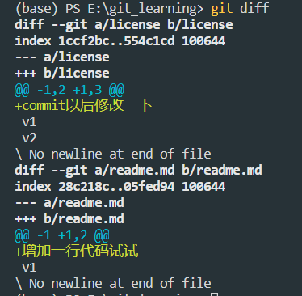 </div>

+ 结果如上图：
  + 三个减号"-"：表示暂存区域的旧版本文件；
  + 三个加号"+"：表示工作目录中的文件，修改后的新文件；
  + @@-1,2 +1,3@@:表示旧文件从1开始共2行，新文件从1开始共3行；

#### 2.4.2 比较两个历史快照
+ `git diff 4ee84b 52eb72`

#### 2.4.3 比较当前工作目录和Git仓库中的快照
+ `git diff 4ee84b`: 即比较当前目录和快照4ee84b
+ `git diff HEAD`: 比较当前目录和最新快照,直接使用HEAD指针,即指向当前最新快照;

#### 2.4.4 比较暂存区域和Git仓库中的快照
+ `git diff --cached`: 直接比较仓库最新的快照和暂存区域的文件;
+ `git diff --cached 52eb72`: 比较仓库指定快照和暂存区域的文件;

#### 2.4.5 git diff终极奥义图
<div align="center"> 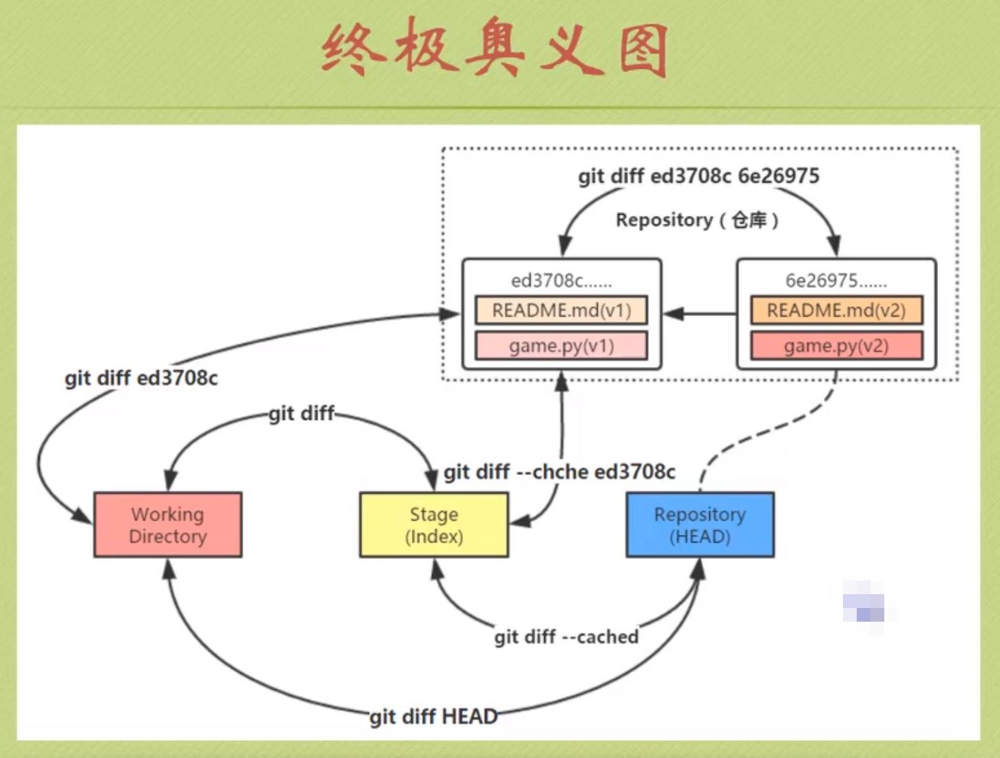 </div>


### 2.5 修改最后一次提交,删除文件和重命名文件
#### 2.5.1 修改最后一次提交说明;
+ 第一种情形:版本刚提交(`commit`)到仓库,突然发现漏掉两个文件还没添加(`add`);
+ 第一种情形:版本刚提交(`commit`)到仓库,突然发现版本提交说明写的不够全面,无法彰显修改的意义;
+ 可以执行带`--amend`选项的`commit`命令,Git就会更正最近一次的提交;
+ `git  commit --amend`: 修改提交说明, 按下`i`直接修改提交说明, 再按下`Esc`和`shift+两下字母z`保存并退出;
+ 如果不修改则`:q!`直接退出;

#### 2.5.2 删除文件
+ 直接右键删除工作目录下的文件后可使用`git checkout -- readme.md`从暂存区域恢复;
+ 如果不小心提交了不该提交的文件`yellow.jpg`: 
  + 先使用命令`git rm yellow.jpg`,但是`git status`和`git log`仍然会显示已删除的信息, 因为已经提交;
  + 再次使用`git reset --soft HEAD~`修改仓库里的HEAD指针, 就相当于撤销了最后一次`commit`的信息, 就看不到已删除的痕迹了;
+ `git rm filename`删除文件后只是删除工作目录和暂存区域的文件, 也就是取消跟踪, 在下次提交时不纳入版本管理;
  + 如果`git add test.py`添加暂存以后又修改了`test.py`再`git rm test.py`就会不执行, 因为Git不知道删除哪一个;
  + 使用`git rm -f test.py`就强行删除了工作目录和暂存区域的`test.py`;
  + 使用`git rm --cached test.py`只删除了暂存的`test.py`;

#### 2.5.3 重命名文件
+ 重命名文件后,`git status`会显示删除一个文件又新建一个文件, 改回原来的名字又clean了;
+ git中修改文件名使用`git mv license game.py`命令,就不会提示删除和增加文件的痕迹了;

### 2.6 创建和切换分支
+ 关于分支:保存有多个快照;
<div align="center"> 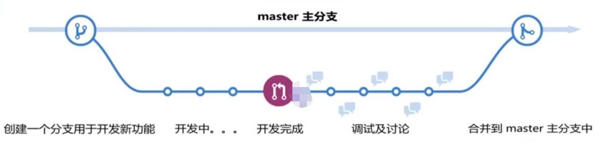 </div>

#### 2.6.1 创建分支 
+ `git branch feature`: 创建新的feature分支,创建分支后的仓库:
<div align="center"> 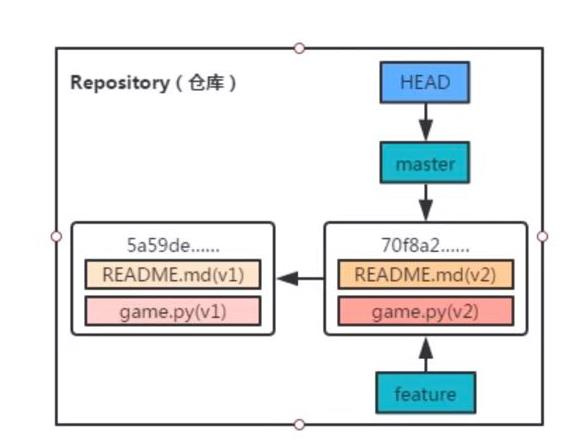 </div>

+ `git log --decorate`: 显示详细带HEAD指针的版本快照信息;
+ `git checkout feature`: 切换到feature分支, 仓库就变成了:
<div align="center"> 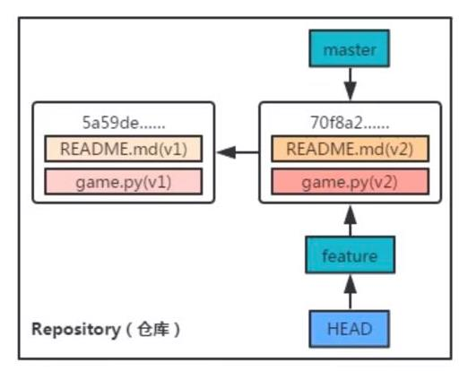 </div>

+ `git log --decorate --oneline`: 精简一行显示快照信息;
+ 修改readme.md后提交,此时仓库变成了:
<div align="center"> 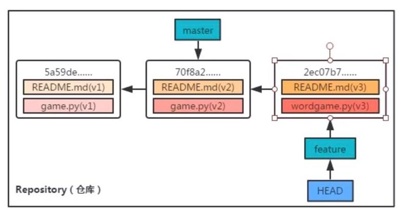 </div>

+ 切换回master分支发现上面对readme.md的修改没有了,因为刚才的修改是对feature分支进行的,此时的仓库:
<div align="center"> 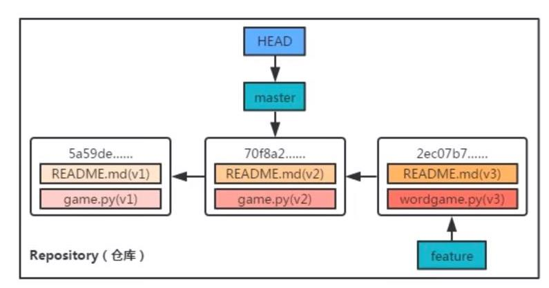 </div>

+ `git log`:只显示针对当前`master`分支的快照,当前已切换到`master`分支;
<div align="center"> 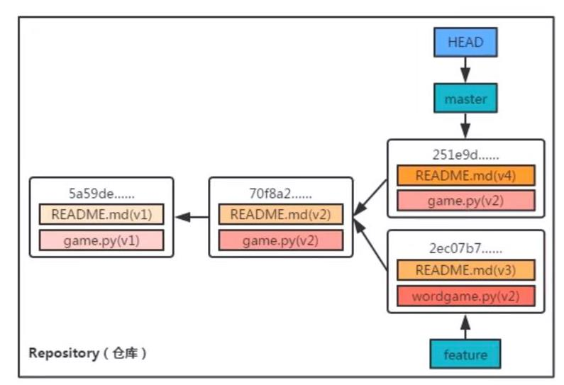 </div>

+ `git log --decorate --oneline --graph --all`: 图形精简单行显示当前分支情况:

### 2.7 合并和删除分支
+ `git merge feature`: 将`feature`分支合并到当前`master`分支;
+ `git branch -d feature`: 删除`feature`分支;

### 2.8 匿名分支和checkout命令
#### 2.8.1 git checkout命令
+ `git checkout [<commit>] [--] <paths>`: 拿暂存区文件覆盖工作区文件, 或者用指定提交中的文件覆盖工作区中对应的文件;
  + 在命令中包含路径 <paths>。为了避免路径<paths>和引用（或者提交）<commit> 同名而冲突，可以在<paths>前用两个连续的短线减号作为分隔。
  + <commit> 是可选项，如果省略则相当于从暂存区（index）检出。这和 `git reset` 重置命令（例如 git reset HEAD <file>）大不相同：`git reset`的默认值是 HEAD，而`git checkout`的默认值是暂存区。因此`git reset`一般用于重置暂存区（除非使用--hard参数，否则不重置工作区），而`git checkout`命令主要是覆盖工作区（如果<commit>不省略，也会替换暂存区中相应的文件）。
  + 包含了路径 <paths> 的用法不会改变 HEAD 头指针，主要是用于拿指定版本的文件覆盖工作区中对应的文件。如果省略<commit>，则会拿暂存区的文件覆盖工作区的文件，否则用指定提交中的文件覆盖暂存区和工作区中对应的文件。

+ `git checkout branch`: 切换分支;
+ `git checkout -b <new_branch> [<start_point>]`: 创建并切换分支; 
+ `git checkout HEAD~`: 使用了`checkout`命令没有指定分支名, Git会默认生成一个匿名分支;
+ 在匿名分支下做了一些修改并提交生成了快照ID, 切换回`master`分支后会提示是否新建分支用来保存刚才在匿名分支下的修改,命令为:`git branch new-branch-name 快照ID`;
+ `checkout`实际上有两种功能:
+ 从历史快照中(或暂存区域)恢复文件到工作目录, `git checkout HEAD~ README.md`从当前指针指向的上一个快照拷贝`README.md`文件到暂存区域和工作目录; 
<div align="center"> 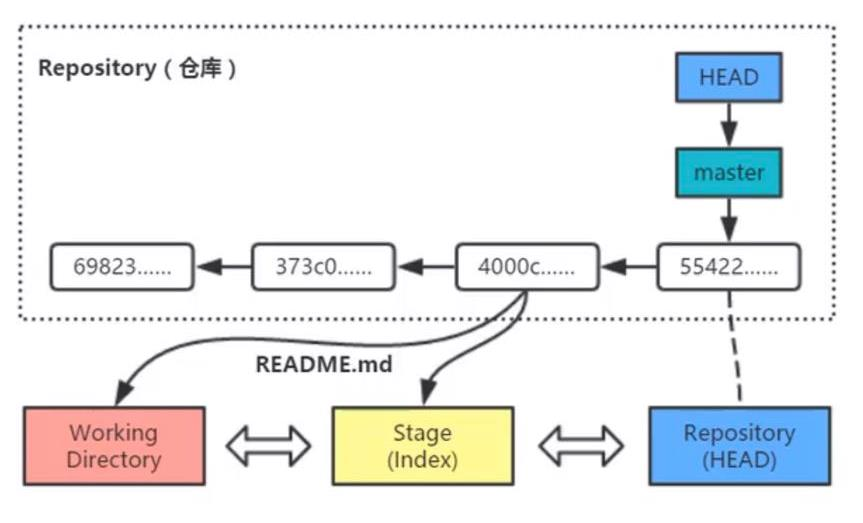 </div>
  
+ 如果没有指定快照`git checkout --README.md`将从暂存区域恢复文件到工作目录;
<div align="center"> 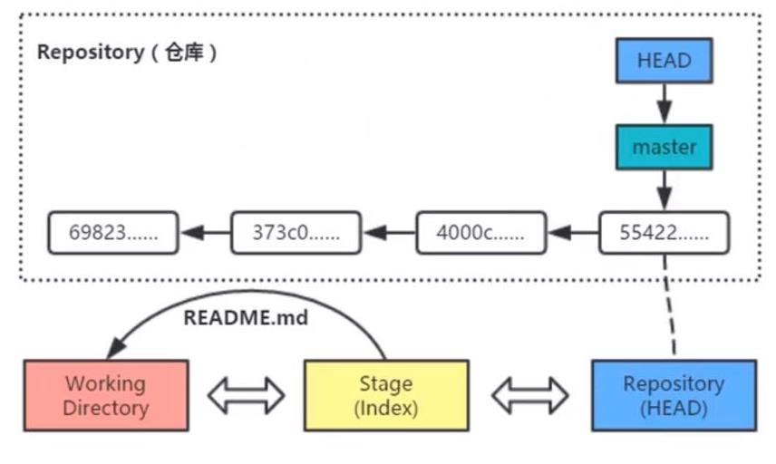 </div>

+ 切换分支: `git checkout 373c0`命令实际上做了下边两件事:
<div align="center"> 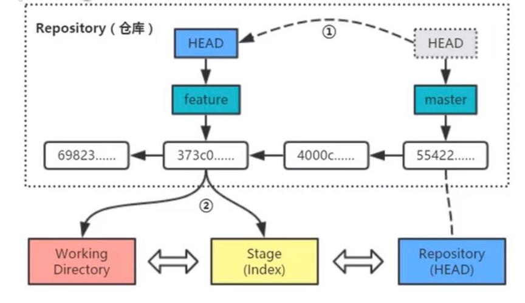 </div>

+ 实际上,如果我们指向恢复指定的文件/路径,那么我们只需要指定具体文件,Git就会忽略第一步修改HEAD指针指向的操作, 只恢复指定文件到工作目录;

#### 2.8.2 reset命令和checkout命令的区别;
+ 恢复文件:
  + 二者用于恢复指定快照的指定文件, 并且二者都不会改变HEAD指向;
+ 区别:
  + `reset`命令只将指定文件恢复到暂存区域(`--mixed`);
  + `checkout`命令是同时覆盖暂存区域和工作目录;
  + 但是,`git reset --hard HEAD~ readme.md`是错误的, 因为`reset`在恢复文件时不允许使用`--soft`和`--hard`选项;
+ 恢复快照:
  + `reset`命令是用来回到过去的, 选项不同结果不同;
  + `checkout`命令是用来切换分支, 事实上也是通过移动HEAD指针和覆盖暂存区域和工作目录来实现的;
+ 区别:
  + 对于`reset --hard`命令来说, `checkout`命令更安全, 因为在切换分之前会先检查一下当前的工作状态,如果不是`clean`的话,Git不允许这样做, 而`reset --hard`命令是直接覆盖所有数据;
  + `git checkout feature`命令只会移动HEAD自身来指向另一个分支, 可以看到HEAD指针在不同分支移动;
  + `git reset --hard feature`命令会移动HEAD所在分支的指向, 以及HEAD本身都切换到了feature分支里, 原来的快照`bd9eda2`直接消失了;

<div align="center"> 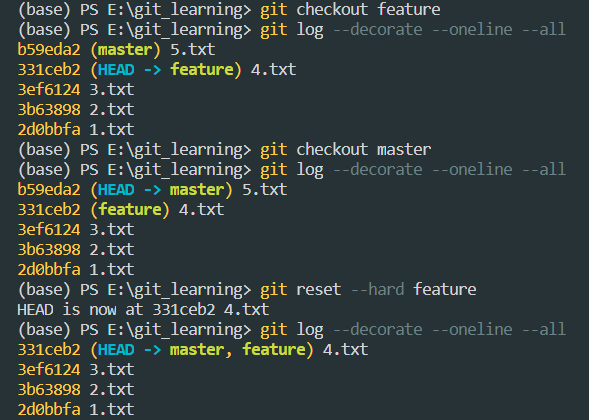 </div>
    

# 二、连接github
## (一)、Github连接问题
+ 经实验，此方法成功
+ 由于某些原因，国内访问Github会异常缓慢，在clone仓库时甚至只有10k以下的速度，下载半天有时还会失败需要从头再来，甚是让人恼火。
+ 本文介绍通过修改系统hosts文件的办法，绕过国内dns解析，直接访问GitHub的CDN节点，从而达到加速的目的。不需要科学上网，也不需要海外的服务器辅助。

### 1.1 获取GitHub官方CDN地址
+ 打开https://www.ipaddress.com/
+ 查询以下三个链接的DNS解析地址
    + github.com
    + assets-cdn.github.com
    + github.global.ssl.fastly.net

+ 记录下查询到的IP地址。

### 1.2 修改系统Hosts文件
+ 打开系统hosts文件(需管理员权限)。
+ 路径：C:\Windows\System32\drivers\etc
+ 在末尾添加三行记录并保存。(需管理员权限，注意IP地址与域名间需留有空格)
    + 192.30.253.112     github.com
    + 151.101.72.133    assets-cdn.github.com
    + 151.101.193.194    github.global.ssl.fastly.net
+ 知乎有更好的回答：https://zhuanlan.zhihu.com/p/107334179

### 1.3 刷新系统DNS缓存
+ Windows+X 打开系统命令行（管理员身份）或powershell
+ 运行 ipconfig /flushdns 手动刷新系统DNS缓存。

### 1.4 实际查询数据
140.82.112.3 github.com    
140.82.114.3 www.github.com
52.216.237.123 http://github-cloud.s3.amazonaws.com
140.82.112.3 gist.github.com 
185.199.108.153 assets-cdn.github.com
199.232.69.194 github.global.ssl.fastly.net

## (二)、Github的分支管理思路

+ 按照图中红色箭头的思路：开发阶段-->测试阶段-->发布阶段
<div align="center"> 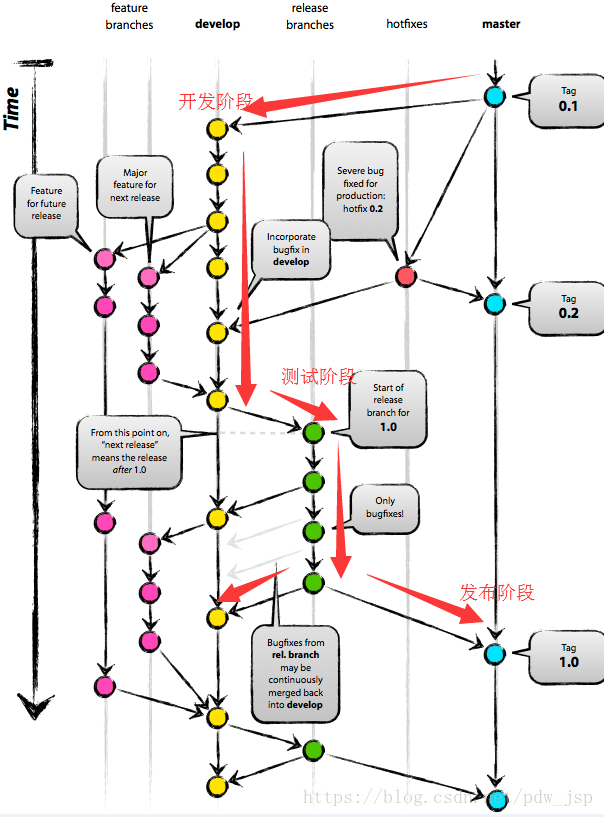 </div>

### 2.1 创建主干master,提交到git服务器:
+ 创建好主干,添加一个`helloworld.txt`文本来测试,文本写入:`this is master origin;`
+ 当前服务器的内容:`master`现在是:`this is master origin;`

### 2.2 创建分支branch,提交分支:
+ 1. 创建: 参考下图,名为`develop`
<div align="center"> 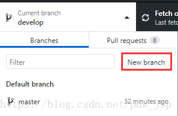 </div>

+ 2. 提交:在工具Bar上有一个push点一下即可  

### 2.3 切换分支+提交分支内容
+ 点击▲即可切换分支,前提是你创建成功了
<div align="center"> 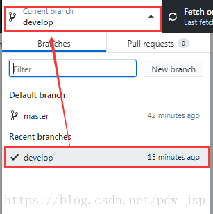 </div>

+ 切换分支了以后,现在的工作环境就到分支下面了,这个时候我们选择在分支里面添加一行文本:`this is develop?`然后`push`,这样主干和分支的内容就不同了;

+ 当前服务器的内容:  
`master` 分支现在是:`this is master origin;`  
`develop`分支现在是:`this is master origin;this is develop?`


### 2.4 创建Release版本给测试
+ 直接创建一个从develop拉出来的分支取名叫release给到QA进行测试.
+ 这个阶段出现了bug直接在这个release分支修复,比如在helloworld.txt中添加一行:this is bug!!!released fixed.
<div align="center"> 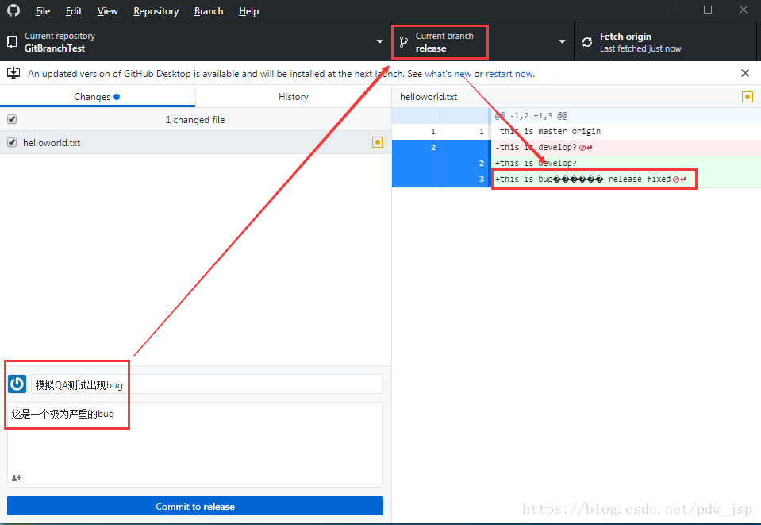 </div>

+ 当前服务器的内容:  
`master` 分支现在是:`this is master origin;`  
`develop`分支现在是:`this is master origin;this is develop?`   
`release`分支现在是:`this is master origin;this is develop?this is bug!!!release fixed.`


### 2.5 合并Release版本到develop和master进行发布:
+ 把当前分支切换到主干然后选择`Branch/Compare to Branch`选择`Master`
<div align="center"> 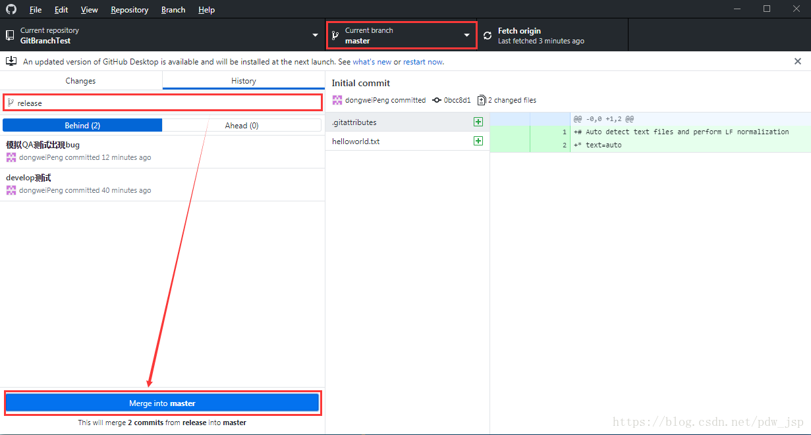 </div>

+ 点击`Merge into master`进行合并操作,等待完成后,push到服务器.合并到develop是一个道理.  

+ 当前服务器的内容:  
`master` 分支现在是:`this is master origin;this is develop?this is bug!!!release fixed. `   
`develop`分支现在是:`this is master origin;this is develop?this is bug!!!release fixed.`    
`release`分支现在是:`this is master origin;this is develop?this is bug!!!release fixed.`  

### 2.6 预发布+发布
+ 1.合并代码后我们先选择预发布(必须在工程根目录进行,点击release按钮就进入到下图界面)
<div align="center"> 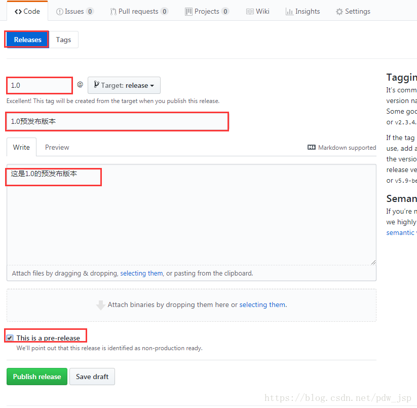 </div>

+ 2.预发布的结果:
<div align="center"> 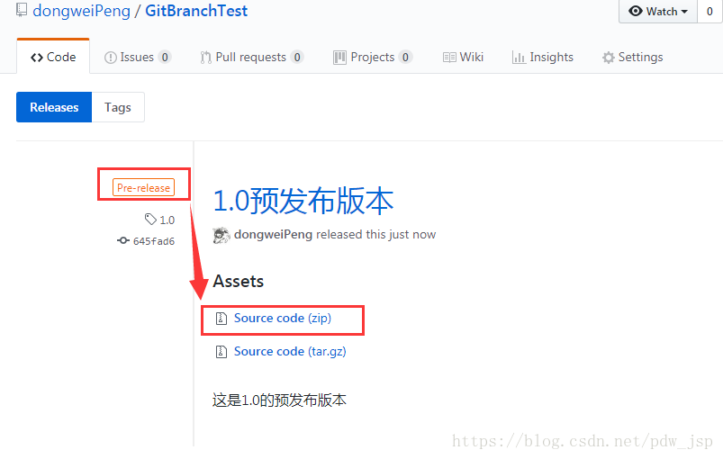 </div>

+ 3.发布正式包(点击预发布的窗口然后编辑把pre-release勾选即可)
<div align="center"> 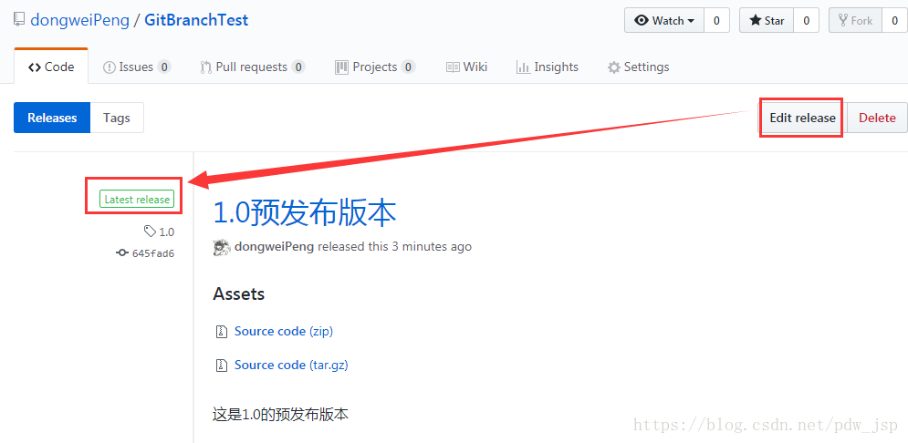 </div>

## (三)、配置SSH Key

+ 电脑上添加SSH Key，绑定到github账号，各台电脑都可连接到github上；
+ 配置SSH的目的就是为了在提交代码的过程中不用繁琐的验证过程，简化操作流程。

### 3.1 两种连接方式
```
https://github.com/ZHULOO/Mygit.git
git@github.com:ZHULOO/Mygit.git
```

+ 两个地址联系的是同一个项目Mygit；
+ 第一种连接方式每次git提交的时候都要输入用户名和密码；
+ 第二种连接方式通过配置ssh key连接github，一次配置永久使用；
+ 可在.git文件夹下的config文件里修改以上两种连接方式；
+ 注意：ssh要设置为第二种连接方式

### 3.2 配置SSH的步骤：
#### 3.2.1 设置git的user name和email

```
git config --global user.name "ZHULOO"
git config --global user.email "zhuloo@sina.com"
git config --global user.password "z20465879"
```

+ 可以通过`git config --list`命令查看当前GIT环境的所有配置；

#### 3.2.2 检查是否已经存在SSH Key
```
cd ~/.ssh # 切换到用户文件夹下的.ssh文件夹；
ls # 或者
ll 
# 看是否存在id_rsa和id_rsa.pub文件，如果已存在说明已经有SSH Key；
# 如果没有需要先生成一下：
ssh-keygen -t rsa -C "zhuloo@sina.com"
# 执行之后可以再次查看是否存在id_rsa和id_rsa.pub文件；
```

#### 3.2.3 获取SSH Key
```
cat id_rsa.pub
# 拷贝密钥
```

#### 3.2.4 Github中添加SSH key
+ 登录github后，点击setting进入设置；
+ 点击 `SSH and GPG keys`-->`New SSH key`;
+ 将上面拷贝的密钥黏贴到此处，并可以对密钥进行命名；

#### 3.2.5 验证和修改
+ 测试是否成功配置SSH Key
```
ssh -T git@github.com 
# 运行出现Hi ZHULOO! You 've successfully authenticated...说明配置成功；
```
+ 果之前已经是https连接，想改用ssh提交，可在.git文件夹下的config文件中直接修改对应的
地址为`git@github.com:ZHULOO/Mygit.git`


## (四)、分支的操作

### 4.1 本地分支操作
+ 查看当前本地分支：`git branch`
+ 创建本地分支：`git branch office_to_home`，创建名称为`office_to_home`的分支；
+ 切换到新建分支：`git checkout office_to_home`，切换到`office_to_home`分支；
+ 综合命令`git branch -b office_to_home`，创建并切换到`office_to_home`的分支；
+ 切换不同分支，文件夹下显示的文件是不同的：
  + 如果`home`分支下有`xpath.py`文件，而`office_to_home`分支下没有，
  + 则只有切换到`home`分支的时候才可以在文件加下看到`xpath.py`文件。

### 4.2 远程分支操作
+ 查看远程分支：`git branch -a`，其中，`remotes`开头的代表远程分支；
+ 推送到远程`home`分支：`git push origin home`，将文件推送到home分支；
+ 推送和拉取分支的操作：
  + 从远程分支`home`拉取到当前默认分支：`git pull origin home`;
  + 将远程`office`分支拉取到本地`office_to_home`分支：`git pull origin office:office_to_home`;
  + 将本地分支`office_to_home`推送到远程home分支：`git push origin office_to_home:home`;


### 4.3 远程分支和本地分支的关系
#### 4.3.1 目标
+ 建立本地分支和远程分支的映射关系;
+ 使用`git pull`或`git push`时就不必每次都要指定从远程的那个分支拉取合并和推送到哪个远程分支了;
+ 本地分支只能跟踪远程的同名分支吗? 答案是否定的;

#### 4.3.2 操作过程
+ `git branch -vv`: 查看本地分支与远程分支的关系;
+ `git branch -u origin/office`或者`git branch --set-upstream-to origin/office`: 建立当前分支和远程分支`office`的映射关系;
+ `git branch --unset-upstream`: 撤销本地分支与远程分支的映射关系;

#### 4.3.3 推送和拉取
+ 推送本地分支到远程仓库:`git push --set-upstream origin office` ; 
+ 将远程仓库里的分支拉取到本地(本地不存在的分支):`git checkout -b 本地分支名 origin/远程分支名`: 自动创建本地分支, 并将其与远程分支关联起来;

### 4.4 克隆远程分支到本地 
+ 克隆分支：`git clone -b office git@github.com:ZHULOO/MyGit.git`,远程仓库克隆`office`分支；
+ 从远端拉取`office`分支到本地：`git fetch origin office`;
+ 从当前`master`分支上，拉取远端仓库`office`分支到本地：`git checkout -b master origin/office`;

### 4.5 远程仓库和git merge
#### 4.5.1 查看远程仓库
+ `git remote`: 列出每一个远程仓库的简写;
+ `origin`: Git起的远程仓库默认名字;
+ `git remote -v`: 列出远程仓库的简写和它对应的URL;
#### 4.5.2 添加远程仓库
+ `git remote add name https://github.com/...git`:将URL远程仓库命名为name, 以后可以使用名字name来代替远程仓库的URL;
+  
#### 4.5.3 git fetch命令
+ `git fetch [remote-name]`: 这个命令会访问远程仓库，从中取回所有你还没有的数据。 执行完成后，你将会拥有那个远程仓库中所有分支的引用，可以随时合并或查看。
+ 如果你使用 `clone` 命令克隆了一个仓库，那么 Git 会自动将其添加为远程仓库并默认以“origin” 为简写。所以，`git fetch origin` 会抓取克隆（或上一次抓取）后新推送的所有工作。
<div align="center"> 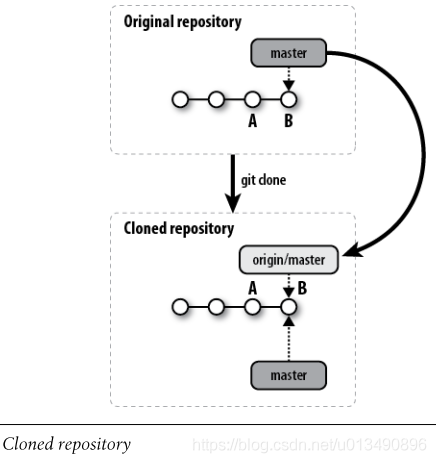 </div>

+ 克隆之后:
  + 原始版本库中的所有提交都复制到克隆版本库。
  + 克隆版本库中有一个名为 `origin/master`的远程追踪分支（remote-tracking branch），它指向原始版本库中` master` 指向的提交，也就是 B。
  + 克隆版本库中创建了一个新的本地追踪分支（local-tracking development branches），称为 `master` 分支。这个 `master` 分支指向 `origin/master` 指向的提交，也就是 B。
  + 克隆后，Git 会选择新的 `master` 分支作为当前分支，并自动检出它。因此，除非切换分支，否则克隆后所做的任何修改都会影响 `master` 分支。
  + 在图中，原始版本库和派生的克隆版本库中的开发分支都由深灰色作为背景色，而远程追踪分支则用浅灰色作为背景色。在 Git 的实现中，深灰色背景的分支属于 `refs/heads/` 命名空间，浅灰色背景的分支的属于`refs/remotes/`命名空间。
  + 在本地 `master`分支工作的时候，本地的 master 会向前移动，而`origin/master`是不可以移动的。正如下图所示，你的开发使 `master` 分支变长了：在提交 B 的基础上多出 2 个新的提交 —— X 和 Y。
<div align="center"> 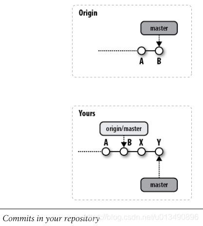 </div>

  + 在你开发期间，如果原始版本库没有任何变化，那么你可以很容易地把 X 和 Y 推送到上游：Git 会把你的提交传输到原始版本库，并把它们添加到 B 的后边，然后 Git 会把你的提交合并到原始版本库的 master 分支，实际上这是一种特殊的合并操作 —— 快进（fast-forward），快进本质上是一个简单的线性历史记录推进操作。
<div align="center"> 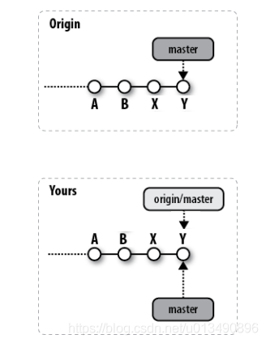 </div>

  + 正如前文所述，在推送（push）的过程中，本地仓库与远程仓库 `origin` 进行了“通信”， `origin/master` 分支会和远程仓库的 master 保持同步，所以，你的`origin/master` 分支也指向了 Y。

##### 4.5.3.1 冲突: 已经有人push更新了远程版本库
+ 在你开发期间，任何其他有权访问原始版本库的开发人员可能已经做了进一步开发，并把他的修改推送到该版本库。如下图：
<div align="center"> 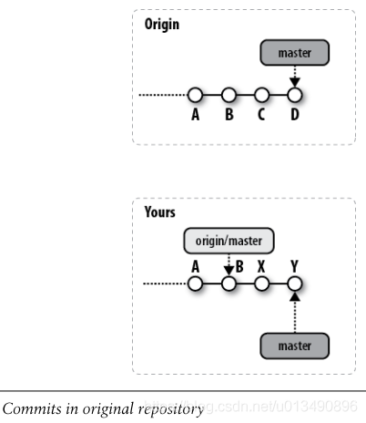 </div>

  + 在这种情况下，我们说版本库的历史记录在提交 B 处分叉（diverged 或 forked）了。当你尝试推送，Git 会拒绝它并用一条如下所示的消息告诉你有关的冲突。
```
 $ git push
    To /tmp/Depot/public_html
     ! [rejected]        master -> master (non-fast forward)
    error: failed to push some refs to '/tmp/Depot/public_html'
```

+ 必须注意: `git fetch` 命令仅仅是将数据拉取到你的本地仓库，它并不会自动合并或修改你当前的工作。当准备好时你必须手动合并。
+ 那么，什么是你真正想要做的？你想覆盖其他人员的工作，还是想要合并两组历史记录？
+ 如果你想覆盖所有其他变化，也是可以的。只要在你的 `git push` 中使用 `-f`选项即可。不过我建议你不要这么做，否则你的伙伴会恨你的……
+ 更多的时候，你不想覆盖别人的提交，你只是想添加你自己的修改。在这种情况下，你必须在推送之前在你的版本库中合并两组历史记录。这时候，就该 `fetch`大显身手了。

+ 要让 Git 合并两组历史记录，那么这两组历史记录必须存在于同一个版本库。现在你的 X 和 Y 提交本身就在你的版本库里，为了把 origin 中的 C 和 D 提交纳入你的版本库，你可以用 git fetch命令进行抓取。这个命令会访问远程仓库，从中拉取所有你还没有的数据，如下图：
<div align="center"> 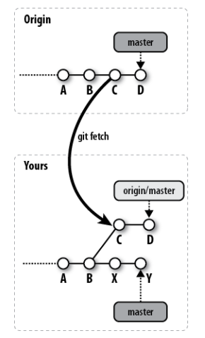 </div>
  
  + 注意，引入 C 和 D 这组历史记录并不能改变由 X 和 Y 代表的历史记录，所以你不用担心 `fetch` 操作会破坏你的劳动成果。`fetch` 后，这两组历史记录同时存在于你的版本库中，形成一幅比较复杂的图，简单来说就是在 B 处分叉了。你的历史记录由 `master` 分支代表，远程历史记录则由 `origin/master` 远程追踪分支代表。
+ 剩下的工作（`merge, push`）以后再说。
  
##### 4.5.3.2 git merge命令
+ 你不能把 `master` 分支合并到 `origin/master` 分支，因为 `origin/master` 是远程引用，远程引用是只读的。
+ 虽然可以 `git checkout` 到某个远程引用，但是 Git 并不会将 HEAD 引用指向该远程引用。因此，你永远不能通过 `commit` 命令来更新远程引用。Git 将这些远程引用作为记录远程服务器上各分支最后已知位置状态的书签来管理。
+ 我们要做的就是把 origin/master 分支合并到 master 分支:`git merge origin/master`;
<div align="center"> 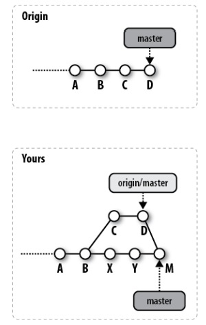 </div>

+ 假设合并过程很顺利，没有任何冲突，现在，你的版本库已经包含了 origin 版本库和你的版本库中的最新变更。但是反过来是不成立的：origin 版本库里依然没有你的变更。
+ 为了让其他人员共享你的变更，你可以用 git push 命令把合并后的历史记录从你的master 分支上推送回 origin 版本库。推送后如下图所示：
<div align="center"> 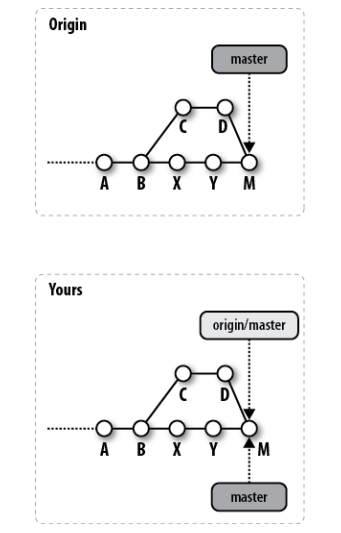 </div>

+ 最后，你可以看到 origin 版本库已经更新了你的开发，你的版本库和 origin 版本库已经完全更新并再次同步了。

### 4.6 本地分支和远程分支
+ `tree .git`:    显示本地git目录下的文件;
+ `git branch -r`:查看远程分支;
+ `git fetch`:同步远程分支`master`到本地`origin/master`分支(这是远程同步到本地的分支名称);
  + `cat .git/packed-refs`:查看本地压缩保存的远程分支`origin/master`的commit信息,不是实时更新的;
  + `cat .git/refs/heads/master`:查看本地分支`master`的commit信息;
  + `cat .git/refs/remotes/origin/master`:`git fetch`同步后查看本地分支`origin/master`已接收到远程最新的commit信息;
+ `git remmote`:远程仓库的名称;
+ `git remmote -v`:远程仓库的名称对应的url详细信息;
+ `git remmote show origin`:显示远程和本地分支及其对应关系;
+ `git remote prune`:


