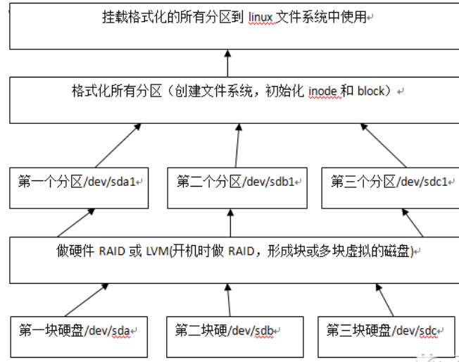

# Linux安装
+ 虚拟机安装
+ 双系统安装(较复杂,一般不考虑)
+ linux系统的详细使用方法参考`linux.md`.
## 一.虚拟机安装linux
+ 参考:[林子雨](http://dblab.xmu.edu.cn/blog/337-2/)
+ 林子雨老师的安装教程里相应软件版本老了,安装容易出问题,可下载最新版相关软件直接安装;
### 1.准备
+ 需要BIOS设置里开启CPU虚拟功能:`Virtualization Technology`设置为`Enabled`;

#### 1.1 下载Virtual Box及相应扩展和插件
+ Virtual Box:`https://www.virtualbox.org/wiki/Downloads`
+ 扩展:`Oracle VM VirtualBox Extension Pack`-->`All supported platforms`
+ 插件:`http://download.virtualbox.org/virtualbox/6.1.26/`
    + 下载`VBoxGuestAdditions_6.1.26.iso`:插件
    + 分辨率提升
    + 本地电脑和虚拟机电脑共享文件
    + 剪切板共享

#### 1.2 下载Ubuntu
+ 网址:`https://ubuntu.com/download/desktop`

### 2.安装
### 2.1 安装Virtual Box
+ 先直接运行安装Virtual Box程序;
+ `运行程序`>`管理`>`全局设定`>`扩展`:安装上面下载的扩展;
### 2.2 安装Ubuntu
+ `新建`进入新建虚拟机界面:
  + 设置内存大小:根据自己机器的内存设置相应大小;
  + 设置硬盘:默认设置即可,硬盘大小可以设置稍微大一些,50G;
+ 设置好虚拟机以后可以点`启动`运行虚拟机,然后再安装Ubuntu:
  + `存储`>`没有盘片`>`选择虚拟盘`:加载下载的Ubuntu安装镜像;
  + 安装过程中会出现界面显示不完全,可以按住`Alt`点击鼠标拖动界面;
  + 进入Ubuntu安装界面后,一路点击`继续`安装即可;
    + `安装类型`界面选择`其它选项`自行设定安装各分区:
    + `新建分区表`然后点`+`号新建分区;
    + `swap`分区:交换区,当linux内存不足时调用此空间,可以分4G;
  + 点`空闲`继续新建分区:
    + `/`分区:linux的根目录,相当于C盘,文件格式为ext4,可以稍微分大一点;
    + `/home`分区:Ubuntu的其他盘,可以把剩下的空间全分给它,也可以不建立该分区;
  + 接下来点击`现在安装`将Ubuntu安装到`/`分区;
### 2.3 分辨率
+ 虚拟机Ubuntu窗口模式分辨率一般很低,为了让虚拟机支持更大分辨率,要安装`VBoxGuestAdditions`插件:
  + 使用Virtual Box虚拟光驱加载上面下载的VBoxGuestAdditions镜像;
  + 然后在开启的Ubuntu虚拟机中点击`设备`>`安装增强功能`就可以安装上一步加载的插件镜像;

## 3.运行虚拟linux
+ `HOST`键即右侧`CTRL`;
+ `右Ctrl+F`:窗口与全屏模式切换;
+ `右Ctrl+C`:缩放模式,很小的窗口缩放后会比较模糊;
+ `win+space`:切换输入法,和windows不同;

## 二.双系统安装Linux
+ 非计算机相关专业不建议双系统安装linux：过程稍复杂，容易出问题.
+ 过程[参考](https://blog.csdn.net/codeHonghu/article/details/111940656)
+ 需要将BIOS中的`Secure Boot`设为`Disabled`.
### 1.准备
+ U盘一个
+ UltralSO软件
+ Ubuntu系统镜像
  
### 2.安装
+ 首先需要查看自己电脑BIOS启动模式:
  + `win+R`输入`msinfo32`回车后查看BIOS模式:
    + `MBR`模式:
    + `UEFI`模式:
+ 安装系统时需要根据以上两种模式和硬盘情况(一个还是两个硬盘)区别对待:
  + `MBR+单硬盘`
  + `MBR+双硬盘`
  + `UEFI+单硬盘`:
  + `UEFI+双硬盘`:
+ `磁盘管理`>`压缩卷`腾出空白分区安装Ubuntu;
+ 关闭win10的快速启动:`电源和睡眠`>`其他电源设置`>`选择电源按钮的功能`>取消勾选`启用快速启动`功能;
+ 安装过程中建议不要选择`与win共存`,而选`其它选项`自己调整安装分区;
  + `UEFI+双硬盘`模式

### 3.启动
+ grub设置

## 三.linux系统分区
+ 搞清楚linux分区对于安装系统有很大的帮助;

### 1.磁盘的体系结构
+ 第1,2,3块硬盘分别用:`/dev/sda`,`/dev/sdb`,`/dev/sdc`表示;
+ 企业级多块磁盘情况:

  

### 2.磁盘分区
+ 所有磁盘的分区信息都是存储在分区表中，Linux系统仅支持4个分区表信息（主分区+扩展分区），一个分区表的大小在64bytes;
+ Linux一般分为三个分区分别是：boot分区、swap分区、/根分区;
+ Linux的分区编号：主分区1-4，逻辑分区从5开始计算;
+ 实际生产环境分区要求:
  + 最少要有/和swap两个分区;
  + swap（虚拟内存）=1.5*物理内存大小，一般大小于或等于16G的物理内存的服务器，swap分区一般都直接设置为16G大小;
  + 建议设置/boot分区，Linux引导分区，如内核文件等，一般所有文件一共才几十M的大小，因此这个分区就设置为100-200M即可;
+ 具体分区