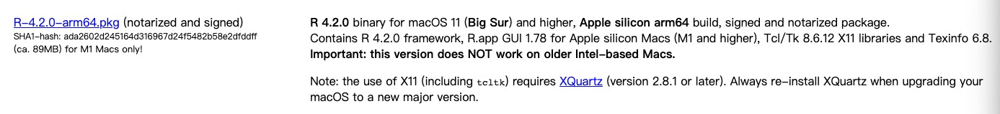
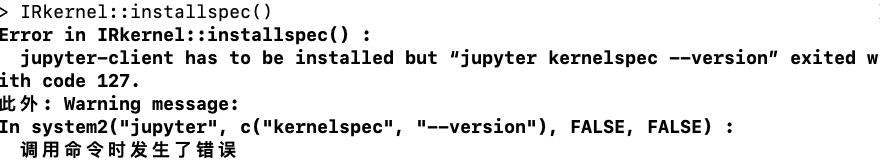

# m1芯片MAC中安装R以及R语言jupyter内核
## 一、下载
- [R语言CRAN](https://cran.r-project.org/)上找到最新的arm-64版本下载

- 不能使用conda安装R语言：可能conda库上的R还不支持arm芯片
- 安装后要安装[XQuartz](https://www.xquartz.org/index.html) :
  - `XQuartz` 就是 macOS 下的 X11，部分 Linux 程序安装时需使用到图形界面，可以选择这个[解决方案](https://www.wuweixin.com/2022/02/23/macos-install-and-using-xquartz/)。
  - 注意：使用 X11（包括 tcltk）需要 XQuartz（版本 2.8.1 或更高版本）。
  - 将 macOS 升级到新的主要版本时，请始终重新安装 XQuartz。
  - <div align="center">  </div>

- `install.packages('devtools')`:安装包失败，提示：`Library not loaded: /opt/local/lib/libSM.6.dylib`等，安装上面的`XQuartz`后即可解决

## 二、jupyter内核
- 运行以下三条命令，安装R语言jupyter内核：

```
install.packages('devtools')
devtools::install_github('IRkernel/IRkernel')
IRkernel::installspec()
```
- `IRkernel::installspec()`失败，提示
- <div align="center">  </div>
- 分析原因是：[借鉴](https://blog.csdn.net/kl28978113/article/details/89956020)
  - `jupyter`是`anaconda`环境下安装的，而`R`语言没有安装在`conda`环境下，`conda`环境下的`R`语言可能不支持`arm`芯片；
  - 所以要在`conda activate base`环境下，进入R终端：
    - 此时直接输入`R`是进不了终端的，因为`base`环境下没有`R`环境变量；
    - 进入`R`终端，输入`R.home()`查看`R`语言的安装路径，然后下面使用全路径进入`R`终端；
    - 需要运行`sudo /Library/Frameworks/R.framework/Resources/bin/R`才能进入`R`终端；
    - 再次运行`IRkernel::installspec()`不再有上图提示的错误；

## 三、快捷键
- when expression
`editorTextFocus && !findInputFocussed && !jupyter.ownsSelection && !notebookEditorFocused && !replaceInputFocussed && editorLangId == 'python'`
```
 {
        "key": "alt+=",
        "command": "type",
        "args": {
            "text":" -> "
        },
        "when": "editorTextFocus && editorLangId == 'r'|| editorTextFocus && editorLangId == 'rmd'"
    },
    {
        "key": "alt+-",
        "command": "type",
        "args": {
            "text":" <- "
        },
        "when": "editorTextFocus && editorLangId == 'r'|| editorTextFocus && editorLangId == 'rmd'"
    },
    {
        "key": "alt+r",
        "command": "type",
        "args": {
            "text":" |> " # "|>"符号：
        },
        "when": "editorTextFocus && editorLangId == 'r'|| editorTextFocus && editorLangId == 'rmd'"
    },
    {
        "key": "alt+m",
        "command": "type",
        "args": {
            "text":" %>% "
        },
        "when": "editorTextFocus && editorLangId == 'r'|| editorTextFocus && editorLangId == 'rmd'"
    },
```