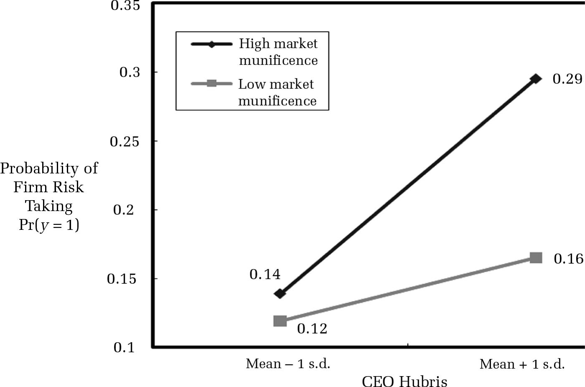

# Markdown-Learning

## 关于markdown
[各扩展版](https://www.dazhuanlan.com/2019/10/15/5da5890f8e1ba/?__cf_chl_jschl_tk__=7db1b13c02ee80e7580c0c8b1e099e75b8ccaa67-1584631049-0-ARD47ZxyE58wpjK1w4dT9-ySBYbIDWAm8fiZebui5W6-zaA38_FhTPIsYRWYM1DVRF6n9f5IE4a6NP01TKSqUnLXWO9hx0A08eHnu4XaqRA_TAVhYqanJhOZcHqydzHz1bikGwLdY68EUjTKHsV0nxHTvMvaBMT7jwu3AoRyKpZ2J-cqzX951Kt0JuU80lA52fk61PZ7HaKhmC2UehFh6WPW2xdE5sMph3Pinql2NLnYGL7T3sKv5B4_vzcW5EWc7FqgGAhztApSrt2N38k2d_u_oxRS5QHMFLI0VdwKGcL4jJ-6VK2GP6jqwapx62m7Sg "点击查看详情")
  + PHP Markdown Extra
  + Maruku
  + kramdown
  + RDiscount
  + Redcarpet
  + GFM Markdown
  + 其中atom默认使用GFM Markdown,即github flavored markdown;

## markdown的基本语法

## 一、基本符号

  `* - + >`
  > 基本上所有的md标记都是基于这几个符号

## 二、标题

`几个#代表几级标题`

## 三、列表

### 3.1 无序列表

+ a
  + g
  + h
  + i
+ b
+ c

`或者 -  * 也行，同一个文档无序列表使用一种符号`

### 3.2 有序列表

1. abc
2. bcd
3. cde
5. hbn

### 3.3 嵌套列表

+ a 无序列表下一级缩进两个空格
  + b
    + e
      + g
      + h
      + i
    + f
    + m
    + n
  + c
  + d

1. abc 有序列表下一级缩进四个空格或tab
    1. abc
    2. bcd
    3. cde
2. bcd
3. cde

## 四、引用说明区域

### 4.1 正常形式

> 引用的内容：是一个区块，放什么内容都可以，英文的尖括号；

### 4.2 嵌套区块

> 一级引用
>> 二级引用
>>> 三级引用
>>>> 四级引用
>>>>> 五级引用
>>>>>> 六级引用

## 五、代码块

### 5.1 少量代码

`单行使用，直接包裹起来就行了`

    代码块（左侧有八个不可见的空格）
    或者使用四个空格和tab键也可以表示代码块

### 5.2 大量代码

  ```python
  import os
  import pandas as pd
  ```

### 5.3 三个斜点

    ```python
    import pandas as pd
    ```
+ 和 下面的区别:
```python
import pandas as pd
```
+ 前面加tab就直接显示带\`的代码块了;

### 5.4 代码块的运行
+ 一是md中直接运行
  + 上面的代码块格式，借助hydrogen运行；
  + 使用快捷键`shift+center`；
  + Stata、R和Python均支持，与单独语言中Hydrogen运行类似。

+ 另一个是在preview的html格式中直接运行代码块：
  + Markdown Preview Enhanced 支持[渲染代码块](https://shd101wyy.github.io/markdown-preview-enhanced/#/zh-cn/code-chunk?id=latex "具体请点击")的运行结果；
  + 直接在html中运行代码块观察结果：
  ```python {cmd=true matplotlib=true}
  import matplotlib.pyplot as plt
  plt.plot([1,2,3, 4])
  plt.show() # show figure
  ```
  ```stata {cmd=true}
  sysuse auto,clear //暂时没支持stata代码块；
  reg price mpg
  ```
  ```latex {cmd=true}
  \documentclass{standalone}
  \begin{document}
     Hello world!
  \end{document}
  ```
+ .line-numbers显示代码行号
  ```latex {cmd=true,.line-numbers}
  \documentclass{standalone}
  \begin{document}
     Hello world!
  \end{document}
  ```

## 六、链接

### 6.1 行内式

链接的文字放在[]中，链接地址放在随后的()中，链接也可以带title属性，链接地址后面空一格，然后用引号引起来

[百度](https://www.baidu.com "百度一下，你就知道")

+ 链接地址后面空一格，跟提示性文字;
+ 链接不能加引号。

### 6.2 参数式

链接的文字放在[]中，链接地址放在随后的:后，链接地址后面空一格，然后用引号引起来

[简书]是一个创作社区,任何人均可以在其上进行创作。用户在简书上面可以方便的创作自己的作品,互相交流。

[简书]: <https://www.jianshu.com> "创作你的创作"

或者:

我经常去的几个网站[GitHub][1]、[知乎][2]以及[简书][3]
[简书][3]是一个不错的[写作社区][]。

[1]:https://github.com "GitHub"
[2]:https://www.zhihu.com "知乎"
[3]:http://www.jianshu.com "简书"
[写作社区]:http://www.jianshu.com

或者:
Markdown 支持以比较简短的自动链接形式来处理网址和电子邮件信箱，只要是用<>;包起来， Markdown 就会自动把它转成链接。一般网址的链接文字就和链接地址一样，例如：

<http://example.com/>
<address@example.com>

## 七、图片
+ ``
  + alt表示图片显示失败时替换的文本;
  + title表示鼠标悬停图片时显示的提示文本,注意要加引号.
  + 引用github内的图片直接使用相对路径就可以了

### 7.1 行内式

+ 和链接的形式差不多，图片的名字放在[]中，图片地址放在随后的()中，title属性（图片地址后面空一格，然后用引号引起来）,注意的是[]前要加上!


+ 可调节图片大小等：

### 7.2 引用式
+ 类似论文的参考文献,图片地址和title属性附在文中;
+ 图片的引用关键字放在[]中，图片的地址和title属性附在后面（图片地址后面空一格，然后用引号引起来）,注意引用图片的时候在[]前要加上!
+ 例如:
![my-logo.png]

+ 引用关键字的写法:

[my-logo.png]: https://upload-images.jianshu.io/upload_images/13623636-6d878e3d3ef63825.png?imageMogr2/auto-orient/strip%7CimageView2/2/w/1240 "my-logo"
```
//引用关键字的其他写法:
[my-logo.png]: https://upload-images.jianshu.io/upload_images/13623636-6d878e3d3ef63825.png?imageMogr2/auto-orient/strip%7CimageView2/2/w/1240 'my-logo'
[my-logo.png]: https://upload-images.jianshu.io/upload_images/13623636-6d878e3d3ef63825.png?imageMogr2/auto-orient/strip%7CimageView2/2/w/1240 (my-logo)
[my-logo.png]: <https://upload-images.jianshu.io/upload_images/13623636-6d878e3d3ef63825.png?imageMogr2/auto-orient/strip%7CimageView2/2/w/1240> "my-logo"
```

## 八、分割线

分割线可以由* - _（星号，减号，底线）这3个符号的至少3个符号表示，注意至少要3个，且不需要连续，有空格也可以

---
或者以下都可以，但是一篇文档统一使用一种分割线：


`- - -`
`  ------`
`  ***`
`  * * *`
`******`
`  ___`
`  _ _ _`
`______`


## 九、其它

### 9.1 强调字体

一个星号或者是一个下划线包起来，会转换为倾斜，如果是2个，会转换为加粗

*md*
**md**
_md_
__md__

### 9.2 转义

基本上和js转义一样,\加需要转义的字符

\\
\*
\+
\-
\`
\_

### 9.3 删除线

用~~把需要显示删除线的字符包裹起来

~~删除~~

## 十、表格

+ 格式一：

|123|234|345|
|:-|:-:|-:|
|abc|bcd|cde|
|abc|bcd|cde|
|abc|bcd|cde|

+ 格式二：

|123|234|345|
|:---|:---:|---:|
|abc|bcd|cde|
|abc|bcd|cde|
|abc|bcd|cde|

+ 格式三：

123|234|345
:-|:-:|-:
abc|bcd|cde
abc|bcd|cde
abc|bcd|cde

+ 表格事项：
  + 表格的格式不一定要对的非常齐，但是为了良好的编程风格，尽量对齐是最好的；
  + 分割线后面的冒号表示对齐方式，写在左边表示左对齐，右边为右对齐，两边都写表示居中。

## 十一、todo list

+ 近期任务安排:

+ [x] 整理Markdown手册
  + [ ] 改善项目
  + [x] 优化首页显示方式
  + [x] 修复闪退问题
+ [ ] 修复视频卡顿
  + [ ] A3项目修复
  + [x] 修复数值错误
+ 或者:
- [x] 整理Markdown手册
  - [ ] 改善项目
  - [x] 优化首页显示方式
  - [x] 修复闪退问题
- [ ] 修复视频卡顿
  - [ ] A3项目修复
  - [x] 修复数值错误

## 十二、Mermaid语法
+ [Mermaid](http://mermaid-js.github.io/mermaid/#/) 是一个用于画流程图、状态图、时序图、甘特图的库，使用 JS 进行本地渲染，广泛集成于许多 Markdown 编辑器中。
+ Markdown Preview Enhanced 内部支持 flow charts, sequence diagrams, mermaid, PlantUML, WaveDrom, GraphViz，Vega & Vega-lite，Ditaa 图像渲染。
+ 也可以通过使用 Code Chunk 来渲染 TikZ, Python Matplotlib, Plotly 等图像。
### 12.1 流程图
#### 12.1.1 方向、节点和连接线
+ 使用下面的代码块方式渲染：
    ```
      ```mermaid{code_block=true}
      graph TD;
        A-->B;
        %% Mermaid的渲染方式,code_block=true表示既显示代码又渲染图形，%%表示注释；
      ```
    ```
+ 流程方向：
  + TD、TB表示上下方向，BT下上，LR左右，RL右左；
  + 上下：
    ```mermaid{code_block=true}
    graph TD;
      A-->B;
    ```
  + 下上：
    ```mermaid{code_block=true}
    graph BT;
      A-->B;
    ```
  + 左右：
    ```mermaid{code_block=true}
    graph LR;
      A-->B;
    ```
  + 右左：
    ```mermaid{code_block=true}
    graph RL;
      A-->B;
    ```
+ 边框形状：
  + 通过`id#+括号`的方式定义边框形状,`#`表示使用数字编号进行区别；
      ```
        ```mermaid # []方框；()圆角框；([])椭圆框；[()]圆柱框；(())圆形框；
        graph LR
          id1[This is the text in the box]
          id2(This is the text in the box)
          id3([This is the text in the box])
          id4[(Database)]
          id5((This is the text in the circle))
        ```
      ```
  + 矩形框：
    ```mermaid{code_block=true}
    graph TB
      id1[This is the text in the box]
    ```
  + 圆角矩形框：
    ```
    graph TB
    id1(This is the text in the box)
    ```
    ```mermaid
    graph TB
    id1(This is the text in the box)
    ```
  + 椭圆框：
    ```
    graph TB
      id1([This is the text in the box])
    ```
    ```mermaid
    graph TB
      id1([This is the text in the box])
    ```
  + 圆柱框：
    ```
    graph TB
      id1[(the text)]
    ```
    ```mermaid
    graph TB
      id1[(the text)]
    ```
  + 圆形框：
    ```
    graph TB
      id1((the text))
    ```
    ```mermaid
    graph TB
      id1((the text))
    ```
  + 不对称框：
    ```
    graph TB
      id1>This is the text in the box]
    ```
    ```mermaid
    graph TB
      id1>This is the text in the box]
    ```
  + 菱形框：
    ```
    graph TB
      id1{This is the text}
    ```
    ```mermaid
    graph TB
      id1{This is the text}
    ```
  + 六边形框：
    ```
    graph TB
      id1{{This is the text}}
    ```
    ```mermaid
    graph TB
      id1{{This is the text}}
    ```
  + 平行四边形形框：
    ```
    graph TB
      id1[/This is the text/]
      id2[\This is the text\]
    ```
    ```mermaid
    graph TB
      id1[/This is the text/]
      id2[\This is the text\]
    ```
  + 梯形框：
    ```
    graph TB
      id1[/This is the text\]
      id2[\This is the text/]
    ```
    ```mermaid
    graph TB
      id1[/This is the text\]
      id2[\This is the text/]
    ```
+ 连接线：
  + 箭头：
    ```
    graph LR
      id1[/This is the text\]-->
      id2[\This is the text/]
    ```
    ```mermaid
    graph LR
      id1[/This is the text\]-->
      id2[\This is the text/]
    ```
  + 直线：
    ```
    graph LR
      A---B
    ```
    ```mermaid
    graph LR
      A---B
    ```
  + 线穿文字：
    ```
    graph LR #注意虚线数；
      A--This is the text---B
    ```
    ```mermaid
    graph LR
      A--This is the text---B
    ```
  + 或者:
    ```
    graph LR
      A---|This is the text|B
    ```
    ```mermaid
    graph LR
      A---|This is the text|B
    ```
  + 箭头穿文字:
    ```
    graph LR #注意虚线数；
      A-->|This is the text|B
    ```
    ```mermaid
    graph LR
      A-->|This is the text|B
    ```
  + 或者:
    ```
    graph LR
      A--This is the text-->B
    ```
    ```mermaid
    graph LR
      A--This is the text-->B
    ```
  + 虚线箭头:
    ```
    graph LR #注意虚线数；
      A-.->B
    ```
    ```mermaid
    graph LR
      A-.->B
    ```
  + 虚线箭头穿文字:
    ```
    graph LR
      A-.text.->B
    ```
    ```mermaid
    graph LR
      A-.text.->B
    ```
  + 粗箭头:
    ```
    graph LR
      A==>B
    ```
    ```mermaid
    graph LR
      A==>B
    ```
  + 粗箭头穿文字:
    ```
    graph LR
      A==text==>B
    ```
    ```mermaid
    graph LR
      A==text==>B
    ```
  + 串联:
    ```
    graph LR
      A--text-->B--text-->C
    ```
    ```mermaid
    graph LR
      A--text-->B--text-->C
    ```
  + 并联:
    ```
    graph LR
      A-->B & C-->D
    ```
    ```mermaid
    graph LR
      A-->B & C-->D
    ```
  + 交叉:
    ```
    graph TB
      A & B-->C & D
    ```
    ```mermaid
    graph TB
      A & B-->C & D
    ```
  + 或者:
    ```
    graph TB
      A-->C
      A-->D
      B-->C
      B-->D
    ```
    ```mermaid
    graph TB
      A-->C
      A-->D
      B-->C
      B-->D
    ```
  + 带特殊符号的文档:
    ```
    graph TB # 如果使用括号，外围需要加双引号；
      id1["This is the (text) in the box"]
    ```
    ```mermaid
    graph TB
      id1["This is the (text) in the box"]
    ```
  + 转义字符的实体代码:
    ```
    graph LR # 用作转义字符的实体代码；
      A["A double quote:#quot;"] -->B["A dec char:#9829;"]
      C["#9832;"]-->D["#9832;"]
      E["#9830;"]-->F["#9830;"]
    ```
    ```mermaid
    graph LR
      A["A double quote:#quot;"] -->B["A dec char:#9829;"]
      C["#9831;"]-->D["#9832;"]
      E["#9833;"]-->F["#9834;"]
    ```
  + 子图：
    ```
    subgraph title
      graph definition
    end
    ```
    ```mermaid
    graph TB
      c1-->a2
      subgraph one
      a1-->a2
      end
      subgraph two
      b1-->b2
      end
      subgraph three
      c1-->c2
      end
    ```
  + 超链接：
    ```
    graph LR;
      A-->B;
      click A callback "Tooltip for a callback"
      click B "http://www.github.com" "This is a tooltip for a link"
    ```
    ```mermaid
    graph LR;
      A-->B;
      click A callback "Tooltip for a callback"
      click B "http://www.github.com" "This is a tooltip for a link"
    ```
  + 注释：
    ```
    graph LR; #注释语句使用双百分号%%
      %% this is a comment A -- text --> B{node}
        A -- text --> B -- text2 --> C
    ```
    ```mermaid
    graph LR;
    %% this is a comment A -- text --> B{node}
      A -- text --> B -- text2 --> C
    ```
  + 注释：
    ```
    graph LR; #注释语句使用双百分号%%
      %% this is a comment A -- text --> B{node}
        A -- text --> B -- text2 --> C
    ```
    ```mermaid
    graph LR;
    %% this is a comment A -- text --> B{node}
      A -- text --> B -- text2 --> C
    ```
#### 12.1.2 样式和类
+ 连接样式
  ```
  graph LR;
    A-->C
    B-->C
    A-->D
    B-->D
    linkStyle 0 stroke:#ff3,stroke-width:4px,color:red;
    linkStyle 3 stroke:#ff3,stroke-width:4px,color:red;
    %%重新定义了连接线的样式，0表示第1个连接线；
  ```
  ```mermaid
  graph LR;
    A-->C
    B-->C
    C-->D
    D-->E
    linkStyle 0 stroke:#ff3,stroke-width:4px,color:red;
    linkStyle 3 stroke:#ff3,stroke-width:4px,color:red;
  ```
+ 节点样式
  ```
  graph LR
    id1(start)-->id2(stop)
    style id1 fill:#f9f,stroke:#333,strocke-width:4px
    style id2 fill:#bbf,stroke:#f66,strocke-width:2px,color:#fff,stroke-dasharray:5.5
    %% fill填充，stroke边框，stroke-width边框线宽，stroke-dasharray边框虚线；
  ```
  ```mermaid
  graph LR
    id1(start)-->id2(stop)
    style id1 fill:#f9f,stroke:#333,strocke-width:4px
    style id2 fill:#bbf,stroke:#f66,strocke-width:2px,color:#fff,stroke-dasharray:5.5
  ```
+ 类
  + 每次定义样式麻烦，可以事先将设置好的样式定义为类，后面可以直接引用类来改变样式；
  + 定义类的代码格式：
  `classDef classname fill:#f9f,stroke:#333,stroke-width:4px`
  + 定义一个节点样式：
  `class nodeid1 classname`
  + 将多个节点定义为一个样式：
  `class nodeid1,nodeid2 classname`
  + 三个冒号的简洁引用类的方式`:::`
    ```mermaid{code_block=true}
    graph LR
      A:::class1 -->B
      classDef class1 fill:#f96
      %%三个冒号的简洁引用下面定义的class1样式；
    ```
+ Css classes
  + 可以事先定义css样式，然后引用：
    ```
    <style>
      .cssClass > rect{
          fill:#FF0000;
          stroke:#FFFF00;
          stroke-width:4px;
        }
    </style>
    ```
    ```mermaid{code_block=true}
    graph LR;
      A-->B[AAA<span>BBB</span>];
      B-->D;
      class A cssClass;
    ```
+ 默认类
  + 指在未定义类的情况下，默认类会被指派给所有类；
  + 语法：
  `classDef default fill:#f9f,stroke:#333,stroke-width:4px`

+ 支持[fontawesome类图标](http://www.fontawesome.com.cn/faicons/#new)
  + 类似于emoji表情的图标库；
    ```mermaid{code_block=true}
    graph TD
      B["fa:fa-twitter for peace"]
      B-->C[fa:fa-ban forbidden]
      B-->D(fa:fa-spinner);
      B-->E(A fa:fa-camera-retro perhaps?);
    ```

+ 图形语法的新申明
  + 不适用分号，直接使用空格分割；
    ```mermaid{code_block=true}
    graph LR
        A[Hard edge] -->|Link text| B(Round edge)
        B --> C{Decision}
        C -->|One| D[Result one]
        C -->|Two| E[Result two]
    ```
### 12.2 时序图
+ 展示了参与人相互交互的序列及过程；
#### 12.2.1 Participants
+ 参与人：
  ```mermaid{code_block=true}
  sequenceDiagram
    Alice->>John:Hello John,how are you?
    John-->>Alice:Great!
  ```
+ 或者：
  ```mermaid{code_block=true}
  sequenceDiagram
    participant John
    participant Alice
    Alice->>John: Hello John, how are you?
    John-->>Alice: Great!
  ```
+ 或者：
  ```mermaid{code_block=true}
  sequenceDiagram
    participant J as John
    participant A as Alice
    A->>J: Hello John, how are you?
    J-->>A: Great!
  ```
+ 信息：
  + 参与人之间的交流，语法：
  `[Actor][Arrow][Actor]:Message text`
  + 六种连线：

    | 类型 | 描述 |
    | :---------| :---------|
    |  `->`  | 无箭头实线  |
    |  `-->`  | 无箭头虚线  |
    |  `->>`  |  有箭头实线 |
    |  `-->>`  | 有箭头虚线  |
    |  `-x`  | 有叉实线  |
    |  `--x`  | 有叉虚线  |

## 十三、其他几种图语法
### 13.1 sequence语法
```sequence{theme="simple",code_block=true}
participant 客户端 as A
participant 服务端 as B
participant 通行证中心 as C
Note over A:用户输入通行证账号、密码
A->C: 发送账号、密码
Note over C:验证账号、密码
C-->>A:返回token
A->B:发送token
B->C:验证token
C-->>B:验证成功
B-->>A:登陆成功
Note left of A:左边注释
B->B:自交互
Note right of C:右边注释
```

### 13.2 flow语法

```flow{code_block=true}
st=>start: 开始
io=>inputoutput: 验证
op=>operation: 选项
cond=>condition: 是 或 否？
sub=>subroutine: 子程序
e=>end: 结束

st->io->op->cond
cond(yes)->e
cond(no)->sub->io
```

### 13.3 PlantUML语法
### 13.4 WaveDrom语法
### 13.5 GraphViz语法
### 13.6 Vega和Vage-lite语法
### 13.7 Ditaa语法

## 十四、字体格式等设值:
+ 字体：
<font face="黑体">我是黑体字</font>
<font face="宋体">我是宋体字</font>
<font face="微软雅黑">我是微软雅黑字</font>
<font face="fantasy">我是fantasy字</font>
<font face="Helvetica">我是Helvetica字</font>
+ 大小：
size为1：<font size="1">size为1</font><br />
size为2：<font size="2">size为2</font><br />
size为3：<font size="3">size为3</font><br />
size为4：<font size="4">size为4</font><br />
size为10：<font size="10">size为10</font><br />
+ 颜色：
  * 标签方法：
浅红色文字：<font color="#dd0000">浅红色文字：</font><br />
深红色文字：<font color="#660000">深红色文字</font><br />
浅绿色文字：<font color="#00dd00">浅绿色文字</font><br />
深绿色文字：<font color="#006600">深绿色文字</font><br />
浅蓝色文字：<font color="#0000dd">浅蓝色文字</font><br />
深蓝色文字：<font color="#000066">深蓝色文字</font><br />
浅黄色文字：<font color="#dddd00">浅黄色文字</font><br />
深黄色文字：<font color="#666600">深黄色文字</font><br />
浅青色文字：<font color="#00dddd">浅青色文字</font><br />
深青色文字：<font color="#006666">深青色文字</font><br />
浅紫色文字：<font color="#dd00dd">浅紫色文字</font><br />
深紫色文字：<font color="#660066">深紫色文字</font><br />
  * latex公式：
    - 语法：`$\color{颜色}{文字}$`
    - $\color{red}{红色}$
    - $\color{blue}{蓝色}$
    - $\color{lime}{绿色}$
    - $\color{#F00}{红色}$
    - $\color{#00F}{蓝色}$
    - $\color{#0F0}{绿色}$
+ 居中：
  + 由于markdown 定义全支持html标记，所以你可以直接在markdown里面写html语法。
  + `<center>居中标题</center>`有如下效果:
  <center>居中标题</center>

+ 文字高亮:
  + 一对儿反引号,也可以用作网站的tag标签;

+ 换行:
  + 直接回车不能换行;
  + 在上一行文本后面补两个空格;
  + 或者两行文本中间加一个空行,这个行距有点大;

+ 斜体、粗体、删除线：
  + *斜体1*  _斜体2_
  + **粗体1** __粗体2__
  + 这是一个~~删除线~~
  + ***斜粗体*** 混合使用;
  + ___斜粗体___
  + ***~~斜粗体加删除线~~***  混合使用;
  + ~~***斜粗体加删除线***~~

### 14.2 更改字体颜色

## 十五、emoji表情
+ 最早由栗田穰崇（Shigetaka Kurita）创作，并在日本网络及手机用户中流行;
+ 自苹果公司发布的iOS 5输入法中加入了emoji后，这种表情符号开始席卷全球，emoji已被大多数现代计算机系统所兼容的Unicode编码采纳，普遍应用于各种手机短信和社交网络中。
+ 常用[emoji表情](https://gist.github.com/rxaviers/7360908#file-gistfile1-md "详情请点击")及格式：
`:smile:`:smile:
`:bird:`:bird:
`:cow:`:cow:
`:kiss:`:kiss:
`:pig:`:pig:
`:dog:`:dog:
`:cry:`:cry:
`:angry:`:angry:
`:sleepy:`:sleepy:
`:mask:`:mask:
`:feet:`:feet:

## 十六、LaTeX语法
### 16.1 行间公式和行内公式
+ `markdown-preview-enhanced`中设置`MathJax`渲染;
+ `Markdown Preview Enhanced: Open Mathjax config`打开`MathJax`设置；
+ [KaTeX](https://katex.org/)和 [MathJax](https://www.mathjax.org/#docs)：
  + 二者都是latex数学公式解析器，支持不同的公式环境以及性能不同；
  + KaTeX 拥有比 MathJax 更快的性能，但是它却少了很多MathJax拥有的特性；
  + KaTeX不支持`split`环境,而MathJax支持等。
#### 16.1.1 行内公式
+ 行内公式`$e = mc^2$`即:$e = mc^2$ ;
+ 行内公式`\(e= mc^2\)`即:\(e= mc^2\) ;
#### 16.1.2 行间公式
+ 一种方法：
    ```
    $$
    2x+3y=5
    $$
    ```
$$
2x+3y = 4
$$
+ 另一种方法:
  ```
  \[
  2x+3y=5
  \]
  ```
\[
2x+3y=5
\]

### 16.2 多行公式,公式组,分段函数,公式自动编号
#### 16.2.1 多行公式
+ `multline`环境：
  ```\[
  \begin{multline}
  x = a+b+c+{}
    e+f+{}
      g+h
  \end{multline}
  \] # multline多行公式,不对齐,此处不可使用&,否则变成表格;
  ```

\[
\begin{multline}
x = a+b+c+{} \\
  e+f+{} \\
    g+h
\end{multline}
\]
+ `split`环境：
  ```\[
  \begin{split}
  x = a+b+c+{}
    e+f+{}
      h+i
  \end{split}
  \] # \\表示换行,split公式居中右对齐,要想以等号对齐可使用&符号;
  ```
\[
\begin{align}
x = a+b+c+{} \\
  e+f+{} \\
    h+i
\end{align}
\]

#### 16.2.2 公式组
+ `gather`环境：
  + `gather`表示不需对齐的公式组,对齐用`aligned`;
  + `gather`可以借助`\label{EQ_1}`对单个方程进行编号;
  ```
  \[
  \begin{gather}
  2x+3y=4 \\
  3x+4y+z=7
  \end{gather}
  \]
  ```

\[
\begin{gather}
2x+3y=4 \\
3x+4y+z=7
\end{gather}
\]
+ `aligned`环境：
  ```
  \[
  \begin{aligned}
  2x+3y=4 \\
  3x+4y+z=7
  \end{aligned}
  \]
  ```
\[
\begin{aligned}
2x+3y=4 \\
3x+4y+z=7
\end{aligned}
\]
#### 16.2.3 分段函数
+ 使用`cases`次环境实现分段函数
  ```
  \[
  y=\begin{cases}
  -x+1,&当\quad x \leq 0; \\
  x^2+1,&当\quad x >0.
  \end{cases}
  \]
  ```
\[
y=\begin{cases}
-x+1,&当\quad x \leq 0; \\
x^2+1,&当\quad x >0.
\end{cases}
\]

+ `equation`实现自动编号:
  ```
  \[
  \begin{equation}
  a^2+b^2=c^2
  \end{equation}
  \] # 自动编号要在preview设置中开启;
  ```
\[
\begin{equation}
a^2+b^2=c^2
\end{equation}
\]

+ 借助`equation`环境实现自动编号:
  ```
  \[
  \begin{equation}
  s(r_k)=\sum_{r_k \ne r_i} \text{exp}(\frac{-D_s(r_k,r_i)}{\sigma_s^2})
  \end{equation}
  \]
  ```
\[
\begin{equation}
s(r_k)=\sum_{r_k \ne r_i} \text{exp}(\frac{-D_s(r_k,r_i)}{\sigma_s^2})
\end{equation}
\]

+ 手动借助`\tag`为公式编号:
  ```
  \[
  \tag{1.1.1}
  \sigma^2=\frac{1}{n-1}\sum_{i=1}^{n}(x_i-\overline{x})^2
  \]
  ```
\[
\tag{1.1.1}
\sigma^2=\frac{1}{n-1}\sum_{i=1}^{n}(x_i-\overline{x})^2
\]

+ 总结:`multline`,`gather`和`equation`不对齐的环境会自动编号;
+ 而`split`,`aligned`和`cases`对齐的环境不会进入自动编号;
+ `equation`环境会自动对公式编号，可以和其它环境嵌套使用
  * 环境中加入`\nonumber`表示停止自动编号；
  * 使用`\tag{2.3.1}`表示手动编号；
  * `\\`或者`\\\\`用来换行,`\\\\`换行后会加入空行来增加行距；
  * 不可直接使用`&`控制对齐，需要嵌套`cases`和`split`环境再使用`&`对齐；
+ `cases`左侧带大括号的分段函数，使用`&`来控制对齐；
+ `split`多行公式，使用`&`控制对齐；

### 16.2 运算符号
| 代码  | 显示  |
|---|---|
| `\leq`  | $\leq$  |
| `\leqslant`  | $\leqslant$ |
| `\geq`  | $\geq$ |
| `\geqslant`  | $\geqslant$ |
| ``  | $$ |
| ``  | $$ |


## 十七、Atom中Markdown相关插件
### 17.1 初期使用的几个插件
+ markdown-toc插件:md文档生成目录插件;
+ markdown-themeable-pdf插件
  + 比markdown-pdf好用,格式较丰富,但是不能转latex代码,如果想转换latex代码,可以使用下面的markdown-preview-plus插件的`save as to pdf`功能;
  + 单单是将markdown格式转换，功能较单一（放弃）。

+ markdown-preview-plus插件
  + 比atom自带的markdown-preview好用,可以转换为多种格式，但是不支持流程图（放弃）；
  + 可以通过另存为pdf格式，转换为pdf格式，且latex正常。
+ 建议使用下面的`markdown-preview-plus`插件：
  + 经过使用对比，以上三个插件功能均不完善；
  + 这三个插件的功能`markdown-preview-plus`都可以实现。

### 17.2 [markdown-preview-enhanced](https://shd101wyy.github.io/markdown-preview-enhanced/#/zh-cn/ "用户文档")插件　　
#### 17.2.1 可以修改markdown样式
+ markdown显示的格式取决于预览md文件格式的插件，例如此处的markdown-preview-enhanced插件；
+ `ctrl+shift+p`然后运行`Markdown Preview Enhanced:Customize Css`打开`style.less`样式文件；
+ `style.less`文件位于`~/.mume/style.less`；
+ 通过编辑`style.less`来修改markdown样式：
    ```
    .markdown-preview.markdown-preview {
      // 在这里编写你的样式
      // 例如：
      //  color: blue;          // 改变字体颜色；
      //  font-size: 14px;      // 改变字体大小；
      //  font-family:SimSun    // 预览字体设置为宋体；
      // 自定义 pdf 导出样式
      @media print {
      }

      // 自定义 prince pdf 导出样式
      &.prince {
      }

      // 自定义 presentation 样式
      .reveal .slides {
        // 修改所有幻灯片
      }

      // 自定义 presentation 样式
      .slides > section:nth-child(1) {
        // 修改 `第 1 个幻灯片`
      }
    }

    .md-sidebar-toc.md-sidebar-toc {
      // 边栏目录样式
    }
    ```

#### 17.2.2 支持`front-matter`自定义
+ `front-matter`是文件最上方以`---`隔开的区域，用于指定个别文件的变量，例如：
  ```
  ---
  title: Hello World
  date: 2013/7/13 20:46:25
  ---
  ```
+ 常用参数：

  | 参数 | 描述 | 默认值 |
  | :----| :----| :----|
  | `layout`| 布局   |  |
  | `title`| 标题 | 文章的文件名 |
  | `date`| 建立日期 | 文件建立日期 |
  | `updated`| 更新日期 | 文件更新日期 |
  | `comments`| 开启文章评论功能 | true |
  | `tags`| 文章标签 |  |

+ Presentation和Beamer等样式需要首先在这里设置，例如：
  ```
  ---
  presentation:
    width: 800
    height: 600
  ---
  ```
+ puppeteer转pdf等格式也通过此处设置参数：
  ```
  ---
  puppeteer:
    landscape: true
    format: "A4"
    timeout: 3000 # <= 特殊设置，意味着等待（waitFor） 3000 毫秒
  ---
  ```

#### 17.2.3 支持流程图
+ 流程图可以渲染[`mermaid`](http://mermaid-js.github.io/mermaid/#/flowchart "详细用法")语法；
+

#### 17.2.4 代码块渲染
+ 支持多种语言代码块，preview中可以直接渲染代码块运行结果：
  + 不支持stata代码块；
  + 支持python，latex；
  + latex渲染需要安装pdf2svg,下载安装包，配置环境变量；
+ 或者在markdown中直接使用Hydrogen运行代码块；
#### 17.2.5 目录
+ 侧边目录：
  + 转换为html格式时，侧边栏目录通过`Enable Script Excution`开启；
  + html格式，带侧边目录导航，阅读体验较好。
+ 文前目录：
  + `ctrl+shift+p`然后运行`Markdown Preview Enhanced:Create TOC`添加目录；

#### 17.2.6 导出文档
+ 导出为`html`格式
  + 默认KaTeX解析的latex公式，和MathJax不同，将数学公式解析工具设置为MathJax；
  + 使用`Open in Browser`或者`HTML`导出为`html`格式；
+ 导出为`PDF`格式
  + 导出pdf有多种方式
  + 方法一、通过html格式下使用浏览器打印功能保存为pdf格式的方式；
  + 方法二、puppeteer也可以直接保存pdf格式：
      + puppeteer和puppeteer-core的区别：
        + 安装puppeteer时会默认自动下载chromium；
        + 而puppeteer-core不会自动下载chromium，而是使用当前chromium环境；
      + 安装pupperteer：`npm install -g pupperteer`，但是latex公式没有得到渲染；
      + 设置了`Purreteer waitFor Timeout = 3000`以后，latex也得到了完整渲染；
      + 也可以通过`front-matter`进行输出设置：
        ```
        ---
        puppeteer:
          landscape: true
          format: "A4" # A4纸较小，会使得字体很小；
          timeout: 3000 # <= 特殊设置，意味着等待（waitFor）3000 毫秒
        export_on_save: #保存时自动导出；
          puppeteer: true # 保存文件时导出 PDF
          puppeteer: ["pdf", "png"] #保存文件时导出 PDF 和 PNG
          puppeteer: ["png"] # 保存文件时导出 PNG
        ---
        ```
  + 方法三、`PDF(prince)`选项导出为pdf格式：
    + 不能渲染latex公式（KaTeX和MathJax无法工作），并且还需要安装`princexml`环境（不推荐）。

  + 方法四、`pandoc`方法：
    + 此方法导出PDF格式也存在一些问题（不推荐）。

#### 17.2.7 使用对比
+ 此插件较好功能完善，可以替代上面的三个插件，功能完善（推荐）：
