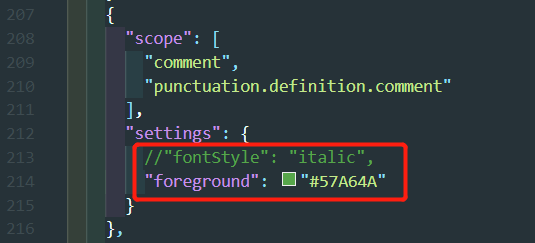
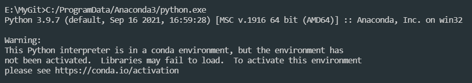
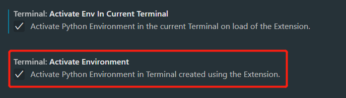

# VsCode的使用

## 1、Markdown插件的配置
### 1.1 经过使用比较以下两个插件配合使用：
+ markdown all in one
+ 编辑器里的语法和便捷设置较好，例如换行自动添加"+"号;
+ 但是不支持数学公式渲染；
+ markdown preview enhanced
+ 各类markdown插件中功能最全的插件，支持：
    + 数学公式渲染；
    + `mermaid`流程图；
    + `emoji`表情;
    + ...

### 1.2 markdown preview enhanced插件
+ 设置
+ 数学公式
  + 公式不能自动编号，需要单独设置，并且存在问题，建议使用`\tag{num}`的方法进行编号；

## 二、Python插件的配置
### 2.1 修改注释字体颜色
+ 插件代码中修改代码:
+ 重装插件后会被覆盖,设置就没有了;
  + `C:\Users\Administrator\.vscode\extensions\tobiasalthoff.atom-material-theme-1.10.8\themes` 打开`Atom Material Theme-color-theme.json`:

<div align="center">  </div>

+ 也可以在`vscode`设置中设置:
    ```
    "workbench.colorTheme": "Atom Material Theme",
    "editor.tokenColorCustomizations": { //设置注释字体为非斜体和绿色；
        "comments": {
            "fontStyle": "",
            "foreground": "#0dbc79",     //从插件内部设置也可以，但是无法同步，此处作为vscode的设置，可同步；
        },
    },
    ``` 

### 2.2 不激活环境，警告信息

<div align="center">  </div>

+ 设置如下消除警告信息:
<div align="center">  </div>

## 三、R语言插件的配置,[Wiki安装介绍](https://github.com/REditorSupport/vscode-R/wiki/Installation:-Windows)
+ 1.在系统上安装`R（>= 3.4.0）`。对于`Windows`用户，建议在安装中将`R Path`写入注册表。
+ 2.在 `R` 中安装语言服务器。`install.packages("languageserver")`
+ 3.安装 `Visual Studio Code` 的 [vscode-R](https://github.com/REditorSupport/vscode-R) 扩展。
+ 4.创建一个 R 文件并开始编码。
#### 3.1 另外建议使用以下软件或扩展来增强在 `VS Code` 中使用 R 的体验：
+ [radian](https://github.com/randy3k/radian)：一个现代的R控制台，纠正了官方R终端的许多限制，并支持许多功能，如语法突出显示和自动完成。
  + 但是我不喜欢用，不好用，设置太麻烦；
  + `conda install -c conda-forge radian`
  + `where.exe radian`
  + `conda install -c conda-forge jedi`:代码提示
  + `vs code`中设置:
    ```
    {
    "r.bracketedPaste": true, #不使用radian时不要设置，否则会出错，会在运行命令前后加`～`
    "r.rterm.windows": "C:\\ProgramData\\Anaconda3\\envs\\geo\\Scripts\\radian.exe"
    //这里注意设置的是rterm的路径,而不是rpath;
    }
    ```
+ [VSCode-R-Debugger](https://github.com/ManuelHentschel/VSCode-R-Debugger)：用于支持 `R` 调试功能的 `VS Code` 扩展,可以查看环境、变量等。
+ [httpgd](https://github.com/nx10/httpgd)：一个 R 包，用于提供通过 HTTP 和 WebSockets 异步提供 SVG 图形的图形设备。
  + `r.plot.useHttpgd`设置为`True`;
#### 3.2 `vscode-R`的功能
+ R、R Markdown 和 R 文档的扩展语法突出显示。
+ R 和 R 标记的代码段。
+ [R 语言服务](https://github.com/REditorSupport/vscode-R/wiki/R-Language-Service)：代码完成、功能签名、符号突出显示、文档大纲、格式、定义、诊断、引用等。
+ [与 R 终端交互](https://github.com/REditorSupport/vscode-R/wiki/Interacting-with-R-terminals)：向终端发送代码、运行多个终端、使用远程服务器。
+ [包开发](https://github.com/REditorSupport/vscode-R/wiki/Package-development)：从 devtools 生成、测试、安装、加载所有命令和其他命令。
+ [键盘快捷键](https://github.com/REditorSupport/vscode-R/wiki/Keyboard-shortcuts)：内置且可自定义的键盘快捷键。
+ [工作区查看器](https://github.com/REditorSupport/vscode-R/wiki/Sidebar-user-interface#workspace-viewer)：环境窗格，用于显示附加的 R 会话中的全局变量。
+ [帮助页面查看器](https://github.com/REditorSupport/vscode-R/wiki/Sidebar-user-interface#help-pages-viewer)：查看 R 帮助页面和搜索帮助主题。
+ [包管理](https://github.com/REditorSupport/vscode-R/wiki/Sidebar-user-interface#package-management)：安装和删除 R 包。
+ 会话符号悬停并完成。
+ [数据查看器](https://github.com/REditorSupport/vscode-R/wiki/Interactive-viewers#data-viewer)：在树视图中查看网格或列表结构中查看或查看。data.framematrix
+ [绘图查看器](https://github.com/REditorSupport/vscode-R/wiki/Plot-viewer)：基于 httpgd 的 PNG 文件查看器和 SVG 绘图查看器。
+ [网页查看器](https://github.com/REditorSupport/vscode-R/wiki/Interactive-viewers#webpage-viewer)：查看 html 字幕，如交互式图形和可视分析结果。
+ [浏览器查看器](https://github.com/REditorSupport/vscode-R/wiki/Interactive-viewers#browser-viewer)：查看交互式闪亮应用。
+ [R Markdown 支持](https://github.com/REditorSupport/vscode-R/wiki/R-Markdown)：R Markdown 块突出显示、块导航、执行命令和预览。
+ RStudio 外接程序支持：使用实时 R 会话在 VS Code 中运行受支持的 RStudio 外接程序。
+ 通过 SSH、容器和 WSL 全面支持远程开发。
+ 实时共享协作：R 对编程中的共享工作区、终端和查看器。

## 四、Latex插件配置
+ 安装latex workshop插件：
+ `latex workshop`插件设置：安装插件以后只需将以下设置复制到settings.json中；
```json
    "latex-workshop.latex.autoClean.run": "onBuilt",      //编译后自动清理；
    "latex-workshop.latex.recipe.default": "lastUsed",    //使用上一次的工具编译；
    "latex-workshop.showContextMenu":true,                //右键菜单；
    "latex-workshop.intellisense.package.enabled": true,  //根据加载的包，自动完成命令或包；
    "latex-workshop.latex.autoBuild.run": "never",        //禁止保存文件时自动build； 
    "latex-workshop.view.pdf.viewer":"tab",               //pdf文件的预览方式；
    "latex-workshop.message.error.show": false,           //关闭编译错误提醒气泡；
    "latex-workshop.message.warning.show": false,         //关闭编译错误提醒气泡；
    "latex-workshop.latex.recipes": [                     //设置编译工具；
        {
            "name": "xelatex",
            "tools": [
                "xelatex"
            ],
        },
        {
            "name": "pdflatex",
            "tools": [
                "pdflatex"
            ]
        },
        {
            "name": "xelatex->biblatex->xelatex->xelatex",
            "tools": [
                "xelatex",
                "bibtex",
                "xelatex",
                "xelatex"
            ]
        },
        {
            "name": "pdflatex->biblatex->pdflatex->pdflatex",
            "tools": [
                "pdflatex",
                "bibtex",
                "pdflatex",
                "pdflatex"
            ]
        }
    ],
    "latex-workshop.latex.tools":[                        //设置编译工具参数；
        {  
            "name": "latexmk",  
            "command": "latexmk",  
            "args": [  
                "-synctex=1",  
                "-interaction=nonstopmode",  
                "-file-line-error",  
                "-pdf",  
                "-outdir=%OUTDIR%",  
                "%DOC%"  
            ],  
            "env": {}  
            },  
            {  
            "name": "pdflatex",  
            "command": "pdflatex",  
            "args": [  
                "-synctex=1",  
                "-interaction=nonstopmode",  
                "-file-line-error",  
                "%DOC%"  
            ],  
            "env": {}  
            },  
            {  
            "name": "xelatex",  
            "command": "xelatex",  
            "args": [  
                "-synctex=1",  
                "-interaction=nonstopmode",  
                "-file-line-error",  
                "%DOC%"  
            ],  
            "env": {}  
            },  
            {  
            "name": "bibtex",  
            "command": "bibtex",  
            "args": [  
                "%DOCFILE%"  
            ],  
            "env": {}  
            }  
        ],  
    "latex-workshop.latex.clean.fileTypes": [             //设定清理文件的类型  
        "*.aux",  
        "*.bbl",  
        "*.blg",  
        "*.idx",  
        "*.ind",  
        "*.lof",  
        "*.lot",  
        "*.out",  
        "*.toc",  
        "*.acn",  
        "*.acr",  
        "*.alg",  
        "*.glg",  
        "*.glo",  
        "*.gls",  
        "*.ist",  
        "*.fls",  
        "*.log",  
        "*.fdb_latexmk",  
        "*.nav",  
        "*.snm",  
        //"*.synctex.gz"   删掉了正反向搜索的文件；
        ],

```
参考：[main.pdf](https://github.com/EthanDeng/vscode-latex)

## 五、配置matlab
+ 安装`matlab`和`matlab-interactivate-terminal`和`matlab-code-run`和`matlab-snippets`插件；
+ 将`matlab`插件中的lint提示的编码设置为gb2312,以防代码错误提示出现乱码；
+ 需要安装python的[matlab引擎](https://ww2.mathworks.cn/help/matlab/matlab_external/install-the-matlab-engine-for-python.html);
+ 找到matlab安装目录；
+ 在安装目录下的\extern\engines\python\文件夹下找到setup.py：
  + 需要安装python3.7.0虚拟环境：
    + conda create -n matlab_vs python=3.7.0；#此处等号不能加空格
    + conda activate matlab_vs；
    + 安装在anaconda目录下的envs文件夹下；
  + 在此虚拟环境下，找到\extern\engines\python\文件夹，然后运行；
    + `python setup.py install`命令；
  + 将此文件夹下的matlab_vs\python.exe添加到`matlab-interactivate-terminal`设置下的python路径中，此时对应的是3.7版本；
  + `ctrl+shift+p`选择`run current selection in matlab `;

## 六、配置snippet
+ `Ctrl+shift+p`输入`snippet`打开语言选择进入snippet设置界面;
+ 需要在设置中添加以下代码, snippet才能生效:
```
"[markdown]": {
    "editor.formatOnSave": true,
    "editor.renderWhitespace": "all",
    "editor.quickSuggestions": {
        "other": true,
        "comments": true,
        "strings": true
    },
    "editor.acceptSuggestionOnEnter": "on"
}

```

## 七、配置快捷键
+ 为特殊符号配置快速输入
+ `ctrl+shift+p`-->`Open Keyboard Shortcuts(JSON)`打开`keybindings.json`,插入下面的代码：
```json
    {
        "key": "alt+=",
        "command": "type",
        "args": {
            "text": " -> "
        },
        "when": "editorTextFocus && editorLangId == 'r'"
    },
    {
        "key": "alt+=",
        "command": "type",
        "args": {
            "text": " -> "
        },
        "when": "editorTextFocus && editorLangId == 'rmd'"
    },
```

## 八、mac下安装
+ 不用安装，直接将下载文件拷贝到应用程序下即可在应用中心显示；
+ 配置文件保存在`/Users/zhulu/Library/Application Support/Code/User`下；

## MAC上vscode中python虚拟环境的切换
+ 
+ `ctrl+shift+p`-->`python:select interpreter`
+ `ctrl+shift+p`-->`python:clear workspace interpreter setting`


