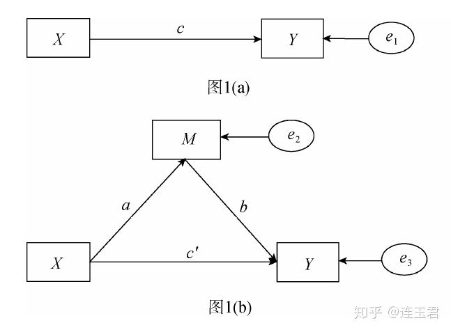

# 中介效应

## 1. 中介效应简介
+ 如果自变量 \(x\) 通过变量 \(M\) 影响因变量 \(y\) , 则称变量 \(M\) 为中介变量;
+ 中介变量发挥的作用就是中介效应,例如租客通过中介公司找到合适的房子;
+ <font color="red">中介效应如图所示:</font>

  + 无中介效应时,自变量 \(x\)直接作用于因变量 \(y\),系数 \(c\)就代表了自变量作用于因变量的总效应;   
  + 考虑中介效应,总效应等于直接效应加上间接效应.
    + 直接效应:自变量直接作用于因变量的效应,系数为 \(c'\);
    + 间接效应:自变量作用于中介变量 \(M\) 的系数为 \(a\),中介变量 \(M\) 作用于因变量的系数为 \(b\) ;
    + 总效应 \(c\) = 直接效应 \(c'\) + 间接效应 \(ab\);
  + 中介效应分析就是要检验 \(ab\) 效应是否存在,以及它在总效应中的占比,体现中介效应的作用强度.

## 2. 逐步检验回归系数
\[
\begin{gather}
Y=cX+e_1 \\
M=aX+e_2 \\
Y=c'X+bM+e_3
\end{gather}
\]
+ 逐步检验回归系数的方法分为三步(Judd & Kenny,1981;Baron & Kenny,1986;温忠麟等,2004)
  + 第一步:检验方程(1)的系数 \(c\) ,也就是自变量 \(X\) 对因变量 \(Y\) 的总效应;
  + 第二步:检验方程(2)的系数 \(a\) ;也就是自变量 \(X\) 和中介变量 \(M\) 的关系;
  + 第三步:控制中介变量 \(M\) 以后,检验方程(3)的系数 \(c'\) 和系数 \(b\) ;
+ 判断依据:
  + 系数 \(c\) 显著,即 \(H_0:c=0\) 被拒绝;
  + 系数 \(a\) 显著,即 \(H_0:a=0\) 被拒绝,且系数 \(b\) 显著,即 \(H_0:b=0\) 被拒绝;
  + 同时满足以上两个条件,则中介效应显著;
  + 如果满足以上两个条件的同时,方程(3)的系数 \(c'\) 不显著,则称为完全中介效应.
+ 注意事项:
  + 逐步检验回归系数的方法简单易懂,是检验中介效应最常用的方法;
  + 逐步检验的检验力在各种方法中是最低的(Friz & MacKinnon,2007;Hay,2009;MacKinnon et al,2002),如果中介效应较低,逐步检验回归系数的方法就很难检验出中介效应显著,反过来,如果研究者用依次检验已经得到显著的结果,检验力低的问题就不再是问题(温忠麟,2014);
  + 方程(1)的系数 \(c\) 是逐步检验回归系数方法的基础,但这一点也受到后来研究的挑战,因为在某些情况下, \(c\) 不显著恰恰是受到了中介效应的影响.工人智力 \((X)\) 按理说应该和工人在生产线上犯错的数量 \((Y)\) 负相关,但是数据显示二者并不相关,即方程(1)的系数 \(c\) 不显著;
  + 发现中介效应变量无聊程度 \((M)\) 在起作用, \(X\) 与 \(M\) 正相关(治理越高越容易无聊), 系数\(a\) 为正;\(M\) 与 \(Y\) 也正相关(越无聊越容易犯错误),系数\(b\) 为正;但\(X\) 与 \(Y\) 负相关,系数 \(c'\) 为负;
  + 总效应 \(c(=ab+c')\) 就因为 \(c'\) 与 \(ab\) 的系数正负相互抵消而不显著,即所谓的抑制/遮掩模型(Suppression Model)(Mackinnon,Krull & Lockwood,2000);
  + 实践中,直接效应 \(c'\) 和间接效应 \(ab\) 完全抵消的情况不常见,但是大小相似符号相反却必然存在,甚至影响因变量和自变量之间的整体关系,所以逐步回归检验法可能会错过一些实际存在的中介效应.

## 3. 系数乘积检验法
+ 针对检验系数乘积 \(H_0:ab=0\) 提出检验方法,又多种计算方法,介绍常用的两种:
### 3.1 Sobel检验
+ 检验统计量 \(z=\frac{\hat{a}\hat{b}}{s_{ab}}\) ,其中,\(\hat{a}\) 和 \(\hat{b}\) 分别是\(a\) 和\(b\) 的估计值,\(\hat{a}\hat{b}\) 的标准误为:
\[
Se(ab)=\sqrt{\hat{a}^2Se_b^2+\hat{b}^2Se_a^2}
\]
+ 其中:\(Se_a\) 和\(Se_b\) 分别是 \(\hat{a}\) 和 \(\hat{b}\) 的标准误;
+ 研究发现,Sobel法的检验力高于依次检验回归系数法(Mackinnon et al,2002;温忠麟等,2004),也就是Sobel方法可以检验出比前者高更多的中介效应,但是如果两种方法的检验结果都显著,依次检验回归系数法结果要强于Sobel(温忠麟,2004);
+ 但是,上面的统计量推到需要 \(\hat{a}\hat{b}\) 服从正太分布,实际中是无法保证的,即使二者都服从正太分布,它们的乘积也不一定服从正太分布;

### 3.2 Bootstrap检验
+ Bootstrap检验的也是 \(H_0:ab=0\) ,但是它是通过Bootstrap方法估计一个置信区间来检验原假设是否成立;
+ 具体操作就是从总体中使用Bootstrap方法抽取一定样本容量的样本500次,计算500个 \(\hat{a}\hat{b}\) 的值,从小到大排序截取2.5%至97.5%分位点构成5%置信水平的置信区间,如果此区间不包含0,则拒绝原假设(Preacher,Rucher,& Hayes,2007;Preacher & Hayes,2008;方杰,张敏强,2012;温忠麟,刘红云,侯泰杰,2012);
+ Bootstrap的前提条件是样本能够代表总体;
+ 研究发现,与其它中介效应检验方法相比,Bootstrap方法具有较高统计效力,是公认的可以取代Sobel的方法(温忠麟,叶宝娟,2014);

## 4. 系数差异检验法
+ 差异系数检验的是 \(H_0:c-c'=0\) ,通常情况下 \(ab=c-c'\),所以系数差异检验法与乘积系数法基本上是相同的;
+ 但是,二者的标准误不同,差异系数检验法犯错误的概率要高于系数乘积检验法(Mackinnon et al,2002;温忠麟等,2004),所以很少使用.

## 5.中介效应分析案例
### 5.1 调用数据并定义变量
+ 数据基本描述：这是一组有关大型百货公司销售人员的数据，我们用来讨论经理的激励与员工工作表现之间的关系，基本假设是：经理的激励 (perceived support from managers) 可能通过影响员工的工作满意度 (job satisfaction) 而影响员工的工作表现 (job performance)。
```stata
cd e:\data
use "http://www.stata-press.com/data/r15/gsem_multmed",clear
save gsem_multmed.dta,replace
use gsem_multmed.dta,clear
summarize
eststo:reg perform support
esttab,label title(describe table) tex
// support:经理的激励 --> X
// satis:工作满意度   --> M
// perform:员工工作表现-->Y
```

### 5.2 多方法进行中介效应
#### 5.2.1逐步检验回归系数方法
+ 分为三步:
```stata
reg perform support       // Y = cX
reg satis support         //M = aX
reg perform satis support //Y = c'X + bM
```
+ 结果解读：
  + 总效应： \(c=0.8218\) ，结果显著；
  + 直接效应： \(c'=0.6161\) ，结果显著；
  + 间接效应： \(0.206(=0.898*0.229)\) 也即中介效应;
  + 建议进一步进行其它方法的检验，看中介效应是否稳健。

#### 5.2.3 两步回归法
+ 只回归后两个方程，是上面的一部分，完全没道理；

#### 5.2.4 sobel检验
+ 安装sgmediation
```stata
findit sgmediation
help sgmediation //弹出帮助文件，已经安装；
sgmediation perform,mv(satis) iv(support) // 用sobel方法检验中介变量结果如下：
```
```
Model with dv regressed on iv (path c) //检验员工工作表现Y和经理激励X之间的路径，形成路径c；

      Source |       SS           df       MS      Number of obs   =     1,500
-------------+----------------------------------   F(1, 1498)      =    412.00
       Model |  258.999482         1  258.999482   Prob > F        =    0.0000
    Residual |  941.695489     1,498  .628635173   R-squared       =    0.2157
-------------+----------------------------------   Adj R-squared   =    0.2152
       Total |  1200.69497     1,499  .800997312   Root MSE        =    .79287

------------------------------------------------------------------------------
     perform |      Coef.   Std. Err.      t    P>|t|     [95% Conf. Interval]
-------------+----------------------------------------------------------------
     support |   .8217557   .0404849    20.30   0.000     .7423427    .9011687
       _cons |    4.99836   .0204746   244.13   0.000     4.958198    5.038522
------------------------------------------------------------------------------

Model with mediator regressed on iv (path a) //检验工作满意度M和经理激励X之间的关系；

      Source |       SS           df       MS      Number of obs   =     1,500
-------------+----------------------------------   F(1, 1498)      =     56.23
       Model |  20.0948214         1  20.0948214   Prob > F        =    0.0000
    Residual |  535.351023     1,498  .357377185   R-squared       =    0.0362
-------------+----------------------------------   Adj R-squared   =    0.0355
       Total |  555.445844     1,499  .370544259   Root MSE        =    .59781

------------------------------------------------------------------------------
       satis |      Coef.   Std. Err.      t    P>|t|     [95% Conf. Interval]
-------------+----------------------------------------------------------------
     support |   .2288945   .0305251     7.50   0.000     .1690181    .2887709
       _cons |    .019262   .0154376     1.25   0.212    -.0110195    .0495436
------------------------------------------------------------------------------

Model with dv regressed on mediator and iv (paths b and c') //加入中介变量M后，Y和M,X之间的关系；

      Source |       SS           df       MS      Number of obs   =     1,500
-------------+----------------------------------   F(2, 1497)      =   1015.21
       Model |  691.131957         2  345.565979   Prob > F        =    0.0000
    Residual |  509.563014     1,497  .340389455   R-squared       =    0.5756
-------------+----------------------------------   Adj R-squared   =    0.5750
       Total |  1200.69497     1,499  .800997312   Root MSE        =    .58343

------------------------------------------------------------------------------
     perform |      Coef.   Std. Err.      t    P>|t|     [95% Conf. Interval]
-------------+----------------------------------------------------------------
       satis |   .8984401   .0252156    35.63   0.000     .8489785    .9479017
     support |   .6161077   .0303447    20.30   0.000      .556585    .6756303
       _cons |   4.981054    .015074   330.44   0.000     4.951486    5.010622
------------------------------------------------------------------------------

Sobel-Goodman Mediation Tests //进行sobel检验，原假设 \(H_0:ab=0\):
```
```
                     Coef         Std Err     Z           P>|Z|
Sobel               .20564799    .02802571   7.338      2.172e-13 //p值，如果小于0.05，则拒绝原假设，认为中介效应成立；
Goodman-1 (Aroian)  .20564799    .02803628   7.335      2.216e-13
Goodman-2           .20564799    .02801514   7.341      2.127e-13

                    Coef      Std Err    Z          P>|Z|
a coefficient   =  .228894   .030525   7.49857    6.5e-14 //这里汇总了三个变量之间的关系路径系数；
b coefficient   =   .89844   .025216   35.6304          0
Indirect effect =  .205648   .028026   7.33783    2.2e-13
  Direct effect =  .616108   .030345   20.3036          0
   Total effect =  .821756   .040485   20.2979          0 //0.8217=0.6161+0.2056(=0.2289*0.8984)

Proportion of total effect that is mediated:  .25025442 //stata直接计算出了中介效应占总效应的比重为25.03%；
Ratio of indirect to direct effect:           .3337858
Ratio of total to direct effect:              1.3337858
```
#### 5.2.5 Bootstrap检验
```stata
bootstrap r(ind_eff) r(dir_eff),reps(500):sgmediation perform,mv(satis) iv(support)
estat bootstrap,percentile bc
```
+ bootstrap结果如下：
```
(running sgmediation on estimation sample)

Bootstrap replications (500)
----+--- 1 ---+--- 2 ---+--- 3 ---+--- 4 ---+--- 5
..................................................    50
..................................................   100
..................................................   150
..................................................   200
..................................................   250
..................................................   300
..................................................   350
..................................................   400
..................................................   450
..................................................   500

Bootstrap results                               Number of obs     =      1,500
                                                Replications      =        500

      command:  sgmediation perform, mv(satis) iv(support)
        _bs_1:  r(ind_eff)
        _bs_2:  r(dir_eff)

------------------------------------------------------------------------------
             |   Observed   Bootstrap                         Normal-based
             |      Coef.   Std. Err.      z    P>|z|     [95% Conf. Interval]
-------------+----------------------------------------------------------------
       _bs_1 |    .205648    .025995     7.91   0.000     .1546987    .2565972
       _bs_2 |   .6161077   .0302057    20.40   0.000     .5569057    .6753097
------------------------------------------------------------------------------
```
+ 计算直接效应和间接效应的置信区间
```

Bootstrap results                               Number of obs     =      1,500
                                                Replications      =        500

      command:  sgmediation perform, mv(satis) iv(support)
        _bs_1:  r(ind_eff) //间接效应=0，2056
        _bs_2:  r(dir_eff) //直接效应=0.6161

------------------------------------------------------------------------------
             |    Observed               Bootstrap
             |       Coef.       Bias    Std. Err.  [95% Conf. Interval]
-------------+----------------------------------------------------------------
       _bs_1 |   .20564799  -.0007846   .02599499    .1508826    .251855   (P)
             |                                       .1537811    .255744  (BC)
       _bs_2 |   .61610768  -.0010255   .03020567    .5527368   .6767927   (P)
             |                                       .5528828   .6773221  (BC) //很显然，这里95%的置信区间并未包含0，所以拒绝原假设，认为中介效应成立
------------------------------------------------------------------------------
(P)    percentile confidence interval
(BC)   bias-corrected confidence interval
```
#### 5.2.6 结构方程方法
+ 通过结构方程（SEM）和广义线性回归（GSEM）的方式检验中介效应，分为两步：
```stata
sem (perform <- satis support) (satis <- support) //进行模型估计；
estat teffects //计算中介效应；
```
+ 结构方程结果如下：
```
Endogenous variables

Observed:  perform satis

Exogenous variables

Observed:  support

Fitting target model:

Iteration 0:   log likelihood = -3779.9224  
Iteration 1:   log likelihood = -3779.9224  

Structural equation model                       Number of obs     =      1,500
Estimation method  = ml
Log likelihood     = -3779.9224

-------------------------------------------------------------------------------
              |                 OIM
              |      Coef.   Std. Err.      z    P>|z|     [95% Conf. Interval]
--------------+----------------------------------------------------------------
Structural    |
  perform     |
        satis |   .8984401   .0251903    35.67   0.000      .849068    .9478123
      support |   .6161077   .0303143    20.32   0.000     .5566927    .6755227
        _cons |   4.981054   .0150589   330.77   0.000     4.951539    5.010569
  ------------+----------------------------------------------------------------
  satis       |
      support |   .2288945   .0305047     7.50   0.000     .1691064    .2886826
        _cons |    .019262   .0154273     1.25   0.212    -.0109749    .0494989 //总效应=直接效应0.6161+间接效应（0.8984*0.2289）
--------------+----------------------------------------------------------------
var(e.perform)|   .3397087   .0124044                      .3162461     .364912
  var(e.satis)|   .3569007   .0130322                      .3322507    .3833795
-------------------------------------------------------------------------------
LR test of model vs. saturated: chi2(0)   =      0.00, Prob > chi2 =      .
```
+ 效应分析结果：
```
Direct effects //直接效应=0.6161
------------------------------------------------------------------------------
             |                 OIM
             |      Coef.   Std. Err.      z    P>|z|     [95% Conf. Interval]
-------------+----------------------------------------------------------------
Structural   |
  perform    |
       satis |   .8984401   .0251903    35.67   0.000      .849068    .9478123
     support |   .6161077   .0303143    20.32   0.000     .5566927    .6755227
  -----------+----------------------------------------------------------------
  satis      |
     support |   .2288945   .0305047     7.50   0.000     .1691064    .2886826
------------------------------------------------------------------------------


Indirect effects //间接效应0.2056=0.8984*0.2289
------------------------------------------------------------------------------
             |                 OIM
             |      Coef.   Std. Err.      z    P>|z|     [95% Conf. Interval]
-------------+----------------------------------------------------------------
Structural   |
  perform    |
       satis |          0  (no path)
     support |    .205648   .0280066     7.34   0.000      .150756      .26054
  -----------+----------------------------------------------------------------
  satis      |
     support |          0  (no path)
------------------------------------------------------------------------------


Total effects //总效应=0.8217
------------------------------------------------------------------------------
             |                 OIM
             |      Coef.   Std. Err.      z    P>|z|     [95% Conf. Interval]
-------------+----------------------------------------------------------------
Structural   |
  perform    |
       satis |   .8984401   .0251903    35.67   0.000      .849068    .9478123
     support |   .8217557   .0404579    20.31   0.000     .7424597    .9010516
  -----------+----------------------------------------------------------------
  satis      |
     support |   .2288945   .0305047     7.50   0.000     .1691064    .2886826
------------------------------------------------------------------------------
```

## 6 类别变量的中介效应检验
+ 上面的情况是自变量、中介变量、因变量均为连续变量，现在考虑它们为分类变量的情形：
+ 当自变量为分类变量时，可以先通过生成虚拟变量的方法进行处理，之后的过程与连续变量相同。
+ 当因变量和中介变量为类别变量，研究中使用的较少，下面介绍因变量和中介变量为分类变量的方法。
### 6.1 广义结构方程方法
+ 当因变量 \(Y\) 是二分类变量，中介变量为连续变量的情况，可以考虑使用gsem模型检验中介效应；
+ 依然使用上面的案例数据，先将因变量 \(Y\) 处理为二分类变量:
```stata
cd e:\data
use gsem_multmed.dta,clear
sum
gen perform_gr2 = 0
replace perform_gr2 = 1 if perform > 5
br
tab perform_gr2
```
+ 将perform处理为perfor_gr2二分类变量，1大于均值员工表现好，0小于均值员工表现不好；
+ 自变量support和中介变量satis依然为连续变量；
+ 进行模型估计：
```stata
gsem (perform_gr2 <- support satis) (satis <- support) //模型估计
gsem,coeflegend //计算效应
nlcom _b[perform_gr2:satis]*_b[satis:support] //计算间接效应
nlcom _b[perform_gr2:support]+_b[perform_gr2:satis]*_b[satis:support] //计算总效应
```
+ gsem估计结果如下：
```

Iteration 0:   log likelihood =  -2091.094  
Iteration 1:   log likelihood =  -2091.094  

Generalized structural equation model           Number of obs     =      1,500

Response       : perform_gr2
Family         : Gaussian
Link           : identity

Response       : satis
Family         : Gaussian
Link           : identity

Log likelihood =  -2091.094

-------------------------------------------------------------------------------
              |      Coef.   Std. Err.      z    P>|z|     [95% Conf. Interval]
--------------+----------------------------------------------------------------
perform_gr2   |
        satis |    .415528   .0170752    24.34   0.000     .3820612    .4489948
      support |   .2578802   .0205485    12.55   0.000     .2176059    .2981546
        _cons |   .5096741   .0102077    49.93   0.000     .4896674    .5296807
--------------+----------------------------------------------------------------
satis         |
      support |   .2288945   .0305047     7.50   0.000     .1691064    .2886826
        _cons |    .019262   .0154273     1.25   0.212    -.0109749    .0494989
--------------+----------------------------------------------------------------
var(e.perfo~2)|   .1560887   .0056996                      .1453081     .167669
  var(e.satis)|   .3569007   .0130322                      .3322507    .3833795
-------------------------------------------------------------------------------
```
+ 估计效应结果：
```

Generalized structural equation model           Number of obs     =      1,500

Response       : perform_gr2
Family         : Gaussian
Link           : identity

Response       : satis
Family         : Gaussian
Link           : identity

Log likelihood =  -2091.094

-------------------------------------------------------------------------------
              |      Coef.  Legend
--------------+----------------------------------------------------------------
perform_gr2   |
        satis |    .415528  _b[perform_gr2:satis]
      support |   .2578802  _b[perform_gr2:support]
        _cons |   .5096741  _b[perform_gr2:_cons]
--------------+----------------------------------------------------------------
satis         |
      support |   .2288945  _b[satis:support]
        _cons |    .019262  _b[satis:_cons]
--------------+----------------------------------------------------------------
var(e.perfo~2)|   .1560887  _b[/var(e.perform_gr2)]
  var(e.satis)|   .3569007  _b[/var(e.satis)]
-------------------------------------------------------------------------------
```
+ 计算间接效应：
```

       _nl_1:  _b[perform_gr2:satis]*_b[satis:support]

------------------------------------------------------------------------------
             |      Coef.   Std. Err.      z    P>|z|     [95% Conf. Interval]
-------------+----------------------------------------------------------------
       _nl_1 |   .0951121   .0132645     7.17   0.000     .0691142    .1211099 //间接效应为0.095，显著，中介效应成立；
------------------------------------------------------------------------------
```
+ 总效应结果：
```

       _nl_1:  _b[perform_gr2:support]+_b[perform_gr2:satis]*_b[satis:support]

------------------------------------------------------------------------------
             |      Coef.   Std. Err.      z    P>|z|     [95% Conf. Interval]
-------------+----------------------------------------------------------------
       _nl_1 |   .3529923   .0238251    14.82   0.000     .3062959    .3996886 //总效应为0.353，也显著；
------------------------------------------------------------------------------
```
### 6.2 计算置信区间
+ 当因变量和中介变量为多分类变量的情况，可以考虑直接计算致信区间CI的方式进行中介效应分析；
+ 结合stata和R语言提供多阶段计算置信区间的方法，用以分析分类变量的中介效应；
+ 依然使用上述数据，首先将因变量员工表现perform处理为三分类变量，中介变量satis处理为二分类变量：
```stata
cd e:\data
use gsem_multmed.dta,clear
sum
gen satis_gr2 = 0
replace satis_gr2 = 1 if satis > 0 //satis_gr2= 0 表示员工满意度较低，1表示工作满意度较高；
tab satis_gr2
bysort satis_gr2:sum satis //看分类是否正确；
gen perform_gr3 = 0
replace perform_gr3 = 1 if perform < 4.5
replace perform_gr3 = 2 if perform >= 4.5 & perform <5.5
replace perform_gr3 = 3 if perform >= 5.5 //perform_gr3=1表现不好，2表现一般，3表现优秀；
```
+ 前面介绍的中介效应检验方法，重点在于建立置信区间CI，在此基础上检验中介效应；
+ 文献中几种计算置信区间的方法：
  + the distribution of the product (MacKinnon,Fritz,Williams & Lockwood,2007;MacKinnon,Lockwood,Hoffman,West & Sheets,2002);
  + the Monte Carlo method (MacKinnon,Lockwood,&Williams,2004);
  + resample methods (bootstrap resample;MacKinnon et al,2004);
  + the asymptotic normal distribution method.
  + Tofighi & MacKinnon(2001)介绍了RMediation程序包，可以在R语言上实现上述多个建立置信区间检验中介效应的方法.
+ 具体实施步骤：
  + 第一步：通过stata对变量之间关系进行分析，这一步可以用逐步检验回归系数法进行，这里采用two—step regression (Zhao,Lynch et al.2010):
```stata
logit satis_gr2 support           //分析中介变量和自变量之间的关系；
//结果如下：
Iteration 0:   log likelihood = -1036.1125  
Iteration 1:   log likelihood = -1023.2778  
Iteration 2:   log likelihood = -1023.2732  
Iteration 3:   log likelihood = -1023.2732  

Logistic regression                             Number of obs     =      1,500
                                                LR chi2(1)        =      25.68
                                                Prob > chi2       =     0.0000
Log likelihood = -1023.2732                     Pseudo R2         =     0.0124

------------------------------------------------------------------------------
   satis_gr2 |      Coef.   Std. Err.      z    P>|z|     [95% Conf. Interval]
-------------+----------------------------------------------------------------
     support |   .5254585   .1050218     5.00   0.000     .3196196    .7312974 //由此得到mu.x = 0.525,se.x = 0.105;
       _cons |  -.1457432   .0522417    -2.79   0.005     -.248135   -.0433513
------------------------------------------------------------------------------

mlogit perform_gr3 support satis_gr2,base(1) //控制中介变量后，看自变量和因变量之间的关系；

Iteration 0:   log likelihood = -1616.2168  
Iteration 1:   log likelihood = -1311.7198  
Iteration 2:   log likelihood = -1278.7919  
Iteration 3:   log likelihood = -1278.2065  
Iteration 4:   log likelihood = -1278.2064  
Iteration 5:   log likelihood = -1278.2064  

Multinomial logistic regression                 Number of obs     =      1,500
                                                LR chi2(4)        =     676.02
                                                Prob > chi2       =     0.0000
Log likelihood = -1278.2064                     Pseudo R2         =     0.2091

------------------------------------------------------------------------------
 perform_gr3 |      Coef.   Std. Err.      z    P>|z|     [95% Conf. Interval]
-------------+----------------------------------------------------------------
1            |  (base outcome)
-------------+----------------------------------------------------------------
2            |
     support |   1.351604   .1528761     8.84   0.000     1.051972    1.651235
   satis_gr2 |   1.552479   .1638859     9.47   0.000     1.231269     1.87369 //mu.y = 1.552,se.y = 0.164;
       _cons |   .1817889   .0794522     2.29   0.022     .0260653    .3375124
-------------+----------------------------------------------------------------
3            |
     support |   2.888079   .2035522    14.19   0.000     2.489124    3.287034
   satis_gr2 |    3.52255   .2056471    17.13   0.000     3.119489    3.925611 //mu.y = 3.523,se.y = 0.206;
       _cons |  -1.695852   .1426055   -11.89   0.000    -1.975354   -1.416351
------------------------------------------------------------------------------

```
  + 第二步：安装R语言包并计算：
```r
install.packages("RMediation")
library("RMediation")
medci(mu.x = 0.525,mu.y = 1.552,se.x = 0.105,se.y = 0.164,rho = 0,alpha = 0.1,type = "prodclin")
# 表示相对于员工表现不好（perform_gr3=1），员工是否满意（satis_gr2=0或1）对经理激励(support)和员工工作表现一般(perform_gr3=2)的中介作用置信区间，
# 式中参数分别取自第一步的回归结果，命令结果如下：
# 结果中，相对于表现不好，员工是否满意对于经理激励和员工工作表现一般的中介作用置信区间为(0.523,1.131),区间不包含0，中介效应成立；
$`95% CI`         0.523102309217411     1.13084125925233
$Estimate         0.8148
$SE               0.185109967316728
medci(mu.x = 0.525,mu.y = 3.523,se.x = 0.105,se.y = 0.206,rho = 0,alpha = 0.1,type = "prodclin")
# 表示相对于员工表现不好（perform_gr3=1），员工是否满意（satis_gr2=0或1）对经理激励(support)和员工工作表现优秀(perform_gr3=3)的中介作用置信区间，
# 结果如下：相对于表现不好，员工是否满意对于经理激励和员工工作表现优秀的中介作用置信区间为(1.225,2.494),不好含0，中介效应也成立；
$`95% CI`         1.22499744630379     2.49413606263925
$Estimate         1.849575
$SE               0.38600697743046
```
+ `rho`两个变量之间的相关性；
+ `alpha`置信区间的显著性水平，默认为0.05；
+ `type`类型，默认值为"prodclin",还有"DOP"(RDOP程序)、"MC"(蒙特卡洛方法)、"asymp"(AND方法)和"all"(四种方法)；

## 7. 总结
+ 中介变量是联系自变量和因变量的纽带，理论上来讲，可以通过中介变量研究变量关系的内部机制；
+ 传统的逐步检验回归系数方法虽然受到很多挑战，但仍然广泛使用，建议使用逐步检验回归系数方法在检验出部分中介效应的情况下，进一步使用Bootstrap方法对中介效应进行检验；
+ 现有研究对分类变量的中介效应讨论比较少，可以通过设置多阶段方法建立置信区间，检验类别变量的中介效应。
