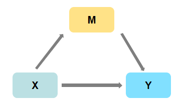

# 交互效应
+ 什么时候需要交互项？
+ 当一个变量对被解释变量的影响可能会受到其它变量的影响时，可以考虑使用含交互项的回归。
## 1 原理及应用

### 1.1 一个经典案例：劳动者收入影响因素

#### 1.1.1 劳动者收入影响因素

\[
\begin{aligned}
    logearn=\beta_0+\beta_1exp+\beta_2sex+\beta_3senior+\epsilon
\end{aligned}
\]
+ \(exp\)：工作年限，连续变量；
+ \(sex\)：性别，男性=0，虚拟变量；
+ \(senior\)：学历，高中及以下=0，虚拟变量；
#### 1.1.2 偏回归系数
+ 在没有加入交互项时， \(\beta_1,\beta_2,\beta_3\) 表示的是在其它控制变量下的单独影响；
+ 假定只存在<font color="red">主效应(main effect)</font>，即每个自变量对因变量的影响不受其它自变量的影响；
+ 现实中最合理的情况是可能存在 <font color="red">条件效应(conditional effect)</font>
#### 1.1.3 更接近现实的劳动者收入影响模型
+ 存在性别异质性，男性劳动者的工作年限对收入的影响是否大于女性劳动者的工作年限对收入的影响？
+ 存在教育门槛，是否在取得高中以上学历的劳动者中，工作年限对收入的影响更强？

### 1.2 交互项的界定
#### 1.2.1 表现形式：变量乘积
+ 交互项就是两个或多个（一般不多于三个）自变量的乘积；
+ 例如：
\[
\begin{aligned}
    y_i=\beta_0+\beta_1x_{1i}+\beta_2x_{2i}+\beta_3x_{1i}x_{2i}+\epsilon_i
\end{aligned}
\]
+ 如果要观察上面模型中 \(x_1\)的变化对因变量 \(y\)的影响，则可以对\(x_1\)求偏导：
\[
\begin{aligned}
    \frac{\partial y}{\partial x_1}=\beta_1+\beta_3x_2
\end{aligned}
\]
#### 1.2.2 统计意义上：条件效应
+ 参与构造交互项的各自变量对因变量的作用依赖于交互项中其它自变量的取值；
+ 交互效应 = 条件效应 \(\neq\) 调节效应；
#### 1.2.3 经济意义上：异质性影响
+ 案例：
  + 工资对于化妆品消费支出的影响，可能受到性别的影响；
  + 高中以上学历的劳动者中，工作年限对收入的影响更强；

## 2 交互项的分类

### 2.1 按照变量连续性分类

#### 2.1.1 虚拟变量*虚拟变量
+ 例如：性别*学历
\[
\begin{aligned}
    logearn=\beta_0+\beta_1exp+\beta_2sex+\beta_3senior+\beta_4sex\cdot senior+\epsilon
\end{aligned}
\]
+ 结果分析：
  + 对整个模型的斜率 \(\beta_1\) 没有影响，只对截距有影响；

#### 2.1.2 连续变量*虚拟变量
+ 例如：性别*工作年限
\[
\begin{aligned}
    logearn=\beta_0+\beta_1exp+\beta_2sex+\beta_3senior+\beta_4exp\cdot sex+\epsilon
\end{aligned}
\]
+ 结果分析：
  + 影响模型的斜率 \(\beta_1\) ，不影响截距；

#### 2.1.3 连续变量*连续变量
+ 例如：地区工业总产值*工作年限
\[
\begin{aligned}
    logearn=\beta_0+\beta_1exp+\beta_2grossd+\beta_3exp\cdot grossd
\end{aligned}
\]
+ 结果分析：
  + 根据交互项系数 \(\beta_3\) 的符号来判断二者之间的相互作用。

### 2.2 按照交互变量的个数分类
#### 2.2.1 两个变量构成的交互项
#### 2.2.2 三个变量构成的交互项

## 3 其它几种概念
### 3.1 相关概念辨析
#### 3.1.1 <font color="red">交互效应</font> VS <font color="red">分组回归</font> VS <font color="red">分层分析</font>  
+ 分组回归与交互效应的区别
  + 完全交互的时候二者是相同的；
  + 用性别变量交乘其它变量相当于按性别变量分组回归：
\[
\begin{aligned}
    inc=\beta_0+\beta_1inc+\beta_2edu+\beta_3male+\beta_4male\cdot inc+\beta_5male\cdot edu+\epsilon
\end{aligned}
\]
+ 与男性人群中(\(sex=0\))和女性人群中(\(sex=1\))分别进行回归系数是一样的；
\[
\begin{aligned}
    inc=\alpha_0+\alpha_1inc+\alpha_2edu+\epsilon
\end{aligned}
\]
+ stata实际操作对比：
```stata
cd e:\data
use income.dta,clear
browse
help eststo
help return
help esample
//分组回归：
eststo clear
eststo:qui reg inc exp edu if male == 0
eststo:qui reg inc exp edu if male == 1
//交互项：
eststo:qui reg inc exp edu male c.exp#male c.edu#male
//性别变量male分别和其他所有变量交互，此时交互效应和按性别分组回归结果是等价的。
esttab
estout
```
+ 结果分析：
  + 分组回归与完全交互分析得到的系数是一样的，但是标准误不一样；
  + 分组回归与不完全交互分析，更不会一样了；
  + 对不同的人群进行回归也叫做“分层分析”；
  + 通常做法：为了增加模型估计的准确性且使对组间差异的检验更为精准，我们可以引入交互项对样本总体进行回归，而不是对不同人群进行分组回归。
#### 3.1.2 <font color="blue">中介</font> VS <font color="blue">调节</font> VS <font color="blue">交互</font> VS <font color="blue">门槛</font>
+ 门槛 VS 调节
  + 原理：门槛检验是一种特殊的调节效应检验；
  + 差别：调节的变量是虚拟变量，也即是“非此即彼”的关系，存在结构突变，跨过某个点，系数发生跃迁，甚至可能正负反号。
+ 调节 VS 中介
  + 调节效应：自变量 \(X\) 对因变量 \(Y\) 作用的大小受调节变量 \(M\) 的影响，如图：
  
  模型： \(Y=aX+bM+cXM+e\)
  + 中介效应：自变量 \(X\) 通过中介变量 \(M\) 影响因变量 \(Y\) ，如图：
  
  模型：
  \[
  \begin{aligned}
      M &=aX+\epsilon_1 \\
      Y &=c'X+bM+\epsilon_2
  \end{aligned}
  \]
+ 调节 VS 交互
  + 联系：形式上都是交互；
  + 区别：
    + 交互作用两个变量是对等的，调节效应两个变量不对等；
    + 有的情况下，二者不能互换：将年级作为调节变量，研究数学能力的性别差异，而不能将性别作为调节变量研究数学能力的年级差异，因为不同年级的数学成绩没有可比性。

### 3.2 操作中的问题
#### 3.2.1 回归方程中应该包括的变量
+ 若回归中有交互项，则所有的交互项中的变量都应该单独包含在回归方程中（除非经济理论将其排除）。
+ 例如：如果回归方程中有 \(x_1x_2\) 则回归方程中也至少再包括 \(x_1\) 和 \(x_2\) 项；
+ 如果回归方程中有三次交叉项 \(x_1x_2x_3\) ，则回归方程中应该也包括 \(x_1,x_2,x_3,x_1x_2,x_1x_3,x_2x_3\) 等项；
+ 缺少某一主要项，交互项可能由于left-out variable bias而显著。
#### 3.2.2 共线性问题
+ 交互项和主要项可能会相关产生共线性问题，但并不认为共线性在一般交互模型中是太特殊或严重的问题；

#### 3.2.3 主要项解释
+ \(\alpha_1\) 表示当其它变量等于0时， \(x_1\) 每增加一个单位，y 的平均值会增加 \(\alpha_1\) 单位。
+ 存在交互项时，其他情况不变的情况下，educ对wage的边际效应为：
\[
\begin{aligned}
    \frac{\Delta wage}{\Delta educ}=\hat{\alpha_1}+\hat{\alpha_2}\cdot exper=34.6951+3.9745exper
\end{aligned}
\]
+ 当exper = 0时，受教育年限每增加一年，工资会额外增加34.6951美元。但实际中exper的值介于1与23年之间，因此 \(\alpha_1\) 并没有太大的意义；
+ educ 对 wage 的边际效应会受到另一个解释变量 \(x_2\) 的影响；
+ 中心化：如果想让交互的解释变量的主要项系数有意义，可以考虑交叉项中心化（centering，变量减去自己的均值）例如：
\[
\begin{aligned}
    y=\gamma_0+\gamma_1x_1+\gamma_2(x_1-\bar{x}_1)(x_2-\bar{x}_2)+\gamma_3x_2+\mu
\end{aligned}
\]
  + 此时的 \(\hat{\gamma}_2=\hat{\alpha}_2\)，此外：
  \[
  \begin{aligned}
      \frac{\Delta y}{\Delta x_1}=\gamma_1+\gamma_2(x_2-\bar{x}_2)
  \end{aligned}
  \]
  所以， \(x_1\) 的系数 \(\gamma_1\) 解释为：当 \(x_2=\bar{x}_2\)时，\(x_1\) 每增加一个单位，y平均会增加\(\gamma_1\) 个单位；
  + 至于主要项是否要中心化并不重要，因为它们会并入截距项，只对交叉项中心化和同时对主要项、交叉项中心化的结果只存在截距项的差异。
#### 3.2.4 内生性处理
+ 若遇到 \(x_2\) 是内生的，\(x_1\) 时外生的，z是\(x_2\) 对应的工具变量，则 \(x_1z\) 也是\(x_1x_2\) 的工具变量。
#### 3.2.5 利用图形展示完整结果
+ 在 \(x_2\) 的影响下，\(x_1\) 对y的边际效应可能为正也可能为负，可能显著也可能不显著。

#### 实例：
+ `interflex`命令
```stata
cd e:\data\wooldridge\
use WAGE2.dta,clear
browse
ssc install interflex,replace all
help interflex
tempfile interflex_exper
tempfile interflex_educ
interflex wage educ exper married,vce(robust) type(linear) ylab("wage") dlab("educ") xlab("exper")
graph save Graph 'interflex_exper',replace
interflex wage educ exper married,vce(robust) type(linear) ylab("wage") dlab("exper") xlab("educ")
graph save Graph 'interflex_educ',replace
graph combine 'interflex_exper'.gph 'interflex_educ'.gph
graph save Graph "WAGE2-interflex-2.gph",replace
graph export "WAGE2-interflex-2.pdf",as(pdf) replace
```
+ 交互项中心化
```stata
ssc install center //已安装
center educ exper,prefix(c)
gen cedu_cexper = ceduc*cexper
gen edu_exper = educ*exper
eststo clear
eststo:qui reg wage educ exper edu_exper married,robust   //交互项不中心化；
eststo:qui reg wage educ exper cedu_cexper married,robust //交互项中心化，会改变主项回归系数；
eststo:qui reg wage ceduc cexper cedu_cexper married,robust //主项和交互项均中心化；
esttab
```
```
------------------------------------------------------------
                      (1)             (2)             (3)   
                     wage            wage            wage   
------------------------------------------------------------
educ                34.70*          80.65*** //交互项中心化，改变了主项的回归系数               
                   (1.97)         (12.05)                   
exper              -34.91           18.62***                
                  (-1.80)          (5.51)                   
edu_exper           3.974**                                 
                   (2.60)                                   
married             187.0***        187.0***        187.0***
                   (5.14)          (5.14)          (5.14)   
cedu_cexper                         3.974**         3.974**
                                   (2.60)          (2.60)   
ceduc                                               80.65*** //主项是否中心化不影响其回归系数，只影响截距项的大小；
                                                  (12.05)   
cexper                                              18.62***
                                                   (5.51)   
_cons               125.6          -493.4***        808.3***
                   (0.53)         (-4.29)         (23.48)   
------------------------------------------------------------
N                     935             935             935   
------------------------------------------------------------
t statistics in parentheses
* p<0.05, ** p<0.01, *** p<0.001
```
```stata
sysuse auto,clear
reg mpg i.foreign weight
margins,at(weight= (1760(100)4840)) //对应计算了weight取31个值的边际效应,并可以画图如下:
marginsplot
*marginscontplot命令可以画出连续性变量边际效应的图,外部命令需要安装:
marginscontplot weight,ci
```
