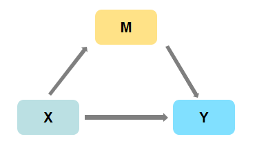
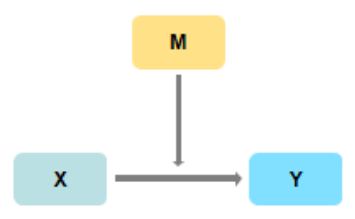

# 各种效应：
## 1、中介效应

+ 解释变量 \(X\) 通过中介变量 \(M\) 影响被解释变量 \(Y\)；
+ 例如：工作满意度(\(X\))通过影响创新氛围(\(M\))进而影响工作绩效(\(Y\))。
## 2、调节效应

+ 解释变量 \(X\) 对被解释变量 \(Y\) 的作用会收到调节变量 \(M\) 的影响；
+ 例如：开车速度 (\(X\))对车祸可能性(\(Y\))的作用会受到是否喝酒 \(M\) 的干扰。
## 3、交互效应
+ 两个变量相乘作为交互项放到模型中
## 4、边际效应
+ 一个变量每变动一个单位对另一个变量的影响
