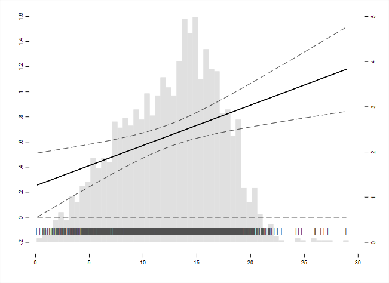
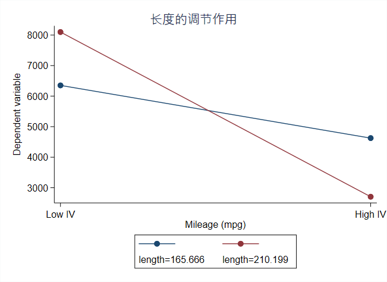

# margins命令计算和图示边际效应的一般过程：
+ 手动计算的边际效应和margins命令计算的边际效应是不一样的：
    * 手动计算的是 $\frac{\partial Y}{\partial X}=\beta_1+\beta_3Z$ 随  $Z$ 变化而变化的情况，如图：
    

    * 而margins命令计算的是 $Y$ 对  $X$ 的关系随  $Z$ 变化而变化的情况，此处  $Z$相当于调节变量：不同  $Z$ 的情况下， $Y$ 对  $X$ 的关系是不同的，如图：  
    

+ margins命令计算边际效应图：

```
//margins命令图示边际效应的一般过程：
cd E:\data\margins
clear 
sysuse auto
reg price c.mpg##c.length
foreach v of var mpg length {
    sum `v' if e(sample)
    local low_`v' = r(mean) - r(sd)
    dis "low_`v'  = " `low_`v''
    local high_`v'= r(mean) + r(sd)
    dis "high_`v' = " `high_`v''
}
margins,at(mpg = (`low_mpg' `high_mpg') ///
        length = (`low_length' `high_length'))
marginsplot,xlabel(`low_mpg' "LOW" `high_mpg' "HIGH") ///
            ytitle("mpg") ///
            ylabel(,angle(horizontal) nogrid) ///
            ytitle("price") ///
            legend(position(3) col(1) stack) ///
            title("Moderation") noci
```
+ 上面使用margins命令计算和图示边际效应的过程：
    * 用margins命令计算因变量在自变量取几个特殊值处的值画出二者散点图；
    * 再使用marginsplot图示边际效应；
    * 是  $Y$ 关于  $X$ 的图。 
+ 更为深入的分析和更为酷炫的图形可以使用外部命令interflex。
+ 对比下面更一般化的边际效应的计算过程。

## 1 手动计算边际效应的原理：
### 1.1 两个变量的交互项  
相当于计算的是 $\frac{\partial Y}{\partial X}=\beta_1+\beta_3Z$ 随  $Z$ 变化而变化的情况；  
是 $\frac{\partial Y}{\partial X}=\beta_1+\beta_3Z$ 关于  $Z$ 的散点图；
假设自变量 $X$ 对因变量 $Y$ 的作用受调节变量 $Z$ 的影响，则模型的基本形式如下：
$$
Y = \beta_0+\beta_1X+\beta_2Z+\beta_3XZ+\mu
$$
$X$的边际效应就是指$X$每增加一个单位时$Y$的变化，即： 
$$
\frac{\partial Y}{\partial X}=\beta_1+\beta_3Z
$$
由上式可以看到,   $X$ 的边际效应不再是常数，而是会随着  $Z$ 的变化而变化；  
例如，假设  $\hat{\beta}_1=2$,  $\hat{\beta}_3=0.5$，则当  $Z=1$ 时,  $X$ 对  $Y$的边际效应为：  
$$
\frac{\partial Y}{\partial X}(Z=1)=\beta_1+\beta_3Z=2+0.5×1=2 
$$  
多数情况下，我们关注  $Z=\bar{Z}$ （样本均值）或者（25、50、75）分为数时的边际效应；  
在该模型中  $X$ 对  $Y$ 的边际效应的标准误也与  $Z$ 的取值有关，即：  
$$
 Var(\frac{\partial Y}{\partial X})=\sqrt{Var(\beta_1)+Z^2Var(\beta_3)+2ZCov(\beta_1,\beta_3)}
 $$
从而利用上面求得的标准误计算边际效应的置信区间。  

### 1.2 三个变量的交乘项
三个变量的交乘项的模型基本形式：  
$$
Y=\beta_0+\beta_1X+\beta_2Z+\beta_3W+\beta_4XZ+\beta_5XW+\beta_6ZW+\beta_7XZW+\mu
$$  
可以看到模型中包含各变量以及它们两两交互和三个交互的项；  
存在一种特殊情况，当其中一个变量是0-1虚拟变量时，将样本分为两个组，每个组分别进行回归，  对于分组样本分别进行两两交互的回归分析（化为上面两个变量交互的情形）。  

## 2 Stata实现

### 2.1 两个变量交乘
以自带的nlsw88.dta为例，手动计算交乘项的边际效应：  
$$
wage=\beta_0+\beta_1grade+\beta_2ttl+\beta_3grade×ttl+\mu
$$
其中，wage代表工资水平，grade代表受教育年限，ttl代表个体的工作时间；  

在上述模型表示，个体工作经验作为调剂变量，影响受教育年限对工资水平的作用：  

+ 具体的计算过程：  
 
```
// 1.首先进行回归
cd "e:/data"
sysuse nlsw88.dta,clear
gen grade_x_ttl = grade*ttl
reg wage grade ttl grade_x_ttl //模型中变量的系数分别存储在矩阵b和V中;
ereturn list
matrix list e(V)
dis %4.2f sqrt(0.0173019) //计算grade系数的标准误;
// 2.从矩阵中可以分别提取回归系数和它们的方差、协方差：
matrix b = e(b)
matrix V = e(V)
matrix list b
matrix list V
scalar b1 = b[1,1]
scalar b3 = b[1,3]
scalar varb1 = V[1,1]
scalar varb3 = V[3,3]
scalar covb1b3 = V[1,3]
scalar list
scalar list covb1b3 
// 3.计算边际效应在Z取均值处的边际效应和标准差：
// 首先要找到ttl的均值，然后带入边际效应公式：
sum ttl
scalar ttl_mean = r(mean)
dis "margins = " b1+b3*ttl_mean
dis "Std.Err = " sqrt(varb1+2*ttl_mean*covb1b3+ttl_mean^2*varb3)
// 4.绘制边际效应图：需要知道grade的边际效应随着ttl如何变化
// 首先，要得到一系列变化的ttl的值，最小0.16，最大28.9，间隔0.01
set obs 2875
gen mvz = (_n+15)/100
//然后，分别计算每个mvz对应的X的边际效应、标准误以及置信区间：
gen bx = b1+b3*mvz
gen sebx = sqrt(varb1+varb3*mvz^2+2*mvz*covb1b3)
gen ax = 1.96*sebx
gen upbx = bx+ax
gen lowbx = bx-ax
//根据计算的值作出边际效应及其置信区间图：
gen where = -0.045
gen pipe = "|"
gen yline = 0
graph twoway hist ttl,width(0.5) percent color(gs14) yaxis(2) ///
    || scatter where ttl,plotr(m(b 4)) ms(none) mlabcolor(gs5) mlabel(pipe) mlabpos(6) legend(off) ///
    || line bx mvz,lpattern(solid) lwidth(medium) lcolor(black) yaxis(1) ///
    || line upbx mvz,lpattern(dash) lwidth(thin) lcolor(black) ///
    || line lowbx mvz,lpattern(dash) lwidth(thin) lcolor(black) ///
    || line yline mvz,lpattern(dash) lwidth(thin) lcolor(black) ///
    || , ///
        xlabel(0 5 10 15 20 25 30,nogrid labsize(2)) ///
        ylabel(-0.2 0 0.2 0.4 0.6 0.8 1 1.2 1.4 1.6,axis(1) nogrid labsize(2)) ///
        ylabel(0 1 2 3 4 5,axis(2) nogrid labsize(2)) ///
        yscale(noline alt) ///
        yscale(noline alt axis(2)) ///
        xscale(noline) ///
        legend(off) ///
        xtitle("",size(2.5)) ///
        ytitle("",axis(2) size(2.5)) ///
        xsca(titlegap(2)) ///
        ysca(titlegap(2)) ///
        scheme(s2mono) graphregion(fcolor(white) ilcolor(white) lcolor(white))
```


### 2.2 三个变量交乘  
模型为：  
$$
wage = \beta_0+\beta_1grade+\beta_2ttl+\beta_3union+\beta_4grade×ttl+\beta_5grade×union+\beta_6ttl×union+\beta_7grade×ttl×union+\mu
$$
union是0-1虚拟变量，分别对应union=0,1分为两个模型，分别计算grade的边际效应：

+ 分别计算union=0或1时进行回归的边际效应，并画图：

```
* 1 计算union=1时，grade的边际效应：
reg wage grade ttl grade_x_ttl if union == 1
matrix b_1 = e(b)
matrix V_1 = e(V)
scalar b1_1 = b_1[1,1]
scalar b3_1 = b_1[1,3]
scalar varb1_1 = V_1[1,1]
scalar varb3_1 = V_1[3,3]
scalar covb1b3_1 = V_1[1,3]

sum ttl if union == 1
scalar ttl_mean_1 = r(mean)
dis "Margins_1 = " b1_1+b3_1*ttl_mean_1
dis "Std.Err = " sqrt(varb1_1+varb3_1*ttl_mean_1^2+2*covb1b3_1)

set obs 2875
gen mvz = (_n+15)/100

gen bx_1 = b1_1+b3_1*mvz
gen sebx_1 = sqrt(varb1_1+varb3_1*mvz^2+2*mvz*covb1b3_1)
gen ax_1 = 1.96*sebx_1
gen upbx_1 = bx_1+ax_1
gen lowbx_1 = bx_1-ax_1

* 2 计算union=0时，grade的边际效应：
reg wage grade ttl grade_x_ttl if union == 0
matrix b_0 = e(b)
matrix V_0 = e(V)
scalar b1_0 = b_0[1,1]
scalar b3_0 = b_0[1,3]
scalar varb1_0 = V_0[1,1]
scalar varb3_0 = V_0[3,3]
scalar covb1b3_0 = V_0[1,3]

sum ttl if union == 0
scalar ttl_mean_0 = r(mean)
dis "Margins_1 = " b1_0+b3_0*ttl_mean_0
dis "Std.Err = " sqrt(varb1_0+varb3_0*ttl_mean_0^2+2*covb1b3_0)

gen bx_0 = b1_0+b3_0*mvz
gen sebx_0 = sqrt(varb1_0+varb3_0*mvz^2+2*mvz*covb1b3_0)
gen ax_0 = 1.96*sebx_0
gen upbx_0 = bx_0+ax_0
gen lowbx_0 = bx_0-ax_0

gen yline = 0
graph twoway line bx_1 mvz,lpattern(solid) lwidth(medium) lcolor(blue) ///
          || line upbx_1 mvz,lpattern(dash) lwidth(thin) lcolor(blue) ///
          || line lowbx_1 mvz,lpattern(dash) lwidth(thin) lcolor(blue) ///
          || line bx_0 mvz,lpattern(solid) lwidth(medium) lcolor(red) ///
          || line upbx_0 mvz,lpattern(dash) lwidth(thin) lcolor(red) ///
          || line lowbx_0 mvz,lpattern(dash) lwidth(thin) lcolor(red) ///
          || line yline mvz,lpattern(dash) lwidth(thin) lcolor(black) ///
          || , ///
            xlabel(0 5 10 15 20 25 30,nogrid labsize(2)) ///
            ylabel(-0.2 0 0.2 0.4 0.6 0.8 1 1.2 1.4 1.6,nogrid labsize(2)) ///
            legend(off) ///
            xtitle("",size(2.5)) ///
            xsca(titlegap(2)) ///
            ysca(titlegap(2)) ///
            scheme(s2mono) graphregion(fcolor(white) ilcolor(white) lcolor(white))
```

## 3 使用margins命令注意事项
+ 需要注意两种回归形式的区别：

### 3.1 `grade\*ttl_exp` 和 `grade#ttl_exp`的区别

```
sysuse nlsw88.dta,clear
sum grade ttl
gen grade_x_ttl = grade*ttl
eststo clear
eststo:reg wage grade ttl grade_x_ttl
eststo:reg wage c.ttl_exp##c.grade
esttab
```

+ 可以看到两种形式进行回归，模型的系数及其对应的标准差都是一样的；
+ 但是分析`margins`命令计算并图示 $ttl\_exp$ 对  $wage$ 的作用在不同的  $grade$ 调节作用下而不同的过程中，发现两种回归形式是不同的；
+ 使用`grade*ttl_exp`的形式回归：

```
reg wage grade ttl grade_x_ttl //没有把相乘项当成交互项，而是当成第三个变量，所以做出的边际效应图是互项平行的；
margins,at(ttl_exp = (0.115 12.53 28.88) grade = (0 13 18)) 
marginsplot,noci
dis (6.2563-0.934+0.144*0.115)/0.032
dis (9.52638-0.934-0.252*13+0.144*0.115)/0.032 //可以反推出此时带入计算的是grade_x_ttl作为第三个变量的平均值，而没有将其看作交互项；
marginscontplot2 ttl_exp grade,at1(0.115(4)28.88) at2(6(6)18)
```

+ 而使用`grade#ttl_exp`的形式回归：

```
reg wage c.ttl_exp##c.grade 
margins,at(ttl_exp = (0.115 12.53 28.88) grade = (0 13 18)) 
marginsplot,noci
dis 0.934-0.144*0.115
dis 0.934+0.252*13-0.144*0.155+0.032*0.115*13 //此时是将二者的真实乘积带入计算
marginscontplot2 ttl_exp grade,at1(0.115(4)28.88) at2(6(6)18)
```

### 3.2 `margins`命令的用法
+ 1 使用`margins`命令：
    * `margins`相当于以下过程：

```
sysuse auto,clear
reg mpg i.foreign weight
margins,at(weight = 1760) //
replace weight = 1760
predict mpg_hat
sum mpg_hat
dis `r(mean)'

```


```
reg wage c.ttl_exp##c.grade
margins,at(ttl_exp = (0.115 12.53 28.88) grade = (0 13 18)) 
marginsplot,noci
```

* 先使用交互项格式进行回归；
* 后使用`margins`命令，计算两个变量在特殊点处取值的因变量值；
* 再使用`marginsplot`画出在调节效应的作用下，自变量对因变量的不同作用图；
* `at(var1 = (min ...max) var2 = (min...max))`位于后面的var2是调节变量。

+ 2 使用外部命令`marginscontplot2`:

```
marginscontplot2 ttl_exp grade,at1(0.115(4)28.88) at2(6(6)18)
```

## 4 `marginscontplot2`命令的用法

+ 对比上边的margins命令：  
    + marginscontplot2直接作图，不需要先求边际效应再画图；
    + marginscontplot2命令可以画出连续性变量的边际效应图；

+ 基本用法：

```
// 1. 一个变量时：
// marginscontplot和marginscontplot2命令
sysuse auto,clear
regress mpg i.foreign##c.weight 
marginscontplot weight, ci  //ci表示带置信区间
marginscontplot2 weight, ci
marginscontplot weight,ci var1(20)            // weight间隔20取值
marginscontplot2 weight,ci var1(20)           
marginscontplot weight,ci at1(2000(500)4500)  //weight按照2000,2500,3000...4500范围取值
marginscontplot2 weight,ci at1(2000(500)4500)  
marginscontplot weight,ci at1(%1 10 25 50 75 90 95(1)99) //取1%、、、99%点处的值；
marginscontplot2 weight,ci at1(%1 10 25 50 75 90 95(1)99)
marginscontplot weight,ci margopts(predict(xb))
marginscontplot2 weight,ci margopts(predict(xb))
// 2. 两个变量时，另一个视作调节变量：
marginscontplot weight foreign    //分别画出foreign=0、1的情况下，weight对mpg的影响；
marginscontplot weight foreign,ci //加上置信区间时，置信区间会重合，所以显示在两个图形中；
```

### 4.1 对数形式的回归模型
+ 可以画出两种边际效应图：
    * 线性
    * 非线性

+ 线性：

```
sysuse auto,clear
generate logwt = ln(weight)
reg mpg logwt i.foreign c.logwt#i.foreign
marginscontplot logwt           //是对log(weight)的边际效应，依然是直线；
marginscontplot logwt foreign 
```

+ 非线性

```
summarize weight
range w r(min) r(max) 20
generate logw = ln(w)
marginscontplot weight(logwt),var1(w(logw)) //此时是对weight的边际效应，是对数曲线；
```