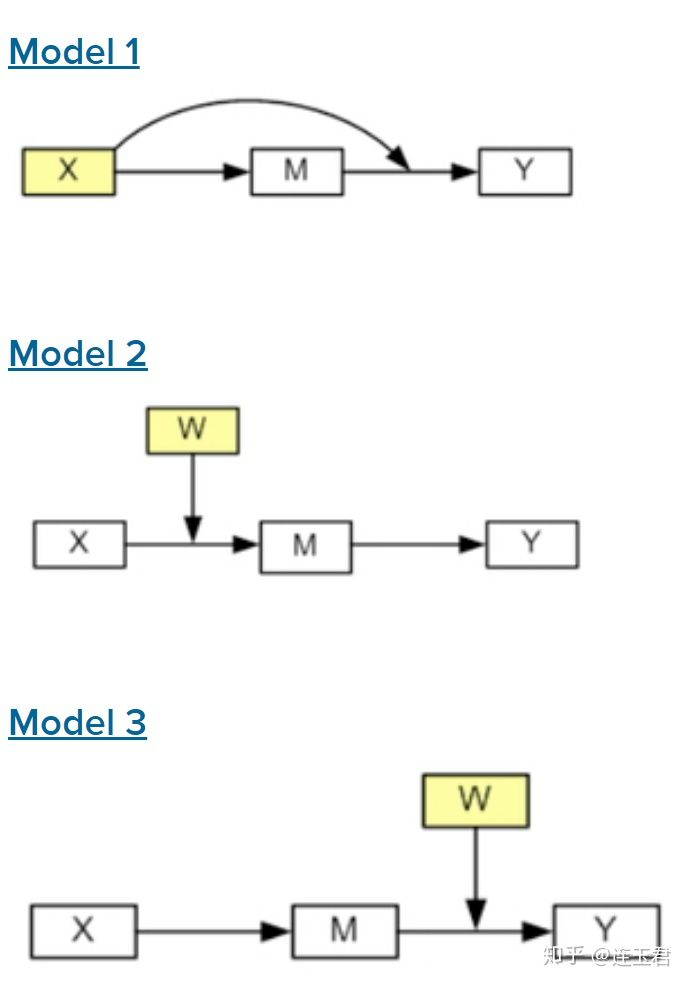
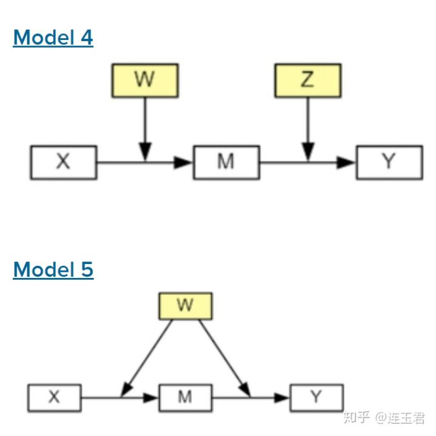

# 区分中介效应(Mediation)和调节效应(Moderation)
##　１、调节效应和中介效应的定义　　
+ 中介变量：介于自变量和因变量之间的，它可以部分地解释自变量对因变量的影响，即自变量对因变量的影响可以分为直接效应和间接效应两部分。
+ 调节变量：影响模型中其它变量的作用效果，也就是说，模型中特定变量的作用效果会依赖于调节变量的取值大小。
+ 调节中介效应：调节变量的取值大小影响中介变量所能解释的间接效应的幅度，这成为条件间接效应。即在调节变量取特定值的条件下，解释间接效应的影响效果。
+ Muller等人（2005）在文章中when moderation is mediated and mediation is moderated中提出了三种基本模型来解释调节中介效应和中介调节效应。
  + \(Mo\)表示调节变量， \(Me\)表示中介变量， \(\epsilon\)表示误差项。

+ 第一步：解释变量\(X\)和被解释变量\(Y\)之间的调节效应也被称为全局处理效应（如图中路径C).实际上，\(X\)对\(Y\)的影响可以被分割为\(A*B+C\).
\[
Y=\beta_{10}+\beta_{11}X+\beta_{12}Mo+\beta_{13}XMo+\epsilon_1
\]
  + 为了理解中介调节效应，首先明确全局调节效应的效果是由\(\beta_{13}\)衡量；
  + 而对于调节中介效应，要求模型中不存在全局调节效应，即\(\beta_{13}\)不显著；
+ 第二步：解释变量和中介变量之间的调节效应（如图中路径A）。
\[
Me=\beta_{20}+\beta_{21}X+\beta_{22}Mo+\beta_{23}XMo+\epsilon_2
\]
  + 若\(\beta_{23}\)是显著的，说明调节变量会影响解释变量和中介变量之间的关系。
+ 第三步：解释变量和被解释变量与中介变量和被解释变量之间的调节效应（如图中路径A和路径B）
\[
Y=\beta_{30}+\beta_{31}X+\beta_{32}Mo+\beta_{33}XMo+\beta_{34}Me+\beta_{35}MeMo+\epsilon_3
\]
  + 若第二步中的\(\beta_{23}\)和第三步中的\(\beta_{33}\)都是显著的，则调节变量会影响解释变量和中介变量之间的关系（如图中的路径A）；
  + 若第二步中的\(\beta_{23}\)和第三步中的\(\beta_{35}\)都是显著的，则调节变量会影响中介变量和被解释变量之间的关系（如中的路径B）。
## 2、调节中介效应的检验方法
+ Hayes（2013）和Preacher（2007）详细讲述了调节中介效应的理论背景和框架，也提供了检验调节中介效应和计算间接效应大小的方法；
+ 第一种方法基于正太分布假定，这种方法理论上很有效，但实际上，条件间接效应的分布往往不呈正太，所以基于正太计算的置信区间和假设检验不够准确；
+ 第二种方法基于Bootstrap方法，虽然计算速度大大降低，但此时置信区间的计算是修正偏误且非对称的，更好地反映了条件间接效应分布的真是情况；
+ 接下来介绍Preacher文章中的5个模型，每个模型使用`sem`和`nlcom`命令基于正太分布假定的方法进行估计，然后介绍如何获得标准误和置信区间的Bootstrap方法；
+ 为了计算条件间接效果的大小，我们需要得到以下两个模型的估计系数：
  + 模型1：用中介变量对解释变量进行回归；
  + 模型2：用被解释变量对解释变量进行回归；
  + 可以使用stata的`sem`命令得到上述估计系数；
  + 条件间接效应可以通过结构方程模型（Structural Equation Model）的估计系数与调节变量给定的取值相乘得到；
+ 5个模型分别为：



+ 对于前四个模型，我们将计算调节变量取三个值(\(\mu-\sigma,\mu,\mu+\sigma\))时，分别对应的条件间接效应，其中模型4由于涉及到两个调节变量会产生3*3=9种结果。

### 2.1、调用数据并定义变量
```stata
cd "e:\data"
use "https://stats.idre.ucla.edu/stat/data/hsb2", clear
save hsb2.dta,replace
use hsb2.dta,clear
rename science y //被解释变量
rename math x    //解释变量
rename read m    //中介变量
rename write w   //调节变量1
rename socst z   //调节变量2
```
### 2.2、模型的估计与构建
#### 2.2.1 模型1：解释变量同时也是中介变量与被解释变量之间的调节变量
\[
\begin{aligned}
    m &=a_0+a_1x \\
    y &=b_0+b_1m+b_2x+b_3mx
\end{aligned}
\]
+ 条件间接效应 \(=a_1(b_1+b_3x)\)
+ 对模型1进行正太分布假定估计：
```stata
summarize x
global m = r(mean)
global s = r(sd)
generate mx = m*x //此处的m不是上面全局变量m，对全局变量引用需要使用`$m`
sem (m <- x)(y <- m x mx)
help nlcom  //计算估计系数的非线性组合；
help lincom //计算估计系数的线性组合；
```
+ 输出结果如下：
```
Endogenous variables

Observed:  m y

Exogenous variables

Observed:  x mx

Fitting target model:

Iteration 0:   log likelihood = -3585.6581  
Iteration 1:   log likelihood = -3585.6581  

Structural equation model                       Number of obs     =        200
Estimation method  = ml
Log likelihood     = -3585.6581

------------------------------------------------------------------------------
             |                 OIM
             |      Coef.   Std. Err.      z    P>|z|     [95% Conf. Interval]
-------------+----------------------------------------------------------------
Structural   |
  m          |
           x |    .724807   .0579824    12.50   0.000     .6111636    .8384504
       _cons |   14.07254   3.100201     4.54   0.000     7.996255    20.14882
  -----------+----------------------------------------------------------------
  y          |
           m |   .9766164   .2875081     3.40   0.001     .4131109    1.540122
           x |    1.03094   .2969707     3.47   0.001     .4488881    1.612992
          mx |  -.0115869   .0053091    -2.18   0.029    -.0219926   -.0011812
       _cons |  -20.83921   15.16952    -1.37   0.170    -50.57092    8.892495
-------------+----------------------------------------------------------------
     var(e.m)|   58.71925   5.871925                      48.26811    71.43329
     var(e.y)|   49.70994   4.970994                      40.86232    60.47326
------------------------------------------------------------------------------
LR test of model vs. saturated: chi2(1)   =    594.37, Prob > chi2 = 0.0000
```
+ 计算特定调节变量取值下的系数：
  + 条件间接效应\(a_1(b_1+b_3x)\)在点\(x=\mu-\sigma\)处的值：
  ```stata
  nlcom _b[m:x]*(_b[y:m]+($m-$s)*_b[y:mx])
  //结果为：
         _nl_1:  _b[m:x]*(_b[y:m]+(52.645-9.368447794077296)*_b[y:mx])

  ------------------------------------------------------------------------------
               |      Coef.   Std. Err.      z    P>|z|     [95% Conf. Interval]
  -------------+----------------------------------------------------------------
         _nl_1 |   .3444105   .0656615     5.25   0.000     .2157163    .4731048
  ------------------------------------------------------------------------------
  ```
  + 条件间接效应\(a_1(b_1+b_3x)\)在点\(x=\mu\)处的值：
  ```stata
  nlcom _b[m:x]*(_b[y:m]+$m*_b[y:mx])
  //结果为：
         _nl_1:  _b[m:x]*(_b[y:m]+52.645*_b[y:mx])

  ------------------------------------------------------------------------------
               |      Coef.   Std. Err.      z    P>|z|     [95% Conf. Interval]
  -------------+----------------------------------------------------------------
         _nl_1 |   .2657319   .0517277     5.14   0.000     .1643474    .3671164
  ------------------------------------------------------------------------------

  ```
  + 条件间接效应\(a_1(b_1+b_3x)\)在点\(x=\mu+\sigma\)处的值：
  ```stata
  nlcom _b[m:x]*(_b[y:m]+($m+$s)*_b[y:mx])
  //结果为：  
         _nl_1:  _b[m:x]*(_b[y:m]+(52.645+9.368447794077296)*_b[y:mx])

  ------------------------------------------------------------------------------
               |      Coef.   Std. Err.      z    P>|z|     [95% Conf. Interval]
  -------------+----------------------------------------------------------------
         _nl_1 |   .1870532   .0609803     3.07   0.002      .067534    .3065724
  ------------------------------------------------------------------------------
  ```
+ 此例中，条件间接效应随着调节变量取值的增加而减小，接下来使用Bootstrap命令运行500次：
```stata
capture program drop bootm1
program bootm1,rclass
  sem (m <- x)(y <- m x mx)
  return scalar cielw = _b[m:x]*(_b[y:m]+($m-$s)*_b[y:mx])
  return scalar ciemn = _b[m:x]*(_b[y:m]+($m)*_b[y:mx])
  return scalar ciehi = _b[m:x]*(_b[y:m]+($m+$s)*_b[y:mx])
end
bootstrap r(cielw) r(ciemn) r(ciehi),reps(500) nodots:bootm1
```
+ 运行结果如下：
```

Bootstrap results                               Number of obs     =        200
                                                Replications      =        500

      command:  bootm1
        _bs_1:  r(cielw)
        _bs_2:  r(ciemn)
        _bs_3:  r(ciehi)

------------------------------------------------------------------------------
             |   Observed   Bootstrap                         Normal-based
             |      Coef.   Std. Err.      z    P>|z|     [95% Conf. Interval]
-------------+----------------------------------------------------------------
       _bs_1 |   .3444105   .0656201     5.25   0.000     .2157975    .4730236
       _bs_2 |   .2657319   .0534206     4.97   0.000     .1610294    .3704343
       _bs_3 |   .1870532   .0590326     3.17   0.002     .0713515    .3027549
------------------------------------------------------------------------------
```
#### 2.2.2 模型2：调节变量影响解释解释变量与中介变量之间的关系
\[
\begin{aligned}
    m &=a_0+a_1x+a_2w+a_3xw \\
    y &=b_0+b_1m+b_2x+b_3w+b_4xw
\end{aligned}
\]
+ 条件间接效应 \(=b_1(a_1+a_3w)\)
```stata
summarize w
global m = r(mean)
global s = r(sd)
generate wx = w*x
sem (m <- x w wx)(y <- m x w wx)
```
+ 分别计算调节变量 \(w\)分别取\(\mu-\sigma,\mu,\mu+\sigma\)三个值时的间接效应：
```stata
nlcom _b[y:m]*(_b[m:x]+($m-$s)*_b[m:wx])
nlcom _b[y:m]*(_b[m:x]+($m)*_b[m:wx])
nlcom _b[y:m]*(_b[m:x]+($m+$s)*_b[m:wx])
```
+ Bootstrap方法运行500次：
```stata
capture program drop bootm2
program bootm2,rclass
  sem (m <- x w wx)(y <- m x w wx)
  return scalar cielw = _b[y:m]*(_b[m:x]+($m-$s)*_b[m:wx])
  return scalar ciemn = _b[y:m]*(_b[m:x]+($m)*_b[m:wx])
  return scalar ciehi = _b[y:m]*(_b[m:x]+($m+$s)*_b[m:wx])
end
bootstrap r(cielw) r(ciemn) r(ciehi),reps(500) nodots:bootm2
```
#### 2.2.3 模型3：调节变量影响中介变量与被解释变量之间的关系
\[
\begin{aligned}
    m &=a_0+a_1x \\
    y &=b_0+b_1m+b_2x+b_3w+b_4mw
\end{aligned}
\]
+ 条件间接效应 \(=a_1(b_1+b_4w)\)
```stata
summarize w
global m = r(mean)
global s = r(sd)
generate mw = m*w
sem (m <- x)(y <- m x w mw)
```
+ 分别计算调节变量 \(w\)分别取\(\mu-\sigma,\mu,\mu+\sigma\)三个值时的间接效应：
```stata
nlcom _b[m:x]*(_b[y:m]+($m-$s)*_b[y:mw])
nlcom _b[m:x]*(_b[y:m]+($m)*_b[y:mw])
nlcom _b[m:x]*(_b[y:m]+($m+$s)*_b[y:mw])
```
+ Bootstrap方法运行500次：
```stata
capture program drop bootm3
program bootm3,rclass
  sem (m <- x)(y <- m x w mw)
  return scalar cielw = _b[m:x]*(_b[y:m]+($m-$s)*_b[y:mw])
  return scalar ciemn = _b[m:x]*(_b[y:m]+($m)*_b[y:mw])
  return scalar ciehi = _b[m:x]*(_b[y:m]+($m+$s)*_b[y:mw])
end
bootstrap r(cielw) r(ciemn) r(ciehi),reps(500) nodots:bootm3
```
#### 2.2.4 模型4：两个不同的调节变量，一个影响解释变量与中介变量之间的关系，另一个影响中介变量与被解释变量之间的关系
\[
\begin{aligned}
    m &=a_0+a_1x+a_2w+a_3wx \\
    y &=b_0+b_1m+b_2x+b_3w+b_4wx+b_5z+b_6mz
\end{aligned}
\]
+ 条件间接效应 \(=(b_1+b_6z)(a_1+a_3w)\)
```stata
summarize w
global m1 = r(mean)
global s1 = r(sd)
summarize z
global m2 = r(mean)
global s2 = r(sd)
generate wx = w*x
generate mz = m*z
sem (m <- x w wx)(y <- m x w wx z mz)
```
+ 分别计算调节变量 \(w,z\)分别取\(\mu-\sigma,\mu,\mu+\sigma\)对应的9种间接效应：
```stata
nlcom ((_b[y:m]+($m2-$s2)*_b[y:mz])*(_b[m:x]+($m1-$s1)*_b[m:wx]))
nlcom ((_b[y:m]+($m2-$s2)*_b[y:mz])*(_b[m:x]+($m1)*_b[m:wx]))
nlcom ((_b[y:m]+($m2-$s2)*_b[y:mz])*(_b[m:x]+($m1+$s1)*_b[m:wx]))
nlcom ((_b[y:m]+($m2)*_b[y:mz])*(_b[m:x]+($m1-$s1)*_b[m:wx]))
nlcom ((_b[y:m]+($m2)*_b[y:mz])*(_b[m:x]+($m1)*_b[m:wx]))
nlcom ((_b[y:m]+($m2)*_b[y:mz])*(_b[m:x]+($m1+$s1)*_b[m:wx]))
nlcom ((_b[y:m]+($m2+$s2)*_b[y:mz])*(_b[m:x]+($m1-$s1)*_b[m:wx]))
nlcom ((_b[y:m]+($m2+$s2)*_b[y:mz])*(_b[m:x]+($m1)*_b[m:wx]))
nlcom ((_b[y:m]+($m2+$s2)*_b[y:mz])*(_b[m:x]+($m1+$s1)*_b[m:wx]))
```
+ Bootstrap方法运行500次：
```stata
capture program drop bootm4
program bootm4,rclass
  sem (m <- x w wx)(y <- m x w wx z mz)
  return scalar ciell = ((_b[y:m]+($m2-$s2)*_b[y:mz])*(_b[m:x]+($m1-$s1)*_b[m:wx]))
  return scalar cielm = ((_b[y:m]+($m2-$s2)*_b[y:mz])*(_b[m:x]+($m1)*_b[m:wx]))
  return scalar cielh = ((_b[y:m]+($m2-$s2)*_b[y:mz])*(_b[m:x]+($m1+$s1)*_b[m:wx]))
  return scalar cieml = ((_b[y:m]+($m2)*_b[y:mz])*(_b[m:x]+($m1-$s1)*_b[m:wx]))
  return scalar ciemm = ((_b[y:m]+($m2)*_b[y:mz])*(_b[m:x]+($m1)*_b[m:wx]))
  return scalar ciemh = ((_b[y:m]+($m2)*_b[y:mz])*(_b[m:x]+($m1+$s1)*_b[m:wx]))
  return scalar ciehl = ((_b[y:m]+($m2+$s2)*_b[y:mz])*(_b[m:x]+($m1-$s1)*_b[m:wx]))
  return scalar ciehm = ((_b[y:m]+($m2+$s2)*_b[y:mz])*(_b[m:x]+($m1)*_b[m:wx]))
  return scalar ciehh = ((_b[y:m]+($m2+$s2)*_b[y:mz])*(_b[m:x]+($m1+$s1)*_b[m:wx]))
end
bootstrap r(ciell) r(cielm) r(cielh) r(cieml) r(ciemm) r(ciemh) r(ciehl) r(ciehm)  r(ciehh), reps(500) nodots: bootm4
```
#### 2.2.5 模型5：两个不同的调节变量，一个影响解释变量与中介变量之间的关系，另一个影响中介变量与被解释变量之间的关系
\[
\begin{aligned}
    m &=a_0+a_1x+a_2w+a_3wx \\
    y &=b_0+b_1m+b_2x+b_3w+b_4wx+b_5mw
\end{aligned}
\]
+ 条件间接效应 \(=(b_1+b_5w)(a_1+a_3w)\)
```stata
summarize w
global m1 = r(mean)
global s1 = r(sd)
drop wx
generate wx = w*x
drop mw
generate mw = m*w
sem (m <- x w wx)(y <- m x w wx mw)
```
+ 分别计算调节变量 \(w\)分别取\(\mu-\sigma,\mu,\mu+\sigma\)对应的3种间接效应：
```stata
nlcom ((_b[y:m]+($m1-$s1)*_b[y:mw])*(_b[m:x]+($m1-$s1)*_b[m:wx]))
nlcom ((_b[y:m]+($m1)*_b[y:mw])*(_b[m:x]+($m1)*_b[m:wx]))
nlcom ((_b[y:m]+($m1+$s1)*_b[y:mw])*(_b[m:x]+($m1+$s1)*_b[m:wx]))
```
+ Bootstrap方法运行500次：
```stata
capture program drop bootm5
program bootm5,rclass
  sem (m <- x w wx)(y <- m x w wx mw)
  return scalar cielw = ((_b[y:m]+($m1-$s1)*_b[y:mw])*(_b[m:x]+($m1-$s1)*_b[m:wx]))
  return scalar ciemw = ((_b[y:m]+($m1)*_b[y:mw])*(_b[m:x]+($m1)*_b[m:wx]))
  return scalar ciehw = ((_b[y:m]+($m1+$s1)*_b[y:mw])*(_b[m:x]+($m1+$s1)*_b[m:wx]))
end
bootstrap r(cielw) r(ciemw) r(ciehw), reps(500) nodots: bootm5
```

## 参考文献
1. Hayes, A.F. (2013) Introduction to Mediation, Moderation, and Conditional Process Analysis: A Regression-Based Approach[M]. New York, NY: Guilford Press

2. Preacher, K.J., Rucker, D.D. and Hayes, A.F. (2007). Addressing moderated mediation hypotheses: Theory, methods, and prescriptions[J]. Multivariate Behavioral Research, 42(1), 185-227. [[PDF]](https://kuscholarworks.ku.edu/bitstream/handle/1808/1658/preacher_rucker_hayes_2007.pdf;jsessionid=4DFDD3B9D14797BC0FB13A6A8EA64650?sequence=1)

3. Muller D, Judd, Charles M, Yzerbyt, Vincent Y. When moderation is mediated and mediation is moderated[J]. Journal of Personality & Social Psychology, 2005, 89(6):852-863. [[PDF]](https://perso.uclouvain.be/vincent.yzerbyt/Muller%20et%20al.%20JPSP%202005.pdf)
