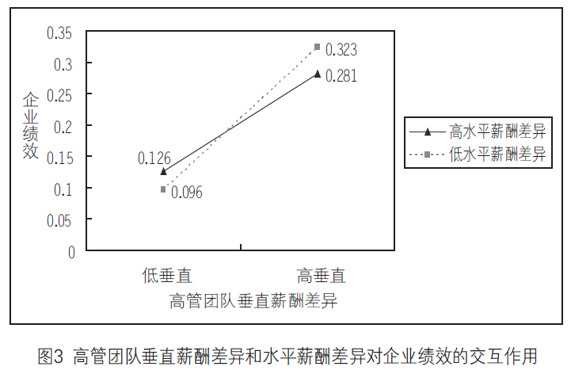

## 调节效应案例：
+ Li, J., & Tang, Y. (2010). CEO Hubris and Firm Risk Taking in China: The Moderating Role of Managerial Discretion. Academy of Management Journal, 53(1), 45–68. [PDF](http://www.bm.ust.hk/mgmt/files/staff/papers/JT/AMJ_v53p45_CEO%20hubris.pdf)
    * 市场丰腴程度对CEO自负程度和企业风险偏好的调节作用：
    * \(x\)：CEO自负程度；
    * \(y\)：企业风险偏好程度；
    * 市场丰腴程度较高的行业，CEO的自负程度对企业的风险偏好影响越大：  
      

    * 图中可以明显看出，市场丰腴程度较高的行业曲线更陡峭。

+ 李绍龙, 龙立荣, 贺伟. 高管团队薪酬差异与企业绩效关系研究:行业特征的跨层调节作用[J]. 南开管理评论, 2012, 15(4):55-65.[PDF](http://kdoc.cnki.net/kdoc/docdown/pubdownload.aspx?dk=kdoc%3apdfdown%3ab4a95b09201d42a67ec62a79500bb8e2&lang=GB)
    * 薪酬差异水平对高管薪酬差异对企业绩效的调节作用：
    * \(x\)：高管薪酬垂直差异；
    * \(y\)：企业绩效；
    * 低水平薪酬差异下，高管团队薪酬差异对企业绩效影响越大：  
    
    * 图中可以明显看出，薪酬差异水平较低的企业曲线更陡峭。

## 图示调节效应：
### 原理
+ 取自变量低、中和高三个水平的取值：\(\bar{x}-\mu,\bar{x},\bar{x}+\mu\)


### [实现代码](E:\MyGit\stata\调节效应.do)；
+ 下面的代码段同时运行
```
// 1 首先进行一个调节效应的回归，将结果保存：
clear
sysuse auto,clear
reg price c.length##c.mpg

//2 分别求自变量以及调节变量在均值上加减一个标准差的值：
foreach v of var length mpg {
    sum `v' if e(sample)   //相当于if e(sample)==1,只使用上一次进行回归用到的样本观测值描述统计；
    local low_`v'=r(mean)-r(sd)
    local high_`v'=r(mean)+r(sd)
}
//3 利用margins命令求预测值，并用marginsplot绘制图形；
margins,at(mpg = (`low_mpg' `high_mpg') /// 
    length = (`low_length' `high_length'))
marginsplot , xlabel(`low_mpg' "Low IV" `high_mpg' "High IV")  ///
              ytitle("Dependent variable")       ///
              ylabel(,angle(horizontal) nogrid) ///
              legend(position(3) col(1) stack)   ///
              title("") noci

```
