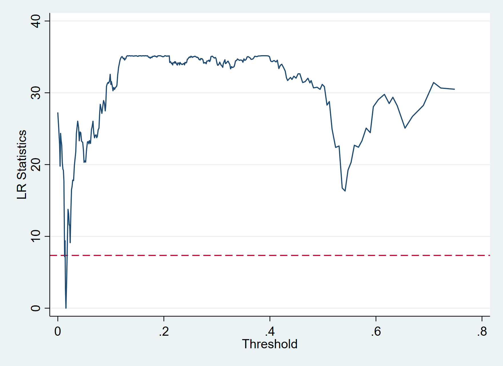

# 门槛回归

+ 做经验研究的时候通常遵循这样的几个步骤：
  + 首先，是分析研究我们关注的核心变量对被解释变量产生的影响（这个影响是一个平均效应）；
  + 其次，是进行对估计的模型进行稳健性检验，从不同的角度来探讨这个平均效应的结果是否稳健；
  + 然后，是机制分析，探讨研究我们所关注的核心解释变量是如何影响被解释变量的；
  + 最后，是异质性分析，探讨关键的解释变量在不同的条件下可能会对被解释变量产生什么样的影响。
+ 门槛模型实际上就是异质性分析。
+ 寻找异质性的一般处理方法有：
  + 在模型中加入解释变量的二次项，以查看解释变量和被解释变量之间是否存在"U"型或倒"U"型的关系；
  + 交互项模型
  + 分组回归
+ 需要注意的是，上述的对异质性处理的方法可能会存在高度共线性的问题，从而使得变量不再显著。此外，在对数据的分组上也存在一定的困难。于是，面板门限模型便成为了一种较好的异质性分析的方法。

## 一、截面门槛
### 1.1 门限回归的背景
+ 在回归分析中，我们常常关心模型系数的估计值是否稳定：
  + 即如果将整个样本分成若干个子样本（subsample）分别进行回归，是否还能够得到大致相同的估计系数。
  + 对于时间序列数据，这意味着经济结构是否随着时间的推移而改变；
  + 对于横截面数据，比如，样本中有男性与女性，则可以根据性别将样本一分为二，分别估计男性样本与女性样本。
  + 如果用来划分样本的变量不是离散型变量而是连续变量，比如，企业规模、人均国民收入，则需要给出一个划分的标准，即“门限（门槛）值”（threshold level）。
+ 在应用研究中，门限变量的应用是非常的广泛。经济规律可能是非线性的，其函数形式可能会依赖于某个变量（称为“门限变量”）而改变。
  + 比如，人们常常怀疑大企业与小企业的投资行为不同，那么如何区分大企业与小企业呢？
  + 另外，受到流动性约束（liquidity constraint）的企业与没有流动性约束企业的投资行为也可能不同，如何通过债务股本比（debt to equity ratio）或其他指标来区分这两类企业？
  + 再比如，发达国家与发展中国家的经济增长规律可能不同，如何通过人均国民收入这一指标来区分一个国家发达与否？
+ 对门限模型的拟合，传统的做法是，由研究者主观（随意）地确定一个门限值，然后根据此门限值把样本一分为二（或分成更多子样本）。这种方法既不对门限值进行参数估计，也不对其显著性进行统计检验。
+ 显然，这样得到的结果并不可靠。为此，Hansen（2000）提出“门限（门槛）回归”（threshold regression），以严格的统计推断方法对门限值进行参数估计与假设检验。
### 1.2 门限回归的原理
+ 假设样本数据为：$\{y_i,x_i,q_i\}_{i=1}^n$，其中 $q_i$ 为用来划分样本的“门限变量”，也可以是解释变量的一部分，考虑以下门槛回归模型：
\[
  \begin{cases}
  y_i=\beta_1'x_i，若q_i \leqslant \gamma \\
  y_i=\beta_2'x_i，若q_i>\gamma
  \end{cases} \tag{1}
\]
+ 其中, \(\gamma\) 为待估的门限值， \(x_i\) 为外生解释变量，与扰动项 \(\varepsilon_i\) 不相关，上面的分段函数可以合并为：
$$
y_i=\beta_1'x_i \cdot I(q_i \leqslant \gamma)+\beta_2'x_i \cdot I(q_i \geq \gamma)+\varepsilon_i \tag{2}
$$
+ 其中, \(I(\cdot)\)  为示性函数，即如果括号中的表达式为真，则取值为1；反之，取值为0。显然，这是一个非线性回归，因为它无法写成参数 \((\beta_1,\beta_2,\gamma)\) 的线性函数。可以用非线性最小二乘法（NLS）来估计，即最小化残差平方和。
+ 事实上，如果 \(\gamma\) 的取值已知，则可以通过定义 \(z_{i1}=x_i\cdot I(q_i\leqslant \gamma)\) 与 \(z_{i2}=x_i\cdot I(q_i > \gamma)\) ，将上述方程转换为参数为 \((\beta_1,\beta_2)\) 的线性回归模型：
$$
y_i=\beta_1'z_{i1}+\beta_2'z_{i2}+\varepsilon_i \tag{3}
$$
+ 因此，在实际计算中，通常分两步来最小化残差平方和确定门限值 $\gamma$  的取值，即首先给定 $\gamma$ 的取值，对方程（3）进行OLS估计得到残差平方和关于 $\gamma$ 的函数 $SSR(\gamma)$ ；其次，选择 $\gamma$ 使得 $SSR(\gamma)$ 最小化。
### 1.3 面板单门限模型的两大检验
#### 1.3.1 门限效应的显著性检验
+ 原假设: $ H_0:\beta_1=\beta_2 $ ,不存在门限效应，拒绝原假设则认为存在门限效应；
+ 备择假设： $ H_1:\beta_1 \neq \beta_2 $;
#### 1.3.2 门限估计值的一致性检验
+ 门限估计值是否等于真实值：
+ 原假设: $ H_0:\gamma=\gamma_0 $；
+ Hansen（1996）使用极大似然法检验门限值，构造似然比统计量： $ LR(\gamma) $;
+ Hansen（2000）计算置信区间，在显著性水平为 $ \alpha $的条件下，当 $ LR(\gamma) \leqslant -2ln(1-\sqrt{1-\alpha}) $时，不能拒绝原假设，认为门限估计值的真实性是显著的；
+ 通过画出$ LR(\gamma) $ 与水平线 $c(\alpha) = \leqslant -2ln(1-\sqrt{1-\alpha}) $的图像，来更加形象化地看到 $ \gamma $值在什么水平；
+ $ \alpha=10%,5%和1% $时，对应的 $ c(\alpha)=6.53,7.35和10.59 $

## 二、面板门槛
### 2.1 单门槛的stata操作
+ 以Hansen（1999）研究的现金流对投资的影响是否受到融资约束的影响；
+ 参照Hansen（1999）构造的面板数据双门限模型，我们构造单门限模型：
$$
I_{it} = \beta_0+\beta_1 q_{it-1}+\beta_2 q^2_{it-1}+\beta_3 q^3_{it-1}+\beta_4 d_{it-1}+\beta_5 q_{it-1}d_{it-1}+ \\\\
 \beta_6 c_{it-1}I(d_{it-1} \leqslant \lambda)+\beta_7 c_{it-1}I(d_{it-1} > \lambda)+\mu_i+\varepsilon_{it} \tag{4}
$$
+ stata面板门槛回归操作的过程
```stata{.line-numbers}
search xthreg //通过查找安装xthreg命令，可以看到附带的hansen1999.dta数据集
help xthreg
xthreg depvar [indepvars] [if] [in], rx(varlist) qx(varname) [thnum(#) grid(#) trim(numlist) bs(numlist) thlevel(#) gen(newvarname) noreg nobslog thgiven options]
//depvar：被解释变量；
//indepvars：控制变量；
//rx(varlist)：要研究的依赖于门限变量的核心解释变量；
//qx(varname)：门限变量；
//thnum(#)：门限数量；
//grid(#)：每个区间的格栅数量；
//trim(numlist)：修剪删去观测值的比例；
//bs(numlist)：自助抽样的次数；
//thlevel(#)：置信水平；
//gen(newvarname)：根据门限变量所在的区间生成虚拟变量；
//noreg：不显示回归结果；
//nobslog：不显示自助迭代的过程；
//thgiven：根据之前的结论拟合模型；
//options：其它适合xtreg命令的任何选项。
cd e:\data
use hansen1999.dta,clear
des //查看数据集额信息：

Contains data from hansen1999.dta
  obs:         7,910                          The Value and Performance of
                                                U.S.Corporations (B.H.Hall &
                                                R.E.Hall, 1993)
 vars:            13                          15 Oct 2009 20:50
                                              (_dta has notes)
--------------------------------------------------------------------------------
              storage   display    value
variable name   type    format     label      variable label
--------------------------------------------------------------------------------
id              int     %9.0g
year            int     %ty
i               double  %10.0g                investments/assets //被解释变量：投资/资本；
q               double  %10.0g                Tobin Q            //市值/资产；
c               double  %10.0g                crash flow/asset   //解释变量：现金流/总资产
d               double  %10.0g                debt/assets        //长期负债率，衡量融资约束，滞后一期作为门限变量；
q1              float   %9.0g                 L.q
q2              float   %9.0g                 L.q^2/100
q3              float   %9.0g                 L.q^3/1000
d1              float   %9.0g                 L.d
qd1             float   %9.0g                 L.q*L.d
c1              float   %9.0g                 L.c
_cat            float   %9.0g
--------------------------------------------------------------------------------
Sorted by: id  year
     Note: Dataset has changed since last saved.

xtdes
//描述统计：
tabstat i q1 c1 d1,s(min p25 p50 p75 max) format(%6.3f) c(s)
//单门限估计：
xthreg i q1 q2 q3 d1 qd1,rx(c1) qx(d1) thnum(1) grid(400) trim(0.01) bs(300)
//模型解释：其中，被解释变量为i（投资/资本）；
//体制依赖变量以外的解释变量q1 q2 q3 d1 qd1；
//体制依赖变量c1：随着门限区域发生改变，回归系数发生改变的变量，也就是我们要研究的自变量；
//门限变量d1（这里异质性因素在模型中既作为控制变量又作为门限变量，一般情况下是不这么做的）；
//格点数为400，将升序后的门限变量上下各删去1%，进行自助抽样300次；
//估计结果：
Estimating  the  threshold  parameters:   1st ......  Done
Boostrap for single threshold
.................................................. +   50
.................................................. +  100
.................................................. +  150
.................................................. +  200
.................................................. +  250
.................................................. +  300

Threshold estimator (level = 95):
-----------------------------------------------------
     model |    Threshold         Lower         Upper
-----------+-----------------------------------------
      Th-1 |       0.0154        0.0141        0.0167 //门限值为0.0154
-----------------------------------------------------

Threshold effect test (bootstrap = 300):
-------------------------------------------------------------------------------
 Threshold |       RSS        MSE      Fstat    Prob   Crit10    Crit5    Crit1
-----------+-------------------------------------------------------------------
    Single |   17.7818     0.0023      35.20  0.0000  13.0421  15.6729  21.1520 //p值为0，拒绝原假设（线性模型），认为存在门限效应；
-------------------------------------------------------------------------------

Fixed-effects (within) regression               Number of obs      =      7910
Group variable: id                              Number of groups   =       565

R-sq:  within  = 0.0951                         Obs per group: min =        14
       between = 0.0692                                        avg =      14.0
       overall = 0.0660                                        max =        14

                                                F(7,7338)          =    110.21
corr(u_i, Xb)  = -0.3972                        Prob > F           =    0.0000

------------------------------------------------------------------------------
           i |      Coef.   Std. Err.      t    P>|t|     [95% Conf. Interval]
-------------+----------------------------------------------------------------
          q1 |   .0105555   .0008917    11.84   0.000     .0088075    .0123035
          q2 |  -.0202872   .0025602    -7.92   0.000     -.025306   -.0152683
          q3 |   .0010785   .0001952     5.53   0.000     .0006959    .0014612
          d1 |  -.0229482   .0042381    -5.41   0.000     -.031256   -.0146403
         qd1 |   .0007392   .0014278     0.52   0.605    -.0020597    .0035381
             |
   _cat#c.c1 |
          0  |   .0552454   .0053343    10.36   0.000     .0447885    .0657022 //虚拟变量取值为0时表示融资约束小于门限值0.0154的情形，这时所对应的系数为融资约束较低时现金流对投资的影响；
          1  |   .0862498   .0052022    16.58   0.000      .076052    .0964476 //取值为1时表示融资约束大于门限值0.0154的情形，所对应的系数为融资约束较高时现金流对投资的影响。
             |
       _cons |   .0628165   .0016957    37.05   0.000     .0594925    .0661405
-------------+----------------------------------------------------------------
     sigma_u |  .03980548
     sigma_e |  .04922656
         rho |  .39535508   (fraction of variance due to u_i)
------------------------------------------------------------------------------
F test that all u_i=0: F(564, 7338) = 6.90                   Prob > F = 0.0000

```
+ 使用`_matplot`命令画出似然比函数LR和水平线 $ c(\alpha) $的图像，对门限估计值的真实性进行检验：
```stata
_matplot e(LR),columns(1 2) yline(7.35,lpattern(dash)) connect(direct) msize(small) mlabp(0) mlabs(zero) ytitle("LR Statistics") xtitle("Threshold") recast(line) name(LR)
```
+ 图像结果如下：

+ 通过图像已看出，门限值 $ LR(\gamma) $是门限 $ \gamma $的函数，当 $ \gamma=0.0154 $时，LR的值最小。
### 2.2 多门槛模型的stata操作
+ xthreg最多可以估计三个门槛的模型，下面直接估计三门槛模型：
```stata
xthreg i q1 q2 q3 d1 qd1,rx(c1) qx(d1) thnum(3) grid(400) trim(0.01 0.01 0.05) bs(0 300 300) thgive
//通过上面的单门限回归知道第一个门限的值为0.0154，所以在bs(#)中将第一个门限值的自助次数设置为0，可以节省模型拟合时间；
//thgive表示在第一个门限值给定为0.0154的情况下，寻找第2、3个门限值，不加thgive表示从头开始；
//结果如下：
Estimating  the  threshold  parameters:   2nd ......  3rd ......  Done
Boostrap for double threshold model:
.................................................. +   50
.................................................. +  100
.................................................. +  150
.................................................. +  200
.................................................. +  250
.................................................. +  300
Boostrap for triple threshold model:
.................................................. +   50
.................................................. +  100
.................................................. +  150
.................................................. +  200
.................................................. +  250
.................................................. +  300

Threshold estimator (level = 95):
-----------------------------------------------------
     model |    Threshold         Lower         Upper
-----------+-----------------------------------------
      Th-1 |       0.0154        0.0141        0.0167
     Th-21 |       0.0154        0.0141        0.0167
     Th-22 |       0.5418        0.5268        0.5473
      Th-3 |       0.4778        0.4755        0.4823
-----------------------------------------------------

Threshold effect test (bootstrap = 0 300 300):
-------------------------------------------------------------------------------
 Threshold |       RSS        MSE      Fstat    Prob   Crit10    Crit5    Crit1
-----------+-------------------------------------------------------------------
    Single |   17.7818     0.0023      35.20  0.0000  13.0421  15.6729  21.1520
    Double |   17.7258     0.0022      24.97  0.0133  12.7394  15.1986  25.3522
    Triple |   17.7119     0.0022       6.20  0.5700  15.1892  19.3399  25.4014 //第三个门限值的p值等于0.57，所以拒绝存在三门限，认为存在双门限效应
-------------------------------------------------------------------------------

Fixed-effects (within) regression               Number of obs      =      7910
Group variable: id                              Number of groups   =       565

R-sq:  within  = 0.0987                         Obs per group: min =        14
       between = 0.0684                                        avg =      14.0
       overall = 0.0667                                        max =        14

                                                F(9,7336)          =     89.26
corr(u_i, Xb)  = -0.4072                        Prob > F           =    0.0000

------------------------------------------------------------------------------
           i |      Coef.   Std. Err.      t    P>|t|     [95% Conf. Interval]
-------------+----------------------------------------------------------------
          q1 |   .0103968   .0008909    11.67   0.000     .0086503    .0121432
          q2 |  -.0201183   .0025559    -7.87   0.000    -.0251286   -.0151081
          q3 |   .0010734   .0001949     5.51   0.000     .0006915    .0014554
          d1 |  -.0166801   .0045804    -3.64   0.000    -.0256589   -.0077012
         qd1 |   .0008845   .0014255     0.62   0.535    -.0019099    .0036788
             |
   _cat#c.c1 |
          0  |   .0587984   .0053924    10.90   0.000     .0482278     .069369
          1  |   .0920255   .0053928    17.06   0.000     .0814541    .1025969
          2  |   .1325752   .0173155     7.66   0.000     .0986318    .1665186
          3  |   .0419859   .0112319     3.74   0.000     .0199681    .0640037
             |
       _cons |   .0604649   .0017873    33.83   0.000     .0569613    .0639684
-------------+----------------------------------------------------------------
     sigma_u |   .0400859
     sigma_e |  .04913619
         rho |  .39959759   (fraction of variance due to u_i)
------------------------------------------------------------------------------
F test that all u_i=0: F(564, 7336) = 6.94                   Prob > F = 0.0000
//三个门限值将样本分为四个组，从而得到不同程度的影响；
```
+ 绘制LR统计量的图像对三个门限估计值的真实性进行检验
```stata
_matplot e(LR21),columns(1 2) yline(7.35,lpattern(dash)) connect(direct) msize(small) mlabp(0) mlabs(zero) ytitle("LR Statistics") xtitle("First Threshold") recast(line) name(LR21) nodraw
_matplot e(LR22),columns(1 2) yline(7.35,lpattern(dash)) connect(direct) msize(small) mlabp(0) mlabs(zero) ytitle("LR Statistics") xtitle("Second Threshold") recast(line) name(LR22) nodraw
_matplot e(LR3),columns(1 2) yline(7.35,lpattern(dash)) connect(direct) msize(small) mlabp(0) mlabs(zero) ytitle("LR Statistics") xtitle("Third Threshold") recast(line) name(LR3) nodraw
graph  combine LR21 LR22 LR3,cols(1)
```
+ 
+ 可以看到，第一个门限与第二个门限的LR图像均与水平线有交点，分别确定了两个门限值的置信区间，所以通过了显著性的检验，而第三个门限的LR图像并没有与水平线出现交点，所以第三门限未能通过显著性的检验。
+ 综上，我们最终应当拟合一个双门限模型。
### 2.3 最终拟合一个双门槛模型
```stata
xthreg i q1 q2 q3 d1 qd1,rx(c1) qx(d1) thnum(2) grid(400) trim(0.01 0.01) bs(300 300)
//结果如下：
Estimating  the  threshold  parameters:   1st ......  2nd ......  Done
Boostrap for single threshold
.................................................. +   50
.................................................. +  100
.................................................. +  150
.................................................. +  200
.................................................. +  250
.................................................. +  300
Boostrap for double threshold model:
.................................................. +   50
.................................................. +  100
.................................................. +  150
.................................................. +  200
.................................................. +  250
.................................................. +  300

Threshold estimator (level = 95):
-----------------------------------------------------
     model |    Threshold         Lower         Upper
-----------+-----------------------------------------
      Th-1 |       0.0154        0.0141        0.0167
     Th-21 |       0.0154        0.0141        0.0167
     Th-22 |       0.5418        0.5268        0.5473
-----------------------------------------------------

Threshold effect test (bootstrap = 300 300):
-------------------------------------------------------------------------------
 Threshold |       RSS        MSE      Fstat    Prob   Crit10    Crit5    Crit1
-----------+-------------------------------------------------------------------
    Single |   17.7818     0.0023      35.20  0.0000  13.0421  15.6729  21.1520
    Double |   17.7258     0.0022      24.97  0.0133  12.7394  15.1986  25.3522
-------------------------------------------------------------------------------

Fixed-effects (within) regression               Number of obs      =      7910
Group variable: id                              Number of groups   =       565

R-sq:  within  = 0.0980                         Obs per group: min =        14
       between = 0.0678                                        avg =      14.0
       overall = 0.0660                                        max =        14

                                                F(8,7337)          =     99.63
corr(u_i, Xb)  = -0.4091                        Prob > F           =    0.0000

------------------------------------------------------------------------------
           i |      Coef.   Std. Err.      t    P>|t|     [95% Conf. Interval]
-------------+----------------------------------------------------------------
          q1 |   .0103749   .0008912    11.64   0.000      .008628    .0121218
          q2 |  -.0200947   .0025567    -7.86   0.000    -.0251065   -.0150828
          q3 |   .0010727   .0001949     5.50   0.000     .0006906    .0014547
          d1 |  -.0150988   .0045344    -3.33   0.001    -.0239875     -.00621
         qd1 |   .0008845    .001426     0.62   0.535    -.0019108    .0036798
             |
   _cat#c.c1 |
          0  |    .059253   .0053908    10.99   0.000     .0486854    .0698205
          1  |   .0929924   .0053795    17.29   0.000      .082447    .1035378
          2  |   .0386989   .0111521     3.47   0.001     .0168376    .0605602
             |
       _cons |   .0601315   .0017824    33.74   0.000     .0566374    .0636256
-------------+----------------------------------------------------------------
     sigma_u |  .04013808
     sigma_e |   .0491522
         rho |  .40006551   (fraction of variance due to u_i)
------------------------------------------------------------------------------
F test that all u_i=0: F(564, 7337) = 6.95                   Prob > F = 0.0000

```
